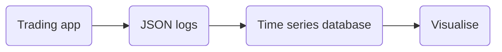

I've come across trading systems that spew out 10s of gigabytes of logs per day. When something goes wrong, some poor intern would have to `grep` through these log files to figure out why it broke -- sometimes for days.

The thing is, logs should not be human readable. These days, computer systems generate so many logs that we need tools to parse and understand them. Human's no longer read logs, machines do.

When coming across trading systems spewing out gigabytes of logs, I bank a quick win by converting these logs into JSON. I can then stream these logs into a time series database and visualise them with my favourite dashboard. That way, I can see exactly what is going on in near real time and catch problems early.

Here, we're going to create a trading app demo that logs to JSON and a system that ships these logs into a time series database and visualises them.



The steps involved are:

1. Create an app that logs a price
2. Switch to JSON logs
3. Setup time series database
4. Setup a log shipper to move logs into the time series database
5. Visualise the data

You can find all the code here in a Github repository [monitoring-trading-systems](https://github.com/robolyst/trading-monitoring-demo).

# 1. Create an app

For our trading app, we'll use a script that logs a random price:

```python
# filename: trader.py
from time import sleep
import numpy as np
import logging
import os

LOG_FILE_NAME = os.environ['LOG_FILE_NAME']

logger = logging.getLogger()
logger.setLevel(logging.DEBUG)
console_handler = logging.StreamHandler()
logger.addHandler(console_handler)
file_handler = logging.FileHandler(LOG_FILE_NAME)
logger.addHandler(file_handler)

price = 100

while True:
    price = price * (1 + np.random.randn() * 0.01)
    logger.info(f"price {price}")
    sleep(0.5)
```

This app sets up a logger that prints to the console and dumps to a log file `LOG_FILE_NAME`. The logs look like:

```bash
price 101.50747597319688
price 101.45122289615952
price 102.82811428242694
```

## Dockerising the app

Dockerising the trading app makes integrating with the monitoring services easier later. Setup your file structure like this:

```files
repo/
├── trader/
│   ├── Dockerfile
│   └── trader.py
└── docker-compose.yml
```

In the `Dockerfile` we want to setup a simple python environment with the two required packages `numpy` and `structlog`:

```Dockerfile
# filename: Dockerfile
FROM python:3.11.0-slim-buster

RUN pip install numpy==1.23.5 structlog==22.3.0

WORKDIR /app
COPY trader.py /app/trader.py
```

We want to be able to run this app with the command `docker-compose up` so put the following into the `docker-compose.yml` file:

```yaml
# filename: docker-compose.yml
version: '3.7'

services:
  trader:
    build:
      context: ./trader
    container_name: trader
    command: python trader.py
    environment:
      - LOG_FILE_NAME=/var/log/trader/trader.logs
    volumes:
      - logdata:/var/log/trader

volumes:
  logdata:
```

Here we've told Docker to build the service called `trader` which runs the command `python trader.py` in the container and stores the logs in a volume called `logdata`.

If you go ahead and run the following command you will see logs in your console:

```bash
docker-compose up
```

# 2. Switch to JSON logs

The Python package [structlog](https://www.structlog.org/en/stable/) creates structured logs for you. The package includes a JSON formatter which we're going to use.

Setting up JSON logs is as easy as configuring `structlog` and wrapping the default logger from our demo trading app above. The updated `trader.py` script looks like:

```python
from time import sleep
import numpy as np
import structlog
import logging
import os

LOG_FILE_NAME = os.environ['LOG_FILE_NAME']

logger = logging.getLogger()
logger.setLevel(logging.DEBUG)
console_handler = logging.StreamHandler()
logger.addHandler(console_handler)
file_handler = logging.FileHandler(LOG_FILE_NAME)
logger.addHandler(file_handler)

# Configure the structured logger
structlog.configure_once(
    processors=[
        structlog.stdlib.add_log_level,
        structlog.processors.TimeStamper(fmt="iso", utc=True),
        structlog.processors.JSONRenderer(),
    ],
)

# Wrap the root logger with the structured logger
json_logger = structlog.wrap_logger(logger)

price = 100

while True:
    price = price * (1 + np.random.randn() * 0.01)

    # Log price in JSON
    json_logger.info(event="price_log", price=price)

    sleep(0.5)
```

A log is a statement that something happened. In other words, an event. `structlog` has the required argument `event="NAME"`. Best practice is for each of your logs to have their own event name. That way, you can always pick out the exact logs you want down stream.

Now, the trading app's logs look like:

```json
{"price": 98.29655117355337, "event": "price", "level": "info", "timestamp": "2022-12-14T06:21:05.874105Z"}
{"price": 99.25440619746382, "event": "price", "level": "info", "timestamp": "2022-12-14T06:21:06.375861Z"}
{"price": 100.36139973205326, "event": "price", "level": "info", "timestamp": "2022-12-14T06:21:06.877588Z"}
{"price": 98.746303446643, "event": "price", "level": "info", "timestamp": "2022-12-14T06:21:07.380507Z"}
```

Perfectly machine readable.

# 3. Setup time series database

 We're going to use [QuestDB](https://questdb.io/) as our time series database. QuestDB ingests logs lightening fast and returns SQL queries in milliseconds.


QuestDB is free and open source. You can add a QuestDB service to the `docker-compose.yml` file with:

```yaml
questdb:
  image: questdb/questdb:7.1.1
  container_name: questdb
  ports:
    - "9000:9000"  # Rest and Web app
    - "9009:9009"  # InfluxDB line protocol
    - "8812:8812"  # Postgres protocol
  healthcheck:
    test: timeout 10s bash -c ':> /dev/tcp/localhost/9003'
    interval: 5s
    timeout: 10s
    retries: 50
```

Here, we've instructed Docker to leave open three ports:

- `9000` gives you a web app to play with QuestDB
- `9009` is the port we will send logs to
- `8812` is the port we'll use to run SQL queries

Take note of the health check. QuestDB can take a moment to start up. We will want services that depend on it to wait before trying to connect. By adding the health check, Docker will know to wait until QuestDB is ready.

# 4. Setup a log shipper

We need a way of moving logs from the `trader.logs` file into QuestDB. Programs that move logs are often termed log shippers.

In this setup, we'll be using [Telegraf](https://www.influxdata.com/time-series-platform/telegraf/).


Telegraf is ideal because it is able to read JSON logs and send them in [InfluxDB's Line Protocol](https://docs.influxdata.com/influxdb/v1.3/write_protocols/line_protocol_tutorial/) format via TCP. QuestDB accepts logs in InfluxDB's Line Protocol format on port `9009`.

Telegraf uses a `telegraf.conf` file for configuration. We want to tell Filebeat where the log file lives and where QuestDB lives. We can do this with:

```toml
# filename: telegraf.conf
[agent]
  # Default data collection interval for all inputs
  interval = "1s"

  # Default flushing interval for all outputs
  flush_interval = "1s"

[[inputs.tail]]
  files = ["$LOG_FILE_NAME"]
  from_beginning = true

  json_string_fields = [
    "level",
  ]

  data_format = "json"
  json_strict = true
  json_name_key = "event"
  json_time_key = "timestamp"
  json_time_format  = "2006-01-02T15:04:05.999999Z"

[[outputs.socket_writer]]
  address = "tcp://$QUESTDB_HOST_NAME"
  data_format = "influx"
```

The Telegraf service can then be created with:

```yaml
telegraf:
  image: telegraf:1.26.2
  container_name: telegraf
  environment:
    - QUESTDB_HOST_NAME=questdb:9009
    - LOG_FILE_NAME=/var/log/trader/trader.logs
  depends_on:
    questdb:
      condition: service_healthy
  volumes:
    - logdata:/var/log/trader
    - ./telegraf.conf:/etc/telegraf/telegraf.conf
```

Here we've told Docker to give `telegraf` access to the same volume (`logdata`) as the `trader` service. This means that `telegraf` can read the logs produced by `trader`.

# 5. Visualise

We've now got a trading app dumping JSON logs to a file and these logs are being streamed into a database. All we have left to do is visualise the data.

[Grafana](https://grafana.com/grafana/) is an open source visualisation tool that excels at metrics and time series.

Add Grafana as a service to your `docker-compose.yml` file:

```yaml
  grafana:
    image: grafana/grafana:9.5.1
    ports:
      - "3000:3000"
    environment:
      - QUESTDB_URL=questdb:8812
      - GF_SECURITY_ADMIN_USER=admin
      - GF_SECURITY_ADMIN_PASSWORD=admin
      - GF_AUTH_BASIC_ENABLED=false
      - GF_AUTH_ANONYMOUS_ENABLED=true
      - GF_AUTH_ANONYMOUS_ORG_ROLE=Editor
    depends_on:
      questdb:
        condition: service_healthy

```

When running, you can navigate to `localhost:3000` to explore Grafana.

## Configuration

Grafana's UI allows you to connect to QuestDB and begin exploring.

A fantastic feature of Grafana is defining all configuration in code. This includes the database connection and dashboards. That's all a little involved to walk through here. However, the accompanying Github repository is setup with a Grafana service configured to talk to QuestDB, and has a ready built dashboard for you to explore.

# Accompanying Repository

To see this whole monitoring system in action, clone [the repository](https://github.com/robolyst/trading-monitoring-demo) and spin up the stack:

```bash
git clone https://github.com/robolyst/trading-monitoring-demo
cd trading-monitoring-demo
docker-compose up
```

You'll get a spew of logs on the screen. Wait a moment and then open the dashboard at [http://localhost:3000/](http://localhost:3000/)


