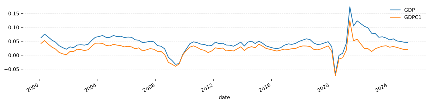

One way to think of market returns is that they are generated by some underlying economic state or regime. For example, during a recession returns may be lower and more volatile than during a period of growth. The resession is one state while the period of growth is another.

The state of the economy is not directly observable, only the returns in the market and various economic indicators. As the state is not directly observable, we call it a *latent* or *hidden* state.

An assumption we can make is that there are fewer states than there are tradable assets. This suggests we might be able to model a large number of assets as a function of a small set of latent states.

Models that incorporate hidden states are called *hidden state models* or *state space models*. There are a few types, but the one we will focus on here is the finite mixture model.

A *finite mixture model* assumes that there are a finite number of hidden states and that each state is associated with a probability distribution that generates the observed data. We will focus on the Gaussian mixture model (GMM) where each state is associated with a multivariate Gaussian distribution.

In this article, we will cover the following:
1. The basics of Gaussian mixture models.
1. The key modelling decisions.
1. Incorporating macro-economic variables.
1. Performing an economic analysis.

# The basics

## Finite mixture models

We are going to model a market with $d$ assets. The vector of returns at time $t$ is $\boldsymbol{r}_t \in \mathbb{R}^d$. In a hidden state model, we say that the market is in one of $K$ states and that each state is associated with a distribution that generates $\boldsymbol{r}_t$.

There are two notations for the state. We can say that the state is $k$, i.e. we can ask "what is the distribution of $\boldsymbol{r}_t$ given we are in state $k$?". We can also represent the state with a vector $\boldsymbol{z}$ which has $z\_{k} = 1$ if the state is $k$ and $0$ for all other states.

Based on this definition of states, we can name a few distributions without specifying their exact form.

**Prior distribution.** The probability of being in state $k$ is:
$$
p(k)
$$

**Emission distribution.** The probability of observing $\boldsymbol{r}_t$ given we are in state $k$ is:
$$
p(\boldsymbol{r}_t | k)
$$
this is often called the *emission* distribution. Later on, we will give this a shape (Gaussian) and parameters.

**Joint distribution.** The probability that we are in state $k$ *and* we observe $\boldsymbol{r}_t$ is (using both notations):
$$
\begin{aligned}
p(k, \boldsymbol{r}_t) &= p(k) p(\boldsymbol{r}_t | k) \\\
\\\
p(\boldsymbol{z}, \boldsymbol{r}_t) &= \prod_k \left[ p(k) p(\boldsymbol{r}_t | k) \right]^{z_k} \\\
\end{aligned}
$$
The information $\boldsymbol{z}$ and $\boldsymbol{r}_t$ are often called the *full set* because at time $t$ the full set of information is the state and the realised returns.

**Mixture distribution.** The probability that we observe $\boldsymbol{r}_t$ is:
$$
p(\boldsymbol{r}_t) = \sum_k^K p(k)p(\boldsymbol{r}_t | k)
$$
Here we've combined or "mixed" the emission distributions into a "mixture" distribution. Under this model, the prior distribution $p(k)$ is sometimes referred to as the *mixing weights*.

**Posterior distribution.** The probability that we are in state $k$ given we observe $\boldsymbol{r}_t$ is derived from the above distributions using Bayes' theorem:
$$
p(k|\boldsymbol{r}_t) = \frac{p(k)p(\boldsymbol{r}_t|k)}{p(\boldsymbol{r}_t)} = \frac{p(k)p(\boldsymbol{r}_t|k)}{\sum_k^K p(k)p(\boldsymbol{r}_t | k)}
$$
This is often viewed as the *responsibility* that state $k$ has for explaining or generating the observation $\boldsymbol{r}_t$ [^Bishop2006].

To do useful things with this latent state model, we need to assume specific distributions for $p(k)$ and $p(\boldsymbol{r}_t | k)$.

## Mixture of Gaussians

We will fix the priors to a single value:
$$
p(k) = \pi_k, \quad \pi_k \ge 0, \quad \sum \pi_k = 1
$$
The emission distribution is set as a Gaussian:
$$
\begin{aligned}
p(\boldsymbol{r}_t | k) &= \mathcal{N}(\boldsymbol{r}_t | \boldsymbol{\mu}_k, \boldsymbol{\Sigma}_k) \\\
&= \frac{1}{(2\pi)^{d/2} |\boldsymbol{\Sigma}_k|^{1/2}} e^{ \left( -\frac{1}{2} (\boldsymbol{r}_t - \boldsymbol{\mu}_k)^\top \boldsymbol{\Sigma}_k^{-1} (\boldsymbol{r}_t - \boldsymbol{\mu}_k) \right)} \\\
\end{aligned}
$$
which means the mixture distribtion is:
$$
p(\boldsymbol{r}_t) = \sum_k^K \pi_k \mathcal{N}(\boldsymbol{r}_t | \boldsymbol{\mu}_k, \boldsymbol{\Sigma}_k)
$$
which is called *a mixture of Gaussians* [^Bishop2006] or a Gaussian mixture model (GMM).

The posterior distribution becomes:
$$
p(k|\boldsymbol{r}_t) = \frac{\pi_k\mathcal{N}(\boldsymbol{r}_t | \boldsymbol{\mu}_k, \boldsymbol{\Sigma}_k)}{\sum_k^K \pi_k\mathcal{N}(\boldsymbol{r}_t | \boldsymbol{\mu}_k, \boldsymbol{\Sigma}_k)}
$$


Two Guassian distributions are shown on the top panel. By mixing the two we get a new distrituion illustrated on the bottom panel. We see an almost Gaussian looking shape with a pronounced right tail. Mixing more Gaussians would result in more complex shapes.



## Estimation

Define $\boldsymbol{R} = [\boldsymbol{r}_1, \dots, \boldsymbol{r}_t]$ to be all the observations and $\boldsymbol{Z} = [\boldsymbol{z}_1, \dots, \boldsymbol{z}_t]$ to be the corresponding hidden states. We will fix the number of states to be $K$. We want to estimate the values $\pi_k$, $\boldsymbol{\mu}_k$ and $\boldsymbol{\Sigma}_k$ for each of the states.

The usual method of estimating a model's parameters is to maximise the log of the likelihood function for the given set of samples. In this case, the likelihood is:
$$
p(\boldsymbol{R}) = \prod_t p(\boldsymbol{r}_t) = \prod_t \left[ \sum_k^K p(k)p(\boldsymbol{r}_t | k) \right]
$$
Taking the log gives us this:
$$
\begin{aligned}
\mathcal{L}( \boldsymbol{R} | \boldsymbol{\pi}, \boldsymbol{\mu}, \boldsymbol{\Sigma}) &= \sum_t \log \left( \sum_k^K p(k)p(\boldsymbol{r}_t | k) \right) \\\
&= \sum_t \log \left( \sum_k^K \pi_k \mathcal{N}(\boldsymbol{r}_t | \boldsymbol{\mu}_k, \boldsymbol{\Sigma}_k) \right) \\\
\end{aligned}
$$
which is a very complex function to maximise due to the summation within the logarithm. In fact, there isn't a closed form solution to this. We can derive an iterative solution which is called the expectation maximisation (EM) algorithm in general. The EM algorithm is an iterative method of finding a solution to a hidden state model. There is a fair amount of theory which you can read about [^Bishop2006]. Here, we will just give a light derivation.

We first switch from using $p(\boldsymbol{R})$ to using the full set distribution and its log-likelihood:
$$
\begin{aligned}
p(\boldsymbol{Z}, \boldsymbol{R}) &= \prod_t\prod_k \left[ p(k) p(\boldsymbol{r}_t | k) \right]^{z\_{tk}} \\\
&= \prod_t\prod_k \left[ \pi_k \mathcal{N}(\boldsymbol{r}_t | \boldsymbol{\mu}_k, \boldsymbol{\Sigma}_k) \right]^{z\_{tk}} \\\
\mathcal{L}( \boldsymbol{R}, \boldsymbol{Z} | \boldsymbol{\pi}, \boldsymbol{\mu}, \boldsymbol{\Sigma}) &= \\sum_t \sum_k z\_{tk} \log \left( \pi_k \mathcal{N}(\boldsymbol{r}_t | \boldsymbol{\mu}_k, \boldsymbol{\Sigma}_k) \right) \\\
\end{aligned}
$$

The EM algorithm proceeds as follows:
1. **Initialise**: Pick some initial values for the parameters $\pi_k$, $\boldsymbol{\mu}_k$ and $\boldsymbol{\Sigma}_k$.
2. **E-step**: Calculate the expected value of $\boldsymbol{Z}$ given: $\boldsymbol{R}$, $\pi_k$, $\boldsymbol{\mu}_k$ and $\boldsymbol{\Sigma}_k$ $\forall k$.
3. **M-step**: Use these values as values for $\boldsymbol{Z}$ and maximise the log-likelihood with respect to the parameters $\pi_k$, $\boldsymbol{\mu}_k$ and $\boldsymbol{\Sigma}_k$.
4. **Check**: Calculate the log-likelihood $\mathcal{L}( \boldsymbol{R} | \boldsymbol{\pi}, \boldsymbol{\mu}, \boldsymbol{\Sigma})$ and check for convergence in the parameters or the log-likelihood value. If not converged, return to step 2.

Initialisation involves picking some starting value for the posterior probabilities. Once you have those, you can proceed with the M-step to complete the initialisation. These starting probabilities can either be random or based on K-means clustering. For the clustering method, K-means is run and the closest cluster centre sets the initial probability to 1 for that state and 0 for all other states. K-means assumes the clusters are spherical (no correlations). This is not appropriate for financial returns, so we will use random initialisation.

**E-step** Recall that each element of $\boldsymbol{Z}$ is a one-hot vector indicating the state at time $t$. The expected value of $z\_{tk}$ is just the posterior probability that we are in state $k$ given $\boldsymbol{r}_t$:
$$
E[z\_{tk}] = p(k | \boldsymbol{r}_t) = \frac{\pi_k\mathcal{N}(\boldsymbol{r}_t | \boldsymbol{\mu}_k, \boldsymbol{\Sigma}_k)}{\sum_k^K \pi_k\mathcal{N}(\boldsymbol{r}_t | \boldsymbol{\mu}_k, \boldsymbol{\Sigma}_k)}
$$

**M-step** To maximise the log-likelihood with respect to the parameters, we take the derivatives and set them to zero. This gives us the following update equations:
$$
\begin{aligned}
\pi_k &= \frac{T_k}{T} \\\
\boldsymbol{\mu}_k &= \frac{1}{T_k}\sum_t E[z\_{tk}] \boldsymbol{r}_t \\\
\boldsymbol{\Sigma}_k &= \frac{1}{T_k} \sum_t E[z\_{tk}] (\boldsymbol{r}_t - \boldsymbol{\mu}_k)(\boldsymbol{r}_t - \boldsymbol{\mu}_k)^\top
\end{aligned}
$$
where
$$
T_k = \sum_t E[z\_{tk}]
$$
is the number of samples attributed to state $k$.

## Portfolio construction

For each of the $k$ states, if we have portfolio weights $\boldsymbol{w}$ we can calculate the expected portfolio return as:
$$
E_k[r_t] = \mu_k = \boldsymbol{w}^\top \boldsymbol{\mu}_k
$$
and the expected variance as:
$$
\sigma^2_k = \boldsymbol{w}^\top \boldsymbol{\Sigma}_k \boldsymbol{w}
$$
We can safely assume that the portfolio return between each state is uncorrelated.


Given a set of PDFs $f_i$ and mixing weights $p_i$ the PDF of the mixture is:
$$
f(x) = \sum_i p_i f_i(x)
$$
It follows that any moment of the mixture distribution is the weighted sum of the moments of the individual distributions:
$$
E[X^n] = \sum_i p_i E_i[X^n]
$$

Thus, the expected portfolio return across all states is:
$$
E[r_t] = \mu = \sum_k^K \pi_k E_k[r_t] = \sum_k^K \pi_k \boldsymbol{w}^\top\boldsymbol{\mu}_k
$$
We can collect that last sum on the right hand side into a single mean vector:
$$
\boldsymbol{\mu} = \sum_k^K \pi_k \boldsymbol{\mu}_k
$$
such that the expected portfolio return is:
$$
E[r_t] = \mu = \boldsymbol{w}^\top \boldsymbol{\mu}
$$

The expected portfolio variance across all states is:
$$\begin{aligned}
E[(r_t - E[r_t])^2] &= E[r_t^2] - (E[r_t])^2 \\\
&= \sum_k^K \pi_k E_k[r_t^2] - (E[r_t])^2 \\\
&= \sum_k^K \pi_k \left( \sigma^2_k + (E_k[r_t])^2 \right) - (E[r_t])^2 \\\
&= \sum_k^K \pi_k \sigma^2_k + \sum_k^K \pi_k (E_k[r_t])^2 - (E[r_t])^2 \\\
\end{aligned}
$$
Expanding out the variance and moments:
$$
= \sum_k^K \pi_k \boldsymbol{w}^\top \boldsymbol{\Sigma}_k \boldsymbol{w} + \sum_k^K \pi_k (\boldsymbol{w}^\top \boldsymbol{\mu}_k)^2 - ( \boldsymbol{w}^\top \boldsymbol{\mu} )^2
$$
which is just a sum of quadratic terms. We can collect the terms into a single covariance matrix:
$$
\boldsymbol{\Sigma} = \sum_k^K \pi_k \boldsymbol{\Sigma}_k + \sum_k^K \pi_k \boldsymbol{\mu}_k \boldsymbol{\mu}_k^\top - \boldsymbol{\mu}\boldsymbol{\mu}^\top
$$
such that the expected portfolio variance is:
$$
\sigma^2 = \boldsymbol{w}^\top \boldsymbol{\Sigma} \boldsymbol{w}
$$

In practice, you'll find that the GMM mean and cov matches almost exactly the empirical mean and cov when fitted to financial returns. The only difference is that in the GMM model, we can break the mean and cov down into different states. Later, we will modify the prior distribution (the mixing weights) to get time-varying means and covariances.

# Modelling decisions

Before we dig into an example, there are a few key modelling decisions to make. We need to decide what **time interval** to use for returns, whether or not to **devolatise** and **how many states** to use. We'll look at each of these in turn.

As we go through each of these decisions, we'll work on real data. Since we're interested in macro-economic regimes, we'll use broad market ETFs that represent different asset classes. Specifically, we'll use:
- SPY -- *US equities*
- TLT -- *US long-term bonds*
- GLD -- *Gold*
- GSG -- *Commodities*

## Time period

Now, we want to try and tie market regimes to macro-economic variables. These macro-economic variables are usually released at monthly or quarterly intervals. Quarterly intervals cuts the number of samples by a third. As such, we'll use monthly intervals for the economic variables and market returns.

The ETFs that we're using do not have data going back very far. To get around this, we splice in index data for SPY, GLD and GSG. For TLT we use bond yields to approximate long-term bond returns before TLT's inception. This gets us prices going back to 1990. The details are in the appendix. 

The dataset of prices is available [here]().

<todo>add appendix and link</todo>

You can load the prices with:
```python
import pandas as pd
daily = pd.read_csv('broad_etf_prices.csv', index_col=0, parse_dates=True)
monthly = daily.resample('MS').last()
```
There are 419 months in the sample which looks like this:


## Devolatise

Returns are [heteroscedastic](https://en.wikipedia.org/wiki/Homoscedasticity_and_heteroscedasticity), meaning that their volatility changes over time. This causes problems for machine learning models which generally assume that the data is identically distributed. For GMMs, they will end up fitting states to different volatility regimes rather than different economic regimes.

We can avoid this by normalising the returns by their recent volatility. This procedure is referred to as *devolatising* returns. A simple way to do this is to divide the returns by their exponentially weighted moving standard deviation.

We can see how big of an impact this procedure has by testing on SPY returns. We will do this on daily returns as it is easier to visualise.

```python
# Get the daily returns
returns = daily['SPY'].pct_change()

# Standardize the returns so that the result
# of all operations are on the same scale.
returns -= returns.mean()
returns /= returns.std()

# Calculate the rolling volatility before
# normalising over the last six months.
before = returns.ewm(halflife=126, min_periods=21).std()

# Remove the volatility clustering. Shift by 1
# so that this could be used in a live trading
# scenario.
std = returns.ewm(halflife=21, min_periods=21).std()
std = std.shift(1)
returns /= std

# Calculate the rolling volatility after
# normalising over the last six months.
after = returns.ewm(halflife=126, min_periods=21).std()
```

Plotting `before` and `after` gives us:


The exponentially weighted standard deviation of SPY daily returns are shown in blue. A half-life of 6 months was used. The SPY returns were then devolatised by dividing by the one month exponentially weighted standard deviation lagged by 1 to reflect real world trading. The results are shown in orange. We can see that the big swings in volatility have been removed.


From here on, we will devolatise the monthly returns before fitting a GMM. We will devolatise with a 6 month half-life. This is a hyperparameter that could be tuned. However, this article is focused on the GMM rather than devolatisation so we will not go into detail here.

## Number of states

The number of states is a critical parameter as we want each state to represent a meaningful economic regime. If we have too few states, then we will end up mixing together different regimes (underfitting). If we have too many states, then we will end up with states that are not economically meaningful (overfitting).

We will do a quick experiment to select the number of states. As a warning, this is not a rigorous method as we will be looking at out-of-sample results. But, it will give us a good idea of the number of states that we can work with for the rest of the article.

The experiment:
1. Split the data into a training set and a test set. Training set is everything before 2022-01-01 and test set is everything after. The test set has about 11% of the data.
1. Loop over a range for the number of states (1 to 8).
1. For each number of states, do 100 fits where we fit a GMM to the training set. The GMM does 40 random initialisations and picks the best one.
1. For each fit save the number of states and the test set log-likelihood.

We can fit a Gaussian Mixture Model with the help of scikit-learn's `GaussianMixture` class ([docs](https://scikit-learn.org/stable/modules/generated/sklearn.mixture.GaussianMixture.html)).

Once we have all the results, we can plot the median test set log-likelihood for each number of states. We'll pick the number of states that maximises the median test set log-likelihood.

Here is the code to run this experiment and collect the results:
```python
from sklearn.mixture import GaussianMixture
from tqdm import tqdm
from datetime import datetime
from itertools import product

# Get our monthly returns
returns = monthly.pct_change()

# Devolatise the returns
std = returns.ewm(halflife=6, min_periods=12).std()
std = std.shift(1)
devoled = (returns / std).dropna()

# Split into train and test
cutoff = datetime(2022, 1, 1)
train = devoled.loc[:cutoff]
test = devoled.loc[cutoff:]

# Test different numbers of states
states = [8, 7, 6, 5, 4, 3, 2, 1]

# For each state, do multiple runs
runs = range(100)

# Put the states and runs together for
# looping over.
loops = list(product(states, runs))

# We'll put the results of each
# loop in here for analysis later.
results: list[dict] = []

for num_states, run in tqdm(loops):

    gm = GaussianMixture(
        n_components=num_states,
        n_init=40,
        init_params='random',
    )

    gm.fit(train.values)
    
    results.append({
        'num_states': num_states,
        'run': run,
        'train_score': gm.score(train.values),
        'test_score': gm.score(test.values),
    })

results = pd.DataFrame(results)
```

Plotting the media test score per state gives us:


A GMM is fitted to devolatised monthly returns for different numbers of states. The median test set log-likelihood is shown for each number of states. The highest median test set log-likelihood is achieved with 3 states.


For the rest of this article, we will use 3 states.

# Example

Now that we have monthly returns, we know we should devolatise them and we have decided on the number of states, we can fit a GMM to the returns and investigate the results.

We can fit the model with:

```python
from sklearn.mixture import GaussianMixture

returns = monthly.pct_change().dropna()

# Devolatise the returns
std = returns.ewm(halflife=6, min_periods=12).std()
std = std.shift(1)
devoled = (returns / std).dropna()

model = GaussianMixture(
    n_components=3,
    random_state=42,
    n_init=40,
    init_params='random',
)
model.fit(devoled)
```

The fitted mixing coefficients ($\pi_k$) can be found with `model.weights_` and look like this:

|   State 0 |   State 1 |   State 2 |
|-----------|-----------|-----------|
|    40.21% |    33.04% |    26.75% |

In this case, the model is saying that State 0 is the most common state, followed by State 1 and then State 2.

We can look at the mean vectors ($\boldsymbol{\mu}_k$) with `model.means_`:

|     |   State 0 |   State 1 |   State 2 |
|:----|----------:|----------:|----------:|
| SPY |    59.95% |    27.56% |   -47.29% |
| TLT |    -4.81% |    12.95% |    68.64% |
| GLD |    41.24% |   -35.78% |    48.17% |
| GSG |    35.67% |    -8.04% |   -26.61% |

It is very difficult to just look at these numbers and name the states. However, we already start to get an idea of what might be going on. From looking at the mean vectors, State 0 looks inflationary with positive returns for all hard assets and a negative return for the cash related asset (TLT bonds). State 1 looks more deflationary with a smaller mean for equities, cash now with positive returns and gold & commodities declining in value. State 2 looks like a destressed state with large negative means for equities and commodities but large positive means for bonds and gold which are traditionally flight to safety assets. 

We can also look at the covariance matrices ($\boldsymbol{\Sigma}_k$) with `model.covariances_`. These are a bit more difficult to visualise, but we can look at the annualised standard deviations (the square root of the diagonal elements multiplied by $\sqrt{12}$):

|     |   State 0 |   State 1 |   State 2 |
|:----|----------:|----------:|----------:|
| SPY |      2.37 |      3.31 |      4.56 |
| TLT |      2.74 |      3.20 |      5.19 |
| GLD |      3.56 |      2.05 |      4.93 |
| GSG |      2.36 |      4.32 |      4.45 |


The main thing to notice here is that State 2 has much higher volatilities than the other two states. This is inline with the earlier intuition that State 2 is a destressed state.

The story so far is that we have an inflationary market (State 0), a deflationary market (State 1) and a destressed market (State 2).

The posterior probabilities are good to check for sanity reasons, but they're not easy to interpret on their own. We can get them with:

```python
model.predict_proba(devoled)
```
and they look like:


We can get a better view of how the different states behave by multiplying the returns by the posterior probablities. To get a frame of each state's returns for a single asset, we can do:

```python
posterior.multiply(returns['SPY'], axis=0)
```

Looking at State 0:


The statistics we looked at for State 0 suggested an inflationary market and this plot confirms that. All of the returns are positive except for TLT which is the cash related asset.

State 1 looks like:


This is also inline with our earlier intuition that state 1 is a deflationary market. Equity returns are lackluster. Cash does better than the inflationary market. Gold and commodities do poorly.

Finally, state 2:


This is the most interesting state. Here we see the flight to safety assets do best relative to equities and commodities. Together with the higher volatilities in this state, we can easily conlcude that this is a market in distress.

The conclusion from this example is that a Gaussian Mixture Model can identify economically meaningful latent market states. The model was able to not just identify up and down martkets, but also periods of distress.

However, once the model is fitted, we are limited to the sample wide set of mixing coefficients $\pi_k$. This means we are not able to predict future returns any better than using the empirical mean and covariance. We need to extend this model to be able to predict future states.

# Covariates

Once we have fitted a GMM to historical returns, we have the following fitted parameters:
1. Mixing coefficients $p(k) = \pi_k$
2. Mean vectors $\boldsymbol{\mu}_k$
3. Covariance matrices $\boldsymbol{\Sigma}_k$

The next thing we want to do is make a prediction about the state at some time $t$. Specifically, we want to predict the probability of being in each state at time $t$. With the current model, the mixing coefficients $\pi_k$ are fixed. This means that our best estimate for probability of being in state $k$ at time $t$ is $\pi_k$.

## Incorporating covariates

Now, let's say we have some extra information that we at time $t$ before $\boldsymbol{r}_t$ is realised. Let's denote it with the vector $\boldsymbol{x}_t$. Now, rather than modelling $p(k)$ we can model $p(k | \boldsymbol{x}_t)$. This means that our mixing coefficients are now time-varying and depend on the information $\boldsymbol{x}_t$.

We're going to model $p(k | \boldsymbol{x}_t)$ as a [multinomial logistic regression](https://en.wikipedia.org/wiki/Multinomial_logistic_regression) [^Gruen2008]:
$$
p(k|\boldsymbol{x}_t) = \frac{e^{\boldsymbol{\beta}_k^T\boldsymbol{x}_t}}{\sum_j^K e^{\boldsymbol{\beta}\_j^T\boldsymbol{x}\_t}}
$$
where the coefficients $\boldsymbol{\beta}_k$ are parameters to be estimated. 

We initialise the parameters in the same way as before. We set the posterior probabilities randomly and jump to the M-step to set the model's paramters.

**E-step** The expected response works in much the same way as before, we just use  $p(k | \boldsymbol{x}_t)$ intead of $p(k)$:
$$
E[z\_{tk}] = p(k | \boldsymbol{r}_t, \boldsymbol{x}_t) = \frac{p(k|\boldsymbol{x}_t)\mathcal{N}(\boldsymbol{r}_t | \boldsymbol{\mu}_k, \boldsymbol{\Sigma}_k)}{\sum_j^K p(j|\boldsymbol{x}_t)\mathcal{N}(\boldsymbol{r}_t | \boldsymbol{\mu}_j, \boldsymbol{\Sigma}_j)}
$$

**M-step** The state means and covariance matrices are the same as before:
$$
\begin{aligned}
\boldsymbol{\mu}_k &= \frac{1}{T_k}\sum_t E[z\_{tk}] \boldsymbol{r}_t \\\
\boldsymbol{\Sigma}_k &= \frac{1}{T_k} \sum_t E[z\_{tk}] (\boldsymbol{r}_t - \boldsymbol{\mu}_k)(\boldsymbol{r}_t - \boldsymbol{\mu}_k)^\top
\end{aligned}
$$

To find the logistic regression parameters $\boldsymbol{\beta}_k$, we take the full set log-likelihood and isolate the terms that depend on these parameters:
$$
\mathcal{L}( \boldsymbol{R}, \boldsymbol{Z} | \boldsymbol{\beta}, \boldsymbol{b}) = \sum_t \sum_k E[z\_{tk}] \log \left( p(k|\boldsymbol{x}_t) \right) + \text{const}
$$
expanding out $p(k|\boldsymbol{x}_t)$ gives us:
$$
\mathcal{L}( \boldsymbol{R}, \boldsymbol{Z} | \boldsymbol{\beta}, \boldsymbol{b}) = \sum_t \sum_k E[z\_{tk}] \left( \boldsymbol{\beta}_k^T\boldsymbol{x}_t - \log \left( \sum_j^K e^{\boldsymbol{\beta}\_j^T\boldsymbol{x}\_t} \right) \right) + \text{const}
$$
We'll also add a L2 regularisation term to avoid overfitting:
$$
-\lambda \sum_k \left( ||\boldsymbol{\beta}\_k||^2 \right)
$$

To find the maximum we take the derivative with respect to $\boldsymbol {\beta}_k$:
$$
\frac{\partial \mathcal{L}}{\partial \boldsymbol{\beta}_k} = \sum_t \left( E[z\_{tk}] - p(k|\boldsymbol{x}_t) \right) \boldsymbol{x}_t - 2 \lambda \boldsymbol{\beta}_k
$$
and set it to zero. There is no closed form solution for $\boldsymbol{\beta}_k$, but we can use gradient ascent to find the maximum.

A couple of notes on solving for $\boldsymbol{\beta}_k$:

1. We do not want to regularise the intercept term. We do not include the intercept in the regularisation term.
1. The model has an indeterminancy as we can scale all the coefficents by a constant and get the same probabilities. Intuitively, as all the probabilites must sum to 1, then one of the probabilities is given by the remaining. To avoid this indeterminancy, we fix one of the state's coefficents to 0. This means we are estimating the other states relative to that state.

## Code

The actual code works in log space as much as possible to avoid numerical issues.

The current code forces an intercept in the logistic regression by adding a column of ones to $\boldsymbol{x}_t$. We might not want an intercept because this adds an indeterminancy to the model.

<todo>Update model so that we do not have an intercept.</todo>

# Economic analysis

We now have a hidden state model with time-varying mixing coefficients. This means that we can investigate how different information variables $\boldsymbol{x}_t$ affect the probability of being in each state.

## Macro-economic variables

We're going to investigate the use of macro-economic variables as information variables. Specifically, we're going to use:

**US Treasury yields.** We'll include daily treasury yields for 1, 2, 3, 5, 7, 10 and 30 year maturities. These yields reflect the market's expectations of future interest rates and economic growth. We fetch these from FRED.


**VIX.** The VIX index is a measure of market volatility derived from S&P 500 options prices. It is often referred to as the "fear gauge" as it tends to spike during periods of market stress. We fetch this from CBOE.


**US GDP growth rate.** The GDP growth rate is a measure of economic growth. It is released quarterly by the Bureau of Economic Analysis (BEA). We fetch this from FRED.


**US CPI growth rate.** The CPI growth rate is a measure of inflation. It is released monthly by the Bureau of Labor Statistics (BLS). We fetch this from FRED.


**US money supply.** The M2 money supply is a measure of the total amount of money in circulation. It is released weekly by the Federal Reserve. We fetch this from FRED.


**Unemployment rate.** The unemployment rate is a measure of the percentage of people who are unemployed. It is released monthly by the BLS. We fetch this from FRED.


**Consumer sentiment index.** The consumer sentiment index is a measure of consumer confidence. It is released monthly by the University of Michigan. We fetch this from FRED.


1. The economic policy uncertainty index (EPU)
We can grab this data from various sources. The treasury yields can be grabbed from the Federal Reserve Economic Data (FRED) website. The VIX index can be grabbed from Yahoo Finance. The EPU index can be grabbed from [PolicyUncertainty.com](https://www.policyuncertainty.com/).
1. Savings
1. Debt
1. Consumer confidence index
1. Manufacturing PMI
1. Retail sales
1. Housing starts
1. Industrial production index
1. Corporate bond spreads
1. Credit default swap spreads
1. Commodity prices (e.g., oil, gold)
1. Exchange rates (e.g., USD index, EUR/USD)
1. Market liquidity measures (e.g., bid-ask spreads, trading volume)
1. Investor sentiment indicators (e.g., AAII sentiment survey)
1. Geopolitical risk indices
1. Financial stress indices
1. Market volatility indices (e.g., VIX, MOVE)
1. Economic policy uncertainty indices
1. Yield curve measures (e.g., slope, curvature)
1. Market breadth indicators (e.g., advance-decline line)
1. Technical indicators (e.g., moving averages, RSI)


{}

{}
