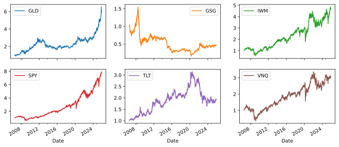
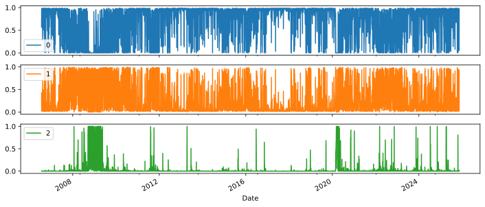
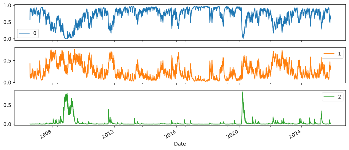
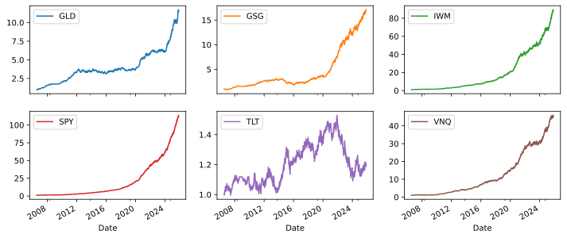
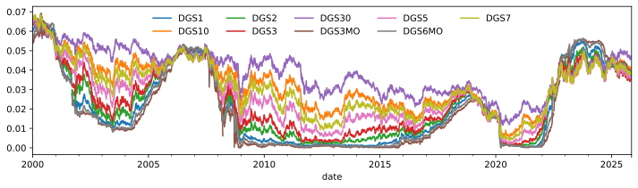

1. GMMs are a type of hidden state model
2. Normally, we estimate expected return, expected variance, expected correlation. In a state space model, we estimate these for some number of states and estimate the expected state, or the probability of each state.

# The basics

## Latent states

We are going to model a market with $d$ assets. The vector of returns at time $t$ is $\boldsymbol{r}_t \in \mathbb{R}^d$. In a hidden state model, we say that the market is in one of $K$ states and that each state is associated with a distribution that generates $\boldsymbol{r}_t$.

There are two notations for the state. We can say that the state is $k$, i.e. we can ask "what is the distribution of $\boldsymbol{r}_t$ given we are in state $k$?". We can also represent the state with a vector $\boldsymbol{z}$ which has $z\_{k} = 1$ if the state is $k$ and $0$ for all other states.

Based on this definition of states, we can write out a few distributions.

**Prior distribution.** The probability of being in state $k$ is:
$$
p(k)
$$

**Emission distribution.** The probability of observing $\boldsymbol{r}_t$ given we are in state $k$ is:
$$
p(\boldsymbol{r}_t | k)
$$
this is often called the *emission* distribution. Later on, we will give this a shape (Gaussian) and parameters.

**Joint distribution.** The probability that we are in state $k$ *and* we observe $\boldsymbol{r}_t$ is (using both notations):
$$
\begin{aligned}
p(k, \boldsymbol{r}_t) &= p(k) p(\boldsymbol{r}_t | k) \\\
\\\
p(\boldsymbol{z}, \boldsymbol{r}_t) &= \prod_k \left[ p(k) p(\boldsymbol{r}_t | k) \right]^{z_k} \\\
\end{aligned}
$$
The information $\boldsymbol{z}$ and $\boldsymbol{r}_t$ are often called the *full set* because at time $t$ the full set of information is the state and the realised returns.

**Mixture distribution.** The probability that we observe $\boldsymbol{r}_t$ is:
$$
p(\boldsymbol{r}_t) = \sum_k^K p(k)p(\boldsymbol{r}_t | k)
$$
Here we've combined or "mixed" the emission distributions into a "mixture" distribution.

**Posterior distribution.** The probability that we are in state $k$ given we observe $\boldsymbol{r}_t$ is derived from the above distributions using Bayes' theorem:
$$
p(k|\boldsymbol{r}_t) = \frac{p(k)p(\boldsymbol{r}_t|k)}{p(\boldsymbol{r}_t)} = \frac{p(k)p(\boldsymbol{r}_t|k)}{\sum_k^K p(k)p(\boldsymbol{r}_t | k)}
$$
This is often viewed as the *responsibility* that state $k$ has for explaining or generating the observation $\boldsymbol{r}_t$ [^Bishop2006].

To do useful things with this latent state model, we need to assume specific distributions for $p(k)$ and $p(\boldsymbol{r}_t | k)$.

## Mixture of Gaussians

We will fix the priors to a single value:
$$
p(k) = \pi_k, \quad \pi_k \ge 0, \quad \sum \pi_k = 1
$$
The emission distribution is set as a Gaussian:
$$
p(\boldsymbol{r}_t | k) = \mathcal{N}(\boldsymbol{\mu}_k, \boldsymbol{\Sigma}_k)
$$
which means the mixture distribtion is:
$$
p(\boldsymbol{r}_t) = \sum_k^K \pi_k \mathcal{N}(\boldsymbol{\mu}_k, \boldsymbol{\Sigma}_k)
$$
which is called *a mixture of Gaussians* [^Bishop2006] or a Gaussian mixture model (GMM).

The posterior distribution becomes:
$$
p(k|\boldsymbol{r}_t) = \frac{\pi_k\mathcal{N}(\boldsymbol{\mu}_k, \boldsymbol{\Sigma}_k)}{\sum_k^K \pi_k\mathcal{N}(\boldsymbol{\mu}_k, \boldsymbol{\Sigma}_k)}
$$

<todo>Some good visuals of a GMM would work well here.</todo>

## Estimation

Define $\boldsymbol{R} = [\boldsymbol{r}_1, \dots, \boldsymbol{r}_t]$ to be all the observations and $\boldsymbol{Z} = [\boldsymbol{z}_1, \dots, \boldsymbol{z}_t]$ to be the corresponding hidden states. We will fix the number of states to be $K$. We want to estimate the values $\pi_k$, $\boldsymbol{\mu}_k$ and $\boldsymbol{\Sigma}_k$ for each of the states.

The usual method of estimating a model is to maximise the log of the likelihood function of the given set of samples. In this case, the likelihood is:
$$
p(\boldsymbol{R}) = \prod_t p(\boldsymbol{r}_t) = \prod_t \left[ \sum_k^K p(k)p(\boldsymbol{r}_t | k) \right]
$$
Taking the log gives us this:
$$
\begin{aligned}
\mathcal{L}( \boldsymbol{R} | \boldsymbol{\pi}, \boldsymbol{\mu}, \boldsymbol{\Sigma}) &= \sum_t \log \left( \sum_k^K p(k)p(\boldsymbol{r}_t | k) \right) \\\
&= \sum_t \log \left( \sum_k^K \pi_k \mathcal{N}(\boldsymbol{r}_t | \boldsymbol{\mu}_k, \boldsymbol{\Sigma}_k) \right) \\\
\end{aligned}
$$
which is a very complex function to maximise due to the summation within the logarithm. In fact, there isn't a closed form solution to this. We can derive an iterative solution which is called the expectation maximisation (EM) algorithm in general. The EM algorithm is an iterative method of finding a solution to a hidden state model. There is a fair amount of theory which you can read about [^Bishop2006]. Here, we will just give a light derivation.

We first switch from using $p(\boldsymbol{R})$ to using the full set distribution and its log-likelihood:
$$
\begin{aligned}
p(\boldsymbol{Z}, \boldsymbol{R}) &= \prod_t\prod_k \left[ p(k) p(\boldsymbol{r}_t | k) \right]^{z\_{tk}} \\\
&= \prod_t\prod_k \left[ \pi_k \mathcal{N}(\boldsymbol{r}_t | \boldsymbol{\mu}_k, \boldsymbol{\Sigma}_k) \right]^{z\_{tk}} \\\
\mathcal{L}( \boldsymbol{R}, \boldsymbol{Z} | \boldsymbol{\pi}, \boldsymbol{\mu}, \boldsymbol{\Sigma}) &= \\sum_t \sum_k z\_{tk} \log \left( \pi_k \mathcal{N}(\boldsymbol{r}_t | \boldsymbol{\mu}_k, \boldsymbol{\Sigma}_k) \right) \\\
\end{aligned}
$$

The EM algorithm proceeds as follows:
1. **Initialise**: Pick some initial values for the parameters $\pi_k$, $\boldsymbol{\mu}_k$ and $\boldsymbol{\Sigma}_k$.
2. **E-step**: Calculate the expected value of $\boldsymbol{Z}$ given: $\boldsymbol{R}$, $\pi_k$, $\boldsymbol{\mu}_k$ and $\boldsymbol{\Sigma}_k$ $\forall k$.
3. **M-step**: Use these values as values for $\boldsymbol{Z}$ and maximise the log-likelihood with respect to the parameters $\pi_k$, $\boldsymbol{\mu}_k$ and $\boldsymbol{\Sigma}_k$.
4. **Check**: Calculate the log-likelihood $\mathcal{L}( \boldsymbol{R} | \boldsymbol{\pi}, \boldsymbol{\mu}, \boldsymbol{\Sigma})$ and check for convergence in the parameters or the log-likelihood value. If not converged, return to step 2.

**E-step** Recall that each element of $\boldsymbol{Z}$ is a one-hot vector indicating the state at time $t$. The expected value of $z\_{tk}$ is just the posterior probability that we are in state $k$ given $\boldsymbol{r}_t$:
$$
E[z\_{tk}] = p(k | \boldsymbol{r}_t) = \frac{\pi_k\mathcal{N}(\boldsymbol{r}_t | \boldsymbol{\mu}_k, \boldsymbol{\Sigma}_k)}{\sum_k^K \pi_k\mathcal{N}(\boldsymbol{r}_t | \boldsymbol{\mu}_k, \boldsymbol{\Sigma}_k)}
$$

**M-step** To maximise the log-likelihood with respect to the parameters, we take the derivatives and set them to zero. This gives us the following update equations:
$$
\begin{aligned}
\pi_k &= \frac{T_k}{T} \\\
\boldsymbol{\mu}_k &= \frac{1}{T_k}\sum_t E[z\_{tk}] \boldsymbol{r}_t \\\
\boldsymbol{\Sigma}_k &= \frac{1}{T_k} \sum_t E[z\_{tk}] (\boldsymbol{r}_t - \boldsymbol{\mu}_k)(\boldsymbol{r}_t - \boldsymbol{\mu}_k)^\top
\end{aligned}
$$
where
$$
T_k = \sum_t E[z\_{tk}]
$$
is the number of samples attributed to state $k$.

## Portfolio construction

For each of the $k$ states, if we have portfolio weights $\boldsymbol{w}$ we can calculate the expected portfolio return as:
$$
E_k[r_t] = \mu_k = \boldsymbol{w}^\top \boldsymbol{\mu}_k
$$
and the expected variance as:
$$
\sigma^2_k = \boldsymbol{w}^\top \boldsymbol{\Sigma}_k \boldsymbol{w}
$$
We can safely assume that the portfolio return between each state is uncorrelated.


Given a set of PDFs $f_i$ and mixing weights $p_i$ the PDF of the mixture is:
$$
f(x) = \sum_i p_i f_i(x)
$$
It follows that any moment of the mixture distribution is the weighted sum of the moments of the individual distributions:
$$
E[X^n] = \sum_i p_i E_i[X^n]
$$

Thus, the expected portfolio return across all states is:
$$
E[r_t] = \mu = \sum_k^K \pi_k E_k[r_t] = \sum_k^K \pi_k \boldsymbol{w}^\top\boldsymbol{\mu}_k
$$
We can collect that last sum on the right hand side into a single mean vector:
$$
\boldsymbol{\mu} = \sum_k^K \pi_k \boldsymbol{\mu}_k
$$
such that the expected portfolio return is:
$$
E[r_t] = \mu = \boldsymbol{w}^\top \boldsymbol{\mu}
$$

The expected portfolio variance across all states is:
$$\begin{aligned}
E[(r_t - E[r_t])^2] &= E[r_t^2] - (E[r_t])^2 \\\
&= \sum_k^K \pi_k E_k[r_t^2] - (E[r_t])^2 \\\
&= \sum_k^K \pi_k \left( \sigma^2_k + (E_k[r_t])^2 \right) - (E[r_t])^2 \\\
&= \sum_k^K \pi_k \sigma^2_k + \sum_k^K \pi_k (E_k[r_t])^2 - (E[r_t])^2 \\\
\end{aligned}
$$
Expanding out the variance and moments:
$$
= \sum_k^K \pi_k \boldsymbol{w}^\top \boldsymbol{\Sigma}_k \boldsymbol{w} + \sum_k^K \pi_k (\boldsymbol{w}^\top \boldsymbol{\mu}_k)^2 - ( \boldsymbol{w}^\top \boldsymbol{\mu} )^2
$$
which is just a sum of quadratic terms. We can collect the terms into a single covariance matrix:
$$
\boldsymbol{\Sigma} = \sum_k^K \pi_k \boldsymbol{\Sigma}_k + \sum_k^K \pi_k \boldsymbol{\mu}_k \boldsymbol{\mu}_k^\top - \boldsymbol{\mu}\boldsymbol{\mu}^\top
$$
such that the expected portfolio variance is:
$$
\sigma^2 = \boldsymbol{w}^\top \boldsymbol{\Sigma} \boldsymbol{w}
$$

In practice, you'll find that the GMM mean and cov matches almost exactly the empirical mean and cov when fitted to financial returns. The only difference is that in the GMM model, we can break the mean and cov down into different states.

# Example

We can grab some returns with:
```python
import yfinance as yf

tickers = yf.Tickers("SPY TLT GLD GSG VNQ IWM")
prices = tickers.download(period="30y", interval="1d")
returns = prices["Close"].pct_change().dropna()
```



We can fit a Gaussian Mixture Model with the help of scikit-learn's `GaussianMixture` class ([docs](https://scikit-learn.org/stable/modules/generated/sklearn.mixture.GaussianMixture.html)).

The only decision we need to make is how many states to use. It's fairly common to go with a small number of states (2-4). We're going to use 3 states as it gives us surprising results that are not immediately obvious. You might think that the model will converge to states that align with a "bull", "bear" and "neutral" market. However, this is not the case, and the actual states are far more interesting.

We can fit the model with:

```python
from sklearn.mixture import GaussianMixture
import pandas as pd

model = GaussianMixture(n_components=3, random_state=42)
model.fit(returns)
```
For now, we are going to do this in-sample and investigate the results.

The fitted mixing coefficients ($\pi_k$) can be found with `model.weights_` and look like this:

|   State 0 |   State 1 |   State 2 |
|-----------|-----------|-----------|
|    60.34% |    35.78% |     3.88% |

In this case, the model is saying that State 0 is the most common state, followed by State 1 and then State 2. Curiously, State 2 is very rare.

We can look at the mean vectors ($\boldsymbol{\mu}_k$) with `model.means_`:

<table border="1" class="dataframe">
  <thead>
    <tr style="text-align: right;">
      <th></th>
      <th>0</th>
      <th>1</th>
      <th>2</th>
    </tr>
    <tr>
      <th>symbol</th>
      <th></th>
      <th></th>
      <th></th>
    </tr>
  </thead>
  <tbody>
    <tr>
      <th>SPY</th>
      <td>0.1087%</td>
      <td>-0.0488%</td>
      <td>-0.1900%</td>
    </tr>
    <tr>
      <th>TLT</th>
      <td>0.0431%</td>
      <td>-0.0181%</td>
      <td>0.1740%</td>
    </tr>
    <tr>
      <th>GLD</th>
      <td>0.0474%</td>
      <td>0.0102%</td>
      <td>-0.0021%</td>
    </tr>
    <tr>
      <th>GSG</th>
      <td>0.0697%</td>
      <td>-0.0235%</td>
      <td>-0.5395%</td>
    </tr>
  </tbody>
</table>

In the table above, we can see that State 0 has positive expected returns for all assets. This looks like a "bull" market. State 1 has negative expected returns for most assets. State 2 has some large negative expected returns.

We can also look at the covariance matrices ($\boldsymbol{\Sigma}_k$) with `model.covariances_`. These are a bit more difficult to visualise, but we can look at the standard deviations (the square root of the diagonal elements):

<table border="1" class="dataframe">
  <thead>
    <tr style="text-align: right;">
      <th></th>
      <th>State 0</th>
      <th>State 1</th>
      <th>State 2</th>
    </tr>
    <tr>
      <th>symbol</th>
      <th></th>
      <th></th>
      <th></th>
    </tr>
  </thead>
  <tbody>
    <tr>
      <th>SPY</th>
      <td>9.64%</td>
      <td>21.06%</td>
      <td>54.19%</td>
    </tr>
    <tr>
      <th>TLT</th>
      <td>9.40%</td>
      <td>15.18%</td>
      <td>29.89%</td>
    </tr>
    <tr>
      <th>GLD</th>
      <td>9.77%</td>
      <td>19.37%</td>
      <td>42.41%</td>
    </tr>
    <tr>
      <th>GSG</th>
      <td>14.52%</td>
      <td>24.84%</td>
      <td>55.10%</td>
    </tr>
  </tbody>
</table>

The main thing to notice here is that State 2 has much higher volatilities than the other two states. This suggests that State 2 is a high-volatility state.

The story so far is that we have a "bull" market (State 0), a "bear" market (State 1) and a "tail" market (State 2).

Things get really interesting when we look at the posterior state probabilities for each time period. We can get these into a DataFrame with:

```python
import pandas as pd

posterior = pd.DataFrame(
    data=model.predict_proba(returns),
    index=returns.index,
)
```

Plotting these straight away gives us:



This is a little bit hard to see what is going on. Looking at state 2, we can see it clustering around certain periods of time. We can highlight this clustering by smoothing the posterior probabilities with an exponential moving average:

```python
posterior.ewm(halflife=5).mean()
```

Plotting the smoothed posterior probabilities gives us:



We see two big clusters of State 2 activity and lots of little clusters. The first big one is around the 2008 financial crisis and the second is around the 2020 COVID crash. This makes sense as these were both periods of high volatility---both tail events.

We can also get a good view of how returns behave in each state by multiplying the returns by the posterior probablities. To get a frame of each state's returns for a single asset, we can do:

```python
posterior.multiply(returns['SPY'], axis=0)
```

Looking at state 0:



The statistics we looked at for state 0 suggested a "bull" market and this plot confirms that. All of the returns are positive. The only one that stands out is TLT (bonds).

State 1 looks like:


This is also inline with our earlier intuition that state 1 is a "bear" market. Most of the returns are negative, with the exception of TLT which is mostly positive. Similarly to state 0, the returns for TLT do not quite match the rest of this state. In the case of state 1, TLT acts as a hedge with mostly positive returns while the remaining assets negative returns.

Finally, state 2:


This is the most interesting state. It's a little harder to interpret as there are fewer examples of this state. As such, the return plots are mostly flat (as there are many time periods not in this state). However, we can see that the returns are much more extreme in this state. Similarly to before, this state seems to represent a "tail" market with high volatility and extreme returns.

The conclusion from this example is that a Gaussian Mixture Model can identify economically meaningful latent market states. The model was able to not just identify bull and bear periods, but also periods of tail risk.

However, once the model is fitted, we are limited to the sample wide set of mixing coefficients $\pi_k$. This means we are not able to predict future returns any better than using the empirical mean and covariance. We need to extend this model to be able to predict future states.

# Reflecting current volatility
We're fitting over long periods of time. This means that the current volatility is not reflected in our forecasts.

# Making predictions

Once we have fitted a GMM to historical returns, we have the following fitted parameters:
1. Mixing coefficients $p(k) = \pi_k$
2. Mean vectors $\boldsymbol{\mu}_k$
3. Covariance matrices $\boldsymbol{\Sigma}_k$

The next thing we want to do is make a prediction about the next time period's return. Specifically, we want to predict which state we will be in next period. With the current model, the mixing coefficients $\pi_k$ are fixed. This means that our best estimate for the next period's state is the historical frequency of each state.

## Incorporating information variables

Now, let's say we have some extra information that we know at the decision point before $\boldsymbol{r}_t$ is realised. Let's denote it with the vector $\boldsymbol{x}_t$. Now, rather than modelling $p(k)$ we can model $p(k | \boldsymbol{x}_t)$. This means that our mixing coefficients are now time-varying and depend on the information $\boldsymbol{x}_t$. We're going to model $p(k | \boldsymbol{x}_t)$ as a multinomial logit model [^Gruen2008]:
$$
p(k|\boldsymbol{x}_t) = \frac{e^{\boldsymbol{\beta}_k^T\boldsymbol{x}_t + b_k}}{\sum_j^K e^{\boldsymbol{\beta}\_j^T\boldsymbol{x}\_t + b_j}}
$$
Where the coefficients $\boldsymbol{\beta}_k$ and intercept $b_k$ are parameters to be estimated. 

We initialise the parameters in the same way (using KMeans) except that we set $\boldsymbol{\beta}_k = 0$ and $b_k = \log(\pi_k)$ so that the initial mixing coefficients match the historical frequencies.

**E-step** The expected response works in much the same way as before, we just use  $p(k | \boldsymbol{x}_t)$ intead of $p(k)$:
$$
E[z\_{tk}] = p(k | \boldsymbol{r}_t, \boldsymbol{x}_t) = \frac{p(k|\boldsymbol{x}_t)\mathcal{N}(\boldsymbol{r}_t | \boldsymbol{\mu}_k, \boldsymbol{\Sigma}_k)}{\sum_j^K p(j|\boldsymbol{x}_t)\mathcal{N}(\boldsymbol{r}_t | \boldsymbol{\mu}_j, \boldsymbol{\Sigma}_j)}
$$

**M-step** The state means and covariance matrices are the same as before:
$$
\begin{aligned}
\boldsymbol{\mu}_k &= \frac{1}{T_k}\sum_t E[z\_{tk}] \boldsymbol{r}_t \\\
\boldsymbol{\Sigma}_k &= \frac{1}{T_k} \sum_t E[z\_{tk}] (\boldsymbol{r}_t - \boldsymbol{\mu}_k)(\boldsymbol{r}_t - \boldsymbol{\mu}_k)^\top
\end{aligned}
$$

To find the logistic regression parameters $\boldsymbol{\beta}_k$ and $b_k$, we take the full set log-likelihood and isolate the terms that depend on these parameters:
$$
\mathcal{L}( \boldsymbol{R}, \boldsymbol{Z} | \boldsymbol{\beta}, \boldsymbol{b}) = \sum_t \sum_k E[z\_{tk}] \log \left( p(k|\boldsymbol{x}_t) \right) + \text{const}
$$
expanding out $p(k|\boldsymbol{x}_t)$ gives us:
$$
\mathcal{L}( \boldsymbol{R}, \boldsymbol{Z} | \boldsymbol{\beta}, \boldsymbol{b}) = \sum_t \sum_k E[z\_{tk}] \left( \boldsymbol{\beta}_k^T\boldsymbol{x}_t + b_k - \log \left( \sum_j^K e^{\boldsymbol{\beta}\_j^T\boldsymbol{x}\_t + b_j} \right) \right) + \text{const}
$$
We'll also add a L2 regularisation term to avoid overfitting:
$$
-\lambda \sum_k \left( ||\boldsymbol{\beta}\_k||^2 \right)
$$

To find the maximum, we'll assume that the intercept is in $\boldsymbol{x}_t$ so that we do not need to worry about $b_k$ and we take the derivative with respect to $\boldsymbol {\beta}_k$:
$$
\frac{\partial \mathcal{L}}{\partial \boldsymbol{\beta}_k} = \sum_t \left( E[z\_{tk}] - p(k|\boldsymbol{x}_t) \right) \boldsymbol{x}_t - 2 \lambda \boldsymbol{\beta}_k
$$
Setting this to zero gives us the maximum. There is no closed form solution for $\boldsymbol{\beta}_k$, but we can use gradient ascent to find the maximum.

The model has a fairly large number of degress of freedom as we are estimating a multinomial probability distribution. If there are $k$ classes then one of the class probabilities is just 1 minus the probability of the remaining classes. We get around this by Fixing one of the classes coefficents to 0. That means we are estimating the other states relative to that state.

## Code

The actual code works in log space as much as possible to avoid numerical issues.

The current code forces an intercept in the logistic regression by adding a column of ones to $\boldsymbol{x}_t$. We might not want an intercept because this adds an indeterminancy to the model.

<todo>Update model so that we do not have an intercept.</todo>

# Economic analysis

We now have a hidden state model with time-varying mixing coefficients. This means that we can investigate how different information variables $\boldsymbol{x}_t$ affect the probability of being in each state.

## Macro-economic variables

We're going to investigate the use of macro-economic variables as information variables. Specifically, we're going to use:

**US Treasury yields.** We'll include daily treasury yields for 1, 2, 3, 5, 7, 10 and 30 year maturities. These yields reflect the market's expectations of future interest rates and economic growth. We fetch these from FRED.


**VIX.** The VIX index is a measure of market volatility derived from S&P 500 options prices. It is often referred to as the "fear gauge" as it tends to spike during periods of market stress. We fetch this from CBOE.


**US GDP growth rate.** The GDP growth rate is a measure of economic growth. It is released quarterly by the Bureau of Economic Analysis (BEA). We fetch this from FRED.


**US CPI growth rate.** The CPI growth rate is a measure of inflation. It is released monthly by the Bureau of Labor Statistics (BLS). We fetch this from FRED.


**US money supply.** The M2 money supply is a measure of the total amount of money in circulation. It is released weekly by the Federal Reserve. We fetch this from FRED.


**Unemployment rate.** The unemployment rate is a measure of the percentage of people who are unemployed. It is released monthly by the BLS. We fetch this from FRED.


**Consumer sentiment index.** The consumer sentiment index is a measure of consumer confidence. It is released monthly by the University of Michigan. We fetch this from FRED.


1. The economic policy uncertainty index (EPU)
We can grab this data from various sources. The treasury yields can be grabbed from the Federal Reserve Economic Data (FRED) website. The VIX index can be grabbed from Yahoo Finance. The EPU index can be grabbed from [PolicyUncertainty.com](https://www.policyuncertainty.com/).
1. Savings
1. Debt
1. Consumer confidence index
1. Manufacturing PMI
1. Retail sales
1. Housing starts
1. Industrial production index
1. Corporate bond spreads
1. Credit default swap spreads
1. Commodity prices (e.g., oil, gold)
1. Exchange rates (e.g., USD index, EUR/USD)
1. Market liquidity measures (e.g., bid-ask spreads, trading volume)
1. Investor sentiment indicators (e.g., AAII sentiment survey)
1. Geopolitical risk indices
1. Financial stress indices
1. Market volatility indices (e.g., VIX, MOVE)
1. Economic policy uncertainty indices
1. Yield curve measures (e.g., slope, curvature)
1. Market breadth indicators (e.g., advance-decline line)
1. Technical indicators (e.g., moving averages, RSI)


{}

{}
