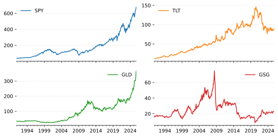
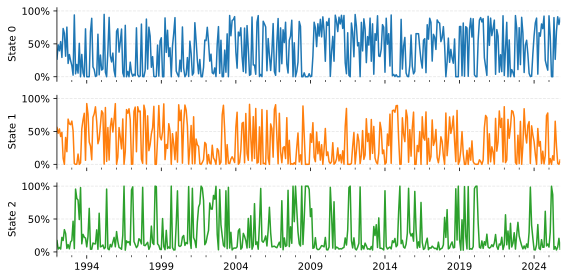
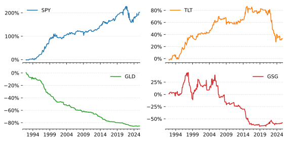
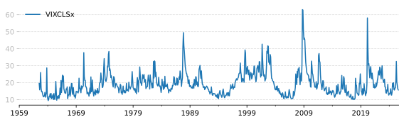
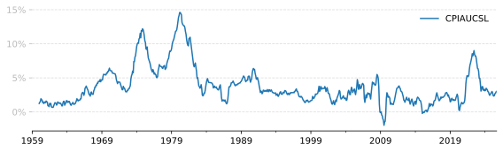
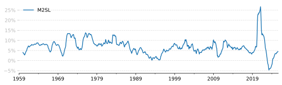
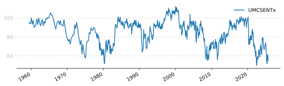

<note>Some time ago I read a Two Sigma article on using Gaussian mixture models for regime detection [^Botte2021]. I wanted to understand the math behind these methods and extend them by tying the results to economic variables. This article is the write-up of that work.</note>

One way to think of market returns is that they are generated by some underlying economic state or regime. For example, during a recession equity returns tend to be lower and more volatile than during a period of growth. The recession is one state while the period of growth is another.

The state of the economy is not directly observable, only the returns in the market and various economic indicators. As the state is not directly observable, we call it a *latent* or *hidden* state.

There are various methods that can be used to model latent states. The one we will use here is the finite [mixture model](https://en.wikipedia.org/wiki/Mixture_model). A finite mixture model assumes that there are a finite number of hidden states and that each state is associated with a probability distribution that generates the observed data. We will focus on the Gaussian mixture model (GMM) where each state is associated with a multivariate Gaussian distribution.

In this article we cover:
1. Basics of Gaussian mixture models.
1. Key modeling decisions.
1. Modeling states as dependent on covariates.
1. Economic analysis.

# The basics

## Finite mixture models

We are going to model a market with $d$ assets. The vector of returns at time $t$ is $\boldsymbol{r}_t \in \mathbb{R}^d$. We say that the market is in one of $K$ states and that each state is associated with a distribution that generates $\boldsymbol{r}_t$.

There are two notations for the state. We can say that the state is $k$, i.e. we can ask "what is the distribution of $\boldsymbol{r}_t$ given we are in state $k$?". We can also represent the state with a vector $\boldsymbol{z}$ which has $z\_{k} = 1$ if the state is $k$ and $0$ for all other states.

Based on this definition of states, we can name a few distributions without specifying their exact form.

**Prior distribution.** The probability of being in state $k$ is:
$$
p(k)
$$

**Emission distribution.** The probability of observing $\boldsymbol{r}_t$ given we are in state $k$ is:
$$
p(\boldsymbol{r}_t | k)
$$
this is often called the *emission* distribution. Later on, we will give this a shape (Gaussian) and parameters.

**Joint distribution.** The probability that we are in state $k$ *and* we observe $\boldsymbol{r}_t$ is (using both notations):
$$
\begin{aligned}
p(k, \boldsymbol{r}_t) &= p(k) p(\boldsymbol{r}_t | k) \\\
\\\
p(\boldsymbol{z}, \boldsymbol{r}_t) &= \prod_k \left[ p(k) p(\boldsymbol{r}_t | k) \right]^{z_k} \\\
\end{aligned}
$$
The information $\boldsymbol{z}$ and $\boldsymbol{r}_t$ are often called the *full set* because at time $t$ the full set of information is the state and the realized returns.

**Mixture distribution.** The probability that we observe $\boldsymbol{r}_t$ is:
$$
p(\boldsymbol{r}_t) = \sum_k^K p(k)p(\boldsymbol{r}_t | k)
$$
Here we've combined or "mixed" the emission distributions into a "mixture" distribution. Under this model, the prior distribution $p(k)$ is sometimes referred to as the *mixing weights*.

**Posterior distribution.** The probability that we are in state $k$ given we observe $\boldsymbol{r}_t$ is derived from the above distributions using Bayes' theorem:
$$
p(k|\boldsymbol{r}_t) = \frac{p(k)p(\boldsymbol{r}_t|k)}{p(\boldsymbol{r}_t)} = \frac{p(k)p(\boldsymbol{r}_t|k)}{\sum_k^K p(k)p(\boldsymbol{r}_t | k)}
$$
This is often viewed as the *responsibility* that state $k$ has for explaining or generating the observation $\boldsymbol{r}_t$ [^Bishop2006].

To do useful things with this latent state model, we need to assume specific distributions for $p(k)$ and $p(\boldsymbol{r}_t | k)$.

## Mixture of Gaussians

We fix the prior probabilities:
$$
p(k) = \pi_k, \quad \pi_k \ge 0, \quad \sum \pi_k = 1
$$
The emission distribution is set as a Gaussian:
$$
\begin{aligned}
p(\boldsymbol{r}_t | k) &= \mathcal{N}(\boldsymbol{r}_t | \boldsymbol{\mu}_k, \boldsymbol{\Sigma}_k) \\\
&= \frac{1}{(2\pi)^{d/2} |\boldsymbol{\Sigma}_k|^{1/2}} e^{ \left( -\frac{1}{2} (\boldsymbol{r}_t - \boldsymbol{\mu}_k)^\top \boldsymbol{\Sigma}_k^{-1} (\boldsymbol{r}_t - \boldsymbol{\mu}_k) \right)} \\\
\end{aligned}
$$
which means the mixture distribution is:
$$
p(\boldsymbol{r}_t) = \sum_k^K \pi_k \mathcal{N}(\boldsymbol{r}_t | \boldsymbol{\mu}_k, \boldsymbol{\Sigma}_k)
$$
which is called *a mixture of Gaussians* [^Bishop2006] or a Gaussian mixture model (GMM).


Two Gaussian distributions are shown in the top panel. Mixing them yields the new distribution in the bottom panel with an almost Gaussian shape and a pronounced right tail. Mixing more Gaussians produces more complex shapes.


The most interesting distribution is the posterior distribution which becomes:
$$p(k|\boldsymbol{r}_t) = \frac{\pi_k\mathcal{N}(\boldsymbol{r}_t | \boldsymbol{\mu}_k, \boldsymbol{\Sigma}_k)}{\sum_k^K \pi_k\mathcal{N}(\boldsymbol{r}_t | \boldsymbol{\mu}_k, \boldsymbol{\Sigma}_k)}
$$


## Estimation

Define $\boldsymbol{R} = [\boldsymbol{r}_1, \dots, \boldsymbol{r}_t]$ to be all the observations and $\boldsymbol{Z} = [\boldsymbol{z}_1, \dots, \boldsymbol{z}_t]$ to be the corresponding hidden states. We will fix the number of states to be $K$. We want to estimate the values $\pi_k$, $\boldsymbol{\mu}_k$ and $\boldsymbol{\Sigma}_k$ for each of the states.

The usual method of estimating a model's parameters is to maximize the log-likelihood for the sample. Here the likelihood is:
$$
p(\boldsymbol{R}) = \prod_t p(\boldsymbol{r}_t) = \prod_t \left[ \sum_k^K p(k)p(\boldsymbol{r}_t | k) \right]
$$
Taking the log gives us this:
$$
\begin{aligned}
\mathcal{L}( \boldsymbol{R} | \boldsymbol{\pi}, \boldsymbol{\mu}, \boldsymbol{\Sigma}) &= \sum_t \log \left( \sum_k^K p(k)p(\boldsymbol{r}_t | k) \right) \\\
&= \sum_t \log \left( \sum_k^K \pi_k \mathcal{N}(\boldsymbol{r}_t | \boldsymbol{\mu}_k, \boldsymbol{\Sigma}_k) \right) \\\
\end{aligned}
$$
This is difficult to maximize directly because of the inner summation. There is no closed form solution. An iterative solution exists which is called the expectation maximisation (EM) algorithm in general. There is a fair amount of theory which you can read about [^Bishop2006]. Here, we will just give a light derivation.

We first switch from using $p(\boldsymbol{R})$ to using the full set distribution and its log-likelihood:
$$
\begin{aligned}
p(\boldsymbol{Z}, \boldsymbol{R}) &= \prod_t\prod_k \left[ p(k) p(\boldsymbol{r}_t | k) \right]^{z\_{tk}} \\\
&= \prod_t\prod_k \left[ \pi_k \mathcal{N}(\boldsymbol{r}_t | \boldsymbol{\mu}_k, \boldsymbol{\Sigma}_k) \right]^{z\_{tk}} \\\
\mathcal{L}( \boldsymbol{R}, \boldsymbol{Z} | \boldsymbol{\pi}, \boldsymbol{\mu}, \boldsymbol{\Sigma}) &= \\sum_t \sum_k z\_{tk} \log \left( \pi_k \mathcal{N}(\boldsymbol{r}_t | \boldsymbol{\mu}_k, \boldsymbol{\Sigma}_k) \right) \\\
\end{aligned}
$$

The EM algorithm proceeds as follows:
1. **Initialize**: Choose initial values for $\pi_k$, $\boldsymbol{\mu}_k$ and $\boldsymbol{\Sigma}_k$.
2. **E-step**: Calculate $E[\boldsymbol{Z}]$ (posterior probabilities) given $\boldsymbol{R}$, $\pi_k$, $\boldsymbol{\mu}_k$ and $\boldsymbol{\Sigma}_k$ for all $k$.
3. **M-step**: Set $\boldsymbol{Z} = E[\boldsymbol{Z}]$ and maximize the log-likelihood with respect to $\pi_k$, $\boldsymbol{\mu}_k$ and $\boldsymbol{\Sigma}_k$.
4. **Check**: Calculate $\mathcal{L}( \boldsymbol{R} | \boldsymbol{\pi}, \boldsymbol{\mu}, \boldsymbol{\Sigma})$ and test for convergence. If not converged, return to step 2.

Initialization involves picking starting posterior probabilities. Once chosen, you can proceed with the M-step. These can be random or derived from K-means. K-means imposes spherical clusters (no correlations), which is inappropriate for financial returns, so we use random initialization.

**E-step.** Each element of $\boldsymbol{Z}$ is a one-hot vector for the state at time $t$. The expected value of $z\_{tk}$ is the posterior probability of state $k$ given $\boldsymbol{r}_t$:
$$
E[z\_{tk}] = p(k | \boldsymbol{r}_t) = \frac{\pi_k\mathcal{N}(\boldsymbol{r}_t | \boldsymbol{\mu}_k, \boldsymbol{\Sigma}_k)}{\sum_k^K \pi_k\mathcal{N}(\boldsymbol{r}_t | \boldsymbol{\mu}_k, \boldsymbol{\Sigma}_k)}
$$

**M-step** To maximize the log-likelihood with respect to the parameters, we take the derivatives and set them to zero. This gives the update equations:
$$
\begin{aligned}
\pi_k &= \frac{T_k}{T} \\\
\boldsymbol{\mu}_k &= \frac{1}{T_k}\sum_t E[z\_{tk}] \boldsymbol{r}_t \\\
\boldsymbol{\Sigma}_k &= \frac{1}{T_k} \sum_t E[z\_{tk}] (\boldsymbol{r}_t - \boldsymbol{\mu}_k)(\boldsymbol{r}_t - \boldsymbol{\mu}_k)^\top
\end{aligned}
$$
where
$$
T_k = \sum_t E[z\_{tk}]
$$
is the number of samples attributed to state $k$.

## Portfolio construction

For each of the $k$ states, if we have portfolio weights $\boldsymbol{w}$ we can calculate the expected portfolio return as:
$$
E_k[r_t] = \mu_k = \boldsymbol{w}^\top \boldsymbol{\mu}_k
$$
and the expected variance as:
$$
\sigma^2_k = \boldsymbol{w}^\top \boldsymbol{\Sigma}_k \boldsymbol{w}
$$
We can safely assume that the portfolio returns between the states are uncorrelated.


Given a set of PDFs $f_i$ and mixing weights $p_i$ the PDF of the mixture is:
$$
f(x) = \sum_i p_i f_i(x)
$$
It follows that any moment of the mixture distribution is the weighted sum of the moments of the individual distributions:
$$
E[X^n] = \sum_i p_i E_i[X^n]
$$

Thus, the expected portfolio return across all states is:
$$
E[r_t] = \mu = \sum_k^K \pi_k E_k[r_t] = \sum_k^K \pi_k \boldsymbol{w}^\top\boldsymbol{\mu}_k
$$
Collect the last sum into a single mean vector:
$$
\boldsymbol{\mu} = \sum_k^K \pi_k \boldsymbol{\mu}_k
$$
such that the expected portfolio return is:
$$
E[r_t] = \mu = \boldsymbol{w}^\top \boldsymbol{\mu}
$$

The expected portfolio variance across all states is:
$$\begin{aligned}
E[(r_t - E[r_t])^2] &= E[r_t^2] - (E[r_t])^2 \\\
&= \sum_k^K \pi_k E_k[r_t^2] - (E[r_t])^2 \\\
&= \sum_k^K \pi_k \left( \sigma^2_k + (E_k[r_t])^2 \right) - (E[r_t])^2 \\\
&= \sum_k^K \pi_k \sigma^2_k + \sum_k^K \pi_k (E_k[r_t])^2 - (E[r_t])^2 \\\
\end{aligned}
$$
Expanding out the variance and moments:
$$
= \sum_k^K \pi_k \boldsymbol{w}^\top \boldsymbol{\Sigma}_k \boldsymbol{w} + \sum_k^K \pi_k (\boldsymbol{w}^\top \boldsymbol{\mu}_k)^2 - ( \boldsymbol{w}^\top \boldsymbol{\mu} )^2
$$
This is a sum of quadratic terms. Collect them into a single covariance matrix:
$$
\boldsymbol{\Sigma} = \sum_k^K \pi_k \boldsymbol{\Sigma}_k + \sum_k^K \pi_k \boldsymbol{\mu}_k \boldsymbol{\mu}_k^\top - \boldsymbol{\mu}\boldsymbol{\mu}^\top
$$
such that the expected portfolio variance is:
$$
\sigma^2 = \boldsymbol{w}^\top \boldsymbol{\Sigma} \boldsymbol{w}
$$

In practice, GMM mean and covariance match the empirical mean and covariance closely for financial returns. The advantage is the decomposition into states. Later we modify mixing weights to obtain time-varying means and covariances.

# Modeling decisions

Before we dig into an example, we need to decide the **time interval** for returns, whether to **devolatilize**, and **how many states** to use.

As we go through these decisions, we'll use real data. Since we want macroeconomic regimes, we select broad market ETFs representing major asset classes:
- SPY -- *US equities*
- TLT -- *US long-term bonds*
- GLD -- *Gold*
- GSG -- *Commodities*

## Time interval

Macroeconomic variables are usually reported monthly or quarterly. Quarterly data would reduce sample size substantially, so we use monthly intervals for variables and returns.

The ETF prices do not extend far back. We splice index data for SPY, GLD, and GSG, and approximate long-term bond returns for TLT using yields before inception, yielding prices back to 1990 (details in the [appendix](#appendix)).

The dataset of prices is available [here](broad_etf_prices.csv).

You can load the prices with:
```python
import pandas as pd
daily = pd.read_csv('broad_etf_prices.csv', index_col=0, parse_dates=True)
monthly = daily.resample('MS').last()
```
There are 419 months in the sample which looks like this:




## Devolatilize

Returns are [heteroscedastic](https://en.wikipedia.org/wiki/Homoscedasticity_and_heteroscedasticity); volatility changes over time. Many models assume identically distributed data. Without adjustment, a GMM tends to discover volatility regimes instead of economic regimes.

We address this by normalizing returns by recent volatility (*devolatilizing*). A simple method divides returns by an exponentially weighted moving standard deviation.

We illustrate the impact using daily SPY returns (easier to visualize).

```python
# Get the daily returns
returns = daily['SPY'].pct_change()

# Standardize the returns so that the result
# of all operations are on the same scale.
returns -= returns.mean()
returns /= returns.std()

# Calculate the rolling volatility BEFORE
# normalising over the last six months.
before = returns.ewm(halflife=126, min_periods=21).std()

# Remove the volatility clustering. Shift by 1
# so that this could be used in a live trading
# scenario.
std = returns.ewm(halflife=21, min_periods=21).std()
std = std.shift(1)
returns /= std

# Calculate the rolling volatility AFTER
# normalising over the last six months.
after = returns.ewm(halflife=126, min_periods=21).std()
```

Plotting `before` and `after`:


The exponentially weighted standard deviation of SPY daily returns (blue) used a 6-month half-life. Returns were devolatilized by dividing by the 1-month exponentially weighted standard deviation lagged by 1 (orange). Large volatility swings are removed.


From here on, we devolatilize monthly returns using a 6-month half-life. This hyperparameter could be tuned, but optimization is outside our scope.


## Number of states

We want each state to represent a meaningful economic regime. Too few states mix different regimes (underfitting). Too many states dilute economic meaning (overfitting).

We run a quick (not fully rigorous) out-of-sample experiment to guide the choice.

The experiment:
1. Split the data into a training set and a test set. Training set is everything before 2022-01-01 and test set is everything after. The test set has about 11% of the data.
1. Loop over a range for the number of states (1 to 8).
1. For each number of states, run 100 fits on the training set. The GMM performs 40 random initializations and picks the best one.
1. For each fit save the number of states and the test set log-likelihood.

We can fit a Gaussian Mixture Model with the help of scikit-learn's `GaussianMixture` class ([docs](https://scikit-learn.org/stable/modules/generated/sklearn.mixture.GaussianMixture.html)).

Once we have all the results, we plot the median test set log-likelihood for each number of states. We pick the number of states that maximizes the median test set log-likelihood.

Code for the experiment:
```python
from sklearn.mixture import GaussianMixture
from tqdm import tqdm
from datetime import datetime
from itertools import product

# Get our monthly returns
returns = monthly.pct_change()

# Devolatilize the returns
std = returns.ewm(halflife=6, min_periods=12).std()
std = std.shift(1)
devoled = (returns / std).dropna()

# Split into train and test
cutoff = datetime(2022, 1, 1)
train = devoled.loc[:cutoff]
test = devoled.loc[cutoff:]

# Test different numbers of states
states = [8, 7, 6, 5, 4, 3, 2, 1]

# For each state, do multiple runs
runs = range(100)

# Put the states and runs together for
# looping over.
loops = list(product(states, runs))

# We'll put the results of each
# loop in here for analysis later.
results: list[dict] = []

for num_states, run in tqdm(loops):

    gm = GaussianMixture(
        n_components=num_states,
        n_init=40,
        init_params='random',
    )

    gm.fit(train.values)
    
    results.append({
        'num_states': num_states,
        'run': run,
        'train_score': gm.score(train.values),
        'test_score': gm.score(test.values),
    })

results = pd.DataFrame(results)
```

Plotting the median test score per state gives us:


A GMM is fitted to devolatilized monthly returns for varying $K$ (number of states). The median test set log-likelihood is shown for each number of states. The highest median test set log-likelihood is achieved with 3 states.


For the rest of this article, we will use 3 states.

# Example

With monthly returns prepared, devolatilized, and the number of states chosen, we can fit a GMM and inspect results.

We can fit the model with:

```python
from sklearn.mixture import GaussianMixture

returns = monthly.pct_change().dropna()

# Devolatilize the returns
std = returns.ewm(halflife=6, min_periods=12).std()
std = std.shift(1)
devoled = (returns / std).dropna()

model = GaussianMixture(
    n_components=3,
    random_state=42,
    n_init=40,
    init_params='random',
)
model.fit(devoled)
```

The fitted mixing coefficients ($\pi_k$) can be found with `model.weights_` and look like this:

|   State 0 |   State 1 |   State 2 |
|-----------|-----------|-----------|
|    40.21% |    33.04% |    26.75% |

In this case, the model is saying that State 0 is the most common state, followed by State 1 and then State 2.

We can look at the mean vectors ($\boldsymbol{\mu}_k$) with `model.means_`:

|     |   State 0 |   State 1 |   State 2 |
|:----|----------:|----------:|----------:|
| SPY |    59.95% |    27.56% |   -47.29% |
| TLT |    -4.81% |    12.95% |    68.64% |
| GLD |    41.24% |   -35.78% |    48.17% |
| GSG |    35.67% |    -8.04% |   -26.61% |

It is hard to label states from numbers alone, but some intuition emerges. **State 0** looks inflationary: positive returns for hard assets and negative for the cash-related asset (TLT). **State 1** looks deflationary: modest equity returns, weaker gold and commodities. **State 2** appears distressed: large negative equity and commodity returns, large positive bond and gold means (flight-to-safety assets).

We can also look at the covariance matrices ($\boldsymbol{\Sigma}_k$) with `model.covariances_`. These are a bit more difficult to visualise, but we can look at the annualised standard deviations (the square root of the diagonal elements multiplied by $\sqrt{12}$):

|     |   State 0 |   State 1 |   State 2 |
|:----|----------:|----------:|----------:|
| SPY |      2.37 |      3.31 |      4.56 |
| TLT |      2.74 |      3.20 |      5.19 |
| GLD |      3.56 |      2.05 |      4.93 |
| GSG |      2.36 |      4.32 |      4.45 |


State 2 has much higher volatilities than the other two, consistent with a distressed state.

The posterior probabilities are good to check for sanity reasons, but they're not easy to interpret on their own. We can get them with:

```python
posterior = pd.DataFrame(
    data=model.predict_proba(devoled),
    index=devoled.index,
)
```
and they look like:



We can better view state behavior by weighting returns by posterior probabilities. For one asset's state-weighted returns:

```python
posterior.multiply(returns['SPY'], axis=0)
```

Looking at State 0:


State 0 aligns with an inflationary market: all positive except TLT.

State 1 looks like:



State 1 matches a deflationary market: lackluster equities, stronger bonds, weaker gold and commodities.

Finally, state 2:


This is the most interesting state. Here we see the flight-to-safety assets outperform. Combined with higher volatility, this indicates market distress.

The conclusion from this example: a Gaussian mixture model can identify economically meaningful latent market states. The model distinguishes not just up and down markets, but periods of distress. The story so far is that we have an inflationary regime (State 0), a deflationary regime (State 1) and a distressed regime (State 2).

However, with fixed mixing coefficients $\pi_k$, interpretation is limited to return behavior. We extend the model to associate states with other variables.

# Covariates

Once we have fitted a GMM to historical returns, we have the following fitted parameters:
1. Mixing coefficients $p(k) = \pi_k$
2. Mean vectors $\boldsymbol{\mu}_k$
3. Covariance matrices $\boldsymbol{\Sigma}_k$

The next thing we want to do is estimate the state at some time $t$. Specifically, we want to estimate the probability of each state at time $t$. With fixed mixing coefficients $\pi_k$, the best estimate is $\pi_k$.

## Incorporating covariates

Suppose we have additional information known at time $t$ before $\boldsymbol{r}_t$ is realized. Denote it as $\boldsymbol{x}_t$. Rather than modelling $p(k)$, we model $p(k | \boldsymbol{x}_t)$, yielding time-varying mixing coefficients.

We're going to model $p(k | \boldsymbol{x}_t)$ as a [multinomial logistic regression](https://en.wikipedia.org/wiki/Multinomial_logistic_regression) [^Gruen2008]:
$$
p(k|\boldsymbol{x}_t) = \frac{e^{\boldsymbol{\beta}_k^T\boldsymbol{x}_t}}{\sum_j^K e^{\boldsymbol{\beta}\_j^T\boldsymbol{x}\_t}}
$$
where the coefficients $\boldsymbol{\beta}_k$ are parameters to be estimated. 

We initialize as before: set random posterior probabilities and use an M-step to establish parameters.

**E-step.** As before, but replace $p(k)$ with $p(k | \boldsymbol{x}_t)$:
$$
E[z\_{tk}] = p(k | \boldsymbol{r}_t, \boldsymbol{x}_t) = \frac{p(k|\boldsymbol{x}_t)\mathcal{N}(\boldsymbol{r}_t | \boldsymbol{\mu}_k, \boldsymbol{\Sigma}_k)}{\sum_j^K p(j|\boldsymbol{x}_t)\mathcal{N}(\boldsymbol{r}_t | \boldsymbol{\mu}_j, \boldsymbol{\Sigma}_j)}
$$

**M-step.** State means and covariance matrices are unchanged:
$$
\begin{aligned}
\boldsymbol{\mu}_k &= \frac{1}{T_k}\sum_t E[z\_{tk}] \boldsymbol{r}_t \\\
\boldsymbol{\Sigma}_k &= \frac{1}{T_k} \sum_t E[z\_{tk}] (\boldsymbol{r}_t - \boldsymbol{\mu}_k)(\boldsymbol{r}_t - \boldsymbol{\mu}_k)^\top
\end{aligned}
$$

To find the logistic regression parameters $\boldsymbol{\beta}_k$, we take the full set log-likelihood and isolate the terms that depend on these parameters:
$$
\mathcal{L}( \boldsymbol{R}, \boldsymbol{Z} | \boldsymbol{\beta}, \boldsymbol{b}) = \sum_t \sum_k E[z\_{tk}] \log \left( p(k|\boldsymbol{x}_t) \right) + \text{const}
$$
Expanding $p(k|\boldsymbol{x}_t)$ gives:
$$
\mathcal{L}( \boldsymbol{R}, \boldsymbol{Z} | \boldsymbol{\beta}, \boldsymbol{b}) = \sum_t \sum_k E[z\_{tk}] \left( \boldsymbol{\beta}_k^T\boldsymbol{x}_t - \log \left( \sum_j^K e^{\boldsymbol{\beta}\_j^T\boldsymbol{x}\_t} \right) \right) + \text{const}
$$
Add an L2 regularization term to reduce overfitting:
$$
-\lambda \sum_k \left( ||\boldsymbol{\beta}\_k||^2 \right)
$$

To find the maximum, take the derivative with respect to $\boldsymbol {\beta}_k$:
$$
\frac{\partial \mathcal{L}}{\partial \boldsymbol{\beta}_k} = \sum_t \left( E[z\_{tk}] - p(k|\boldsymbol{x}_t) \right) \boldsymbol{x}_t - 2 \lambda \boldsymbol{\beta}_k
$$
and set to zero. There is no closed form solution for $\boldsymbol{\beta}_k$. We have to use gradient ascent to find the maximum.

Notes on solving for $\boldsymbol{\beta}_k$:

1. Do not regularize the intercept term.
1. The model has an indeterminacy: shifting all coefficients yields equivalent probabilities. Because all probabilities sum to 1, one is implied by the rest. Fix one state's coefficients to 0 and estimate the remaining states relative to it.

## Code

The code to fit this model is quite involved. Rather than paste it all here, you can find it in this gist: [link](https://gist.github.com/robolyst/a4ac0a38634673cd25c4879d9c9c86fe).

Some things to note about the implementation:
1. The code creates a class called `CondGaussianMixture` which implements the conditional algorithm described above.
1. The docstring for the class contains instructions on how to exactly match the output of the scikit-learn `GaussianMixture` class for the unconditional GMM.
1. Logistic regression is solved with `scipy.optimize.minimize` in a stand-alone function `fit_multinomial_logistic`, usable separately.
1. The class contains functions to calculate the prior probabilities, the posterior probabilities, the conditional mean, and the conditional covariance.


# Economic analysis

We now have a hidden state model with time-varying mixing coefficients, enabling investigation of how variables in $\boldsymbol{x}_t$ affect state probabilities.

## Macroeconomic variables

We use macroeconomic variables as covariates. Specifically, the [FRED-MD](https://www.stlouisfed.org/research/economists/mccracken/fred-databases) dataset [^McCracken2015]. This is a monthly collection of US macro indicators provided in monthly vintages (including revisions).

We use the latest vintage available at writing time. This is unsuitable for live forecasting but suits our purpose of studying relationships between macro variables and regimes.

You can download that CSV file here: [2025-10-md.csv](https://www.stlouisfed.org/-/media/project/frbstl/stlouisfed/research/fred-md/monthly/2025-10-md.csv).

After cleaning, FRED-MD contains 124 variables back to 1959. Examples include:

**US Treasury yields.** The 10-year ([GS10](https://fred.stlouisfed.org/series/GS10)), 5-year ([GS5](https://fred.stlouisfed.org/series/GS5)), and 1-year ([GS1](https://fred.stlouisfed.org/series/GS1)) yields reflect expectations of future rates and growth.


**VIX.** The VIX index ([VIXCLS](https://fred.stlouisfed.org/series/VIXCLS)) measures expected volatility from S&P 500 options and often spikes during market stress.


**US CPI growth rate.** The CPI ([CPIAUCSL](https://fred.stlouisfed.org/series/CPIAUCSL)) growth rate is a measure of inflation. Here we show the the annual inflation rate.


**US money supply.** The M2 money ([M2SL](https://fred.stlouisfed.org/series/M2SL)) supply is the federal reserve's estimate of total liquid assets in the economy. Here we show the the annual rate of change.


**Unemployment rate.** The unemployment rate ([UNRATE](https://fred.stlouisfed.org/series/UNRATE)) is a measure of the percentage of unemployed people.


**Consumer sentiment index.** The consumer sentiment index ([UMCSENT](https://fred.stlouisfed.org/series/UMCSENT)x) is a measure of consumer confidence by the University of Michigan.


The FRED-MD dataset needs to be lightly cleaned and many of the variables transformed. For example, the CPI index needs to be converted to a growth rate. The dataset includes a transformation code for each variable as a guide. These codes are documented in their paper [^McCracken2015].

The cleaning and preparation process I used is:

```python
import pandas as pd

fred = pd.read_csv('2025-10-MD.csv')

# The first row contains transformation codes
tcodes = fred.loc[0].drop('sasdate')

# Drop the first row and parse dates
fred = fred.iloc[1:]
fred['sasdate'] = pd.to_datetime(fred['sasdate'])
fred = fred.set_index('sasdate')

# This is the last month without missing data
fred = fred.loc[:'2025-07-01']

# Forward fill missing data
fred = fred.ffill()

# Two of the series have issues
# ACOGNO starts late
# NONBORRES just looks funny
fred = fred.drop(columns=['ACOGNO', 'NONBORRES']).dropna()

# Apply transformations based on tcodes as specified
# in the FRED-MD paper.
for col in fred:
    match tcodes[col]:
        case 2:
            fred[col] = fred[col].diff()
        case 5 | 6:
            fred[col] = fred[col].pct_change()

# If there are any remaining NaNs, drop them.
fred = fred.dropna()
```

## Impact of variables

Multinomial logistic regression coefficients are not directly interpretable because each affects all states through normalization. We can still measure each variable's impact on each state's probability by calculating the average [marginal effect](https://bookdown.org/mike/data_analysis/sec-marginal-effects.html) (AME).

The marginal effect tells us how much the probability of being in state $k$ at time $t$ changes when we change variable $x\_{tj}$ by a small amount. The average marginal effect is just the average of the marginal effects over all samples. The average marginal effect of variable $j$ on state $k$ is:
$$
\begin{aligned}
\text{AME}_{jk}&= \frac{1}{T} \sum_t \frac{\partial p(k|\boldsymbol{x}_t)}{\partial x\_{tj}} \\\
&= \frac{1}{T} \sum_t \left[ p(k|\boldsymbol{x}_t) \left( \beta\_{kj} - \sum_m^K p(m|\boldsymbol{x}_t) \beta\_{mj} \right)\right] \\
\end{aligned}
$$
This depends on prior probabilities and logistic regression coefficients. The class `CondGaussianMixture` has a method to compute AMEs:
```python
class CondGaussianMixture:
    ...

    def ame(self, X: np.ndarray) -> np.ndarray:
        """
        Compute average marginal effects for the
        multinomial logistic regression.

        Parameters
        ----------
        X : array-like of shape (n_samples, n_features)
            The conditioning features.

        Returns
        -------
        ame : ndarray, shape (n_features, n_states)
            Average marginal effect of each
            feature on each state.
        """
```

## Results

Prepare the dataset:

```python
returns = monthly.pct_change().dropna()
fred_md = pd.read_parquet('fred_md.parquet')

# Use these to devolatise the returns
std = returns.ewm(halflife=6, min_periods=12).std()
std = std.shift(1)

X = fred_md.copy()
y = returns / std

# Match dates
dates = X.dropna().index.intersection(y.dropna().index)
X = X.loc[dates]
y = y.loc[dates]

# Standardize the features.
X = X - X.mean()
X = X / X.std()

# Make sure we have an intercept
X['intercept'] = 1.0
```

Fit the model:
```python
from condgmm import CondGaussianMixture

model = CondGaussianMixture(
    random_state=42,  # For reproducibility
    n_components=3,
    intercept_index=-1,  # Last column is intercept
    n_init=40,
    init_params='random',
    # Chosen to minimise fit time, smaller
    # values take longer to fit. Larger
    # values take less time, but limit
    # the accuracy of the logistic regression.
    l2_penalty=0.01,
)

model.fit(X=X.values, y=y.values)
```

Earlier the unconditional GMM produced inflationary, deflationary, and distressed states. We check whether the conditional GMM finds similar states via means and volatilities.

The means:

|     |   State 0 |   State 1 |   State 2 |
|:----|----------:|----------:|----------:|
|     |   *deflationary* |    *distress* |    *inflationary* |
| SPY |    -1.58% |   -58.67% |    74.09% |
| TLT |    -5.82% |   131.24% |   -19.21% |
| GLD |   -46.68% |    55.27% |    36.56% |
| GSG |   -44.10% |    -5.99% |    40.53% |

The volatilities:

|     |   State 0 |   State 1 |   State 2 |
|:----|----------:|----------:|----------:|
|     |   *deflationary* |    *distress* |    *inflationary* |
| SPY |      3.20 |      4.38 |      2.36 |
| TLT |      3.18 |      3.86 |      2.78 |
| GLD |      2.16 |      4.63 |      3.56 |
| GSG |      3.84 |      4.93 |      2.50 |

**State 2** looks like the inflationary state with strong positive returns for all assets except the cash-related asset TLT. **State 1** looks like the distressed state with large negative returns for equities, strong returns for flight-to-safety assets, and the highest levels of volatility. **State 0** looks like the deflationary state with negative returns for all assets.

State ordering differs from before because identification order varies per fit (an indeterminacy). The important thing: economic meaning persists despite conditioning.

### Analyse AME

For each FRED-MD variable we compute the maximum absolute AME across states and inspect the top 10 to see if they make sense.

Analysis code:
```python
ame = pd.DataFrame(
    model.ame(X.values),
    index=X.columns,
)

# We don't care about the intercept here
ame = ame.drop('intercept', axis=0)

# Calculate the score
ame['score'] = ame.abs().max(1)

# Sort
ame = ame.sort_values('score', ascending=False)

# And keep the best 10
ame = ame.head(10)
```
which gives the following results:

|               |   State 0 |   State 1 |   State 2 |
|:--------------|----------:|----------:|----------:|
|     |   *deflationary* |    *distress* |    *inflationary* |
| S&P 500       |    -3.23% |    -6.73% |     9.96% |
| S&P div yield |     2.20% |     5.55% |    -7.75% |
| OILPRICEx     |    -6.47% |     0.78% |     5.69% |
| GS10          |     0.50% |    -6.18% |     5.67% |
| CES1021000001 |    -4.04% |    -1.60% |     5.64% |
| BAA           |    -0.28% |    -5.30% |     5.59% |
| WPSID61       |     4.75% |     0.74% |    -5.49% |
| AAA           |     2.07% |    -5.45% |     3.37% |
| BUSINVx       |    -0.66% |    -4.58% |     5.24% |
| VIXCLSx       |     2.66% |     2.58% |    -5.24% |

**S&P 500.** The [S&P 500 index](https://fred.stlouisfed.org/series/SP500) level has a strong positive effect on the probability of being in the inflationary state and a strong negative effect on the probability of being in the distressed state. This makes sense as a rising stock market is part of the definition of our inflationary state.

**S&P div yield.** Higher S&P 500 dividend yield raises the probability of being in the inflationary state and lowers the probability of distress. This is intuitive as, all else being equal, as prices rise (inflationary) the dividend yield falls. Conversely, in deflationary or distressed states, prices fall and dividend yields rise.

**OILPRICEx.** The [oil price](https://fred.stlouisfed.org/series/OILPRICE) has a strong positive effect on the probability of being in the inflationary state and a strong negative effect on the deflationary state.

**GS10.** Higher [10 year treasury yields](https://fred.stlouisfed.org/series/GS10) raise the probability of an inflationary regime and reduce the probability of distress. This is intuitive as rising yields are associated with inflation. Similarly, lower yields see more precarious borrowing (leading) or during times of distress investors flock to the safety of treasuries pushing yields down (lagging).

**CES1021000001.** This is the [total number of people employed in the mining sector including jobs in mining, quarry, oil and gas](https://fred.stlouisfed.org/series/CES1021000001). I'm uncertain why this variable has such a strong effect vs the other employment variables.

**AAA / BAA.** These are the yields on [AAA](https://fred.stlouisfed.org/series/AAA) and [BAA](https://fred.stlouisfed.org/series/BAA) rated corporate bonds. Higher rates raise the probability of an inflationary regime and reduce the probability of distress. There is probably quite a bit of economics as to why this is. As a leading indicator, falling corporate bond yields may be a sign of under-pricing risk.

**WPSID61.** This is the [producer price index for intermediate materials](https://fred.stlouisfed.org/series/WPSID61), supplies and components. Higher prices raise the probability of a deflationary state. This makes sense as rising input prices results in lower profit margins which can lead to lower business valuations.

**BUSINVx.** This is the [total business inventories](https://fred.stlouisfed.org/series/BUSINV). Increasing inventories raises the probability of an inflationary regime and lowers the probability of distress. This makes sense as rising inventories can be a sign of strong consumer demand leading to high profits.

**VIXCLSx.** The [VIX index](https://fred.stlouisfed.org/series/VIXCLS) is a well known indicator of market uncertainty and distress. Unsurprisingly, when the VIX is increasing, there is a lower chance being in the inflationary state.

# Summary

In this article, we have seen how to fit a Gaussian Mixture Model to returns to identify meaningful market regimes. We then extended this model to include covariates which allowed us to have time-varying mixing coefficients. Finally, we applied this model to macro-economic variables to see how they affect the probability of being in each market state.

While the analysis was done in-sample, the results are promising. The model was able to identify economically meaningful states and intuitive macroeconomic effects on regime probabilities.

{}

{}

{}

{}
