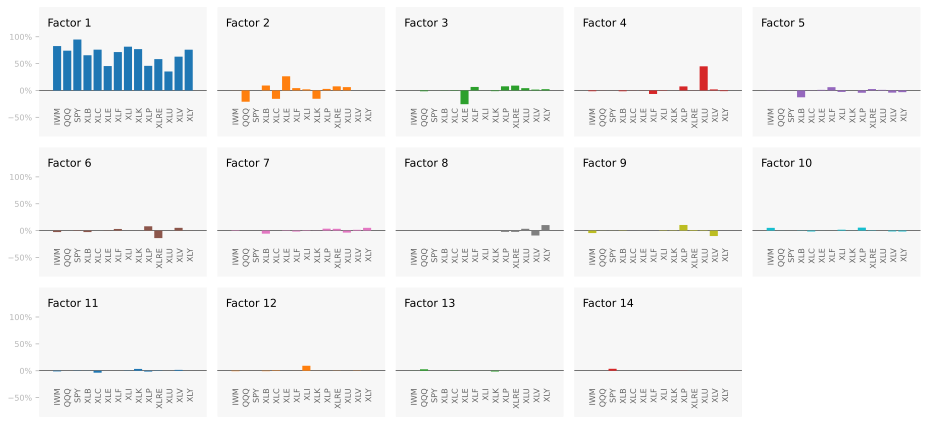
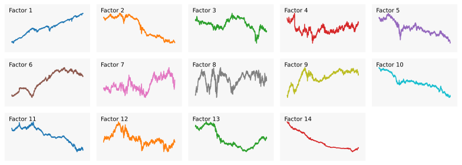

When you buy something, and the price changes, what happend? Let's say, for example, you buy shares in a made-up health company called "Orange". This company makes wearable health monitors. The price of Orange goes down by 5%. Why? It could be because the whole market went down, or because the technology sector went down, or because the health sector went down, or because Orange genuinely performed poorly. Each of these possible explanations is called a *factor*.

The idea of a factor model is that every stream of returns can be explained by a number of underlying factors. A factor model roughly says $\boldsymbol{r}_t \approx \boldsymbol{L} \boldsymbol{f}_t$ where $\boldsymbol{r}_t$ is a vector of returns at time $t$, $\boldsymbol{L}$ is a matrix of factor loadings and $\boldsymbol{f}_t$ is a vector of factor returns. If we can identify these factors, we can understand what is driving returns.

Not only does this model allow us to explain returns, we can compare the returns of different assets in a meaningful way. For example, we could break down the returns of [Apple](https://uk.finance.yahoo.com/quote/AAPL/) and [Orange](https://en.wikipedia.org/wiki/Apples_and_oranges) and see how much of their returns are explained by the same factors.

There are a handful of ways to build a factor model. (1) You know the factors $\boldsymbol{f}_t$, and want to estimate the loadings $\boldsymbol{L}$. This is a macroeconomic factor model. (2) You know the loadings and you want to estimate the factors. This is a characteristic factor model. (3) You don't know the factors or loadings and you want to estimate both. This is a *statical factor model* [^Conner2007].

The literature on these approaches is vast, but a fantastic overview is given in the paper [Factor Models, Machine Learning, and Asset Pricing](https://www.annualreviews.org/content/journals/10.1146/annurev-financial-101521-104735) [^Giglio2022].

In this article, we're going to explore statistical factor modelling. We will address a few issues that arise in this approach: (1) the method is data-hungry, requiring long historical return series; (2) the factors we get are often not economically meaningful; (3) the factors we get may not be stable out-of-sample.

# Factor models

For a deep dive into factor models, the best resource on the market is [The Elements of Quantitative Investing](https://www.wiley.com/en-us/The+Elements+of+Quantitative+Investing-p-9781394265466) [^Paleologo2025]. Here, we'll lightly go over everything that will be useful for this article.

A factor model is formulated as
$$
\begin{equation}
\boldsymbol{r}_t = \boldsymbol{\alpha} + \boldsymbol{L} \boldsymbol{f}_t + \boldsymbol{\epsilon}_t \label{eq:factor_model}\tag{1}
\end{equation}
$$

where
* $\boldsymbol{r}_t$ is a random vector of returns for $N$ assets at time $t$. Generally, the risk free rate is subtracted, making these excess returns.
* $\boldsymbol{\alpha}$ is the *alpha* vector. This is an $N \times 1$ vector of constants that represent the average return of each asset not explained by the factors.
* $\boldsymbol{L}$ is the factor loading matrix. This is an $N \times K$ matrix where each row represents an asset and each column represents a factor. The entries represent the sensitivity of each asset to each factor.
* $\boldsymbol{f}_t$ is a $K \times 1$ random vector of factor returns.
* $\boldsymbol{\epsilon}_t$ is a random vector of *idiosyncratic* returns. This is an $N \times 1$ vector representing the portion of each asset's return not explained by the factors.

The alpha vector $\boldsymbol{\alpha}$ is generally assumed to be $\text{E}[\boldsymbol{\alpha}] = 0$. If it is not, then we have an arbitrage opportunity. That is, we can find portfolio weights $\boldsymbol{w}$ such that $\boldsymbol{w}^\top \boldsymbol{\alpha} > 0$ and $\boldsymbol{w}^\top \boldsymbol{L} \boldsymbol{f}_t = 0$, meaning we can earn positive returns while having no exposure to the factors. In practice, a model that predicts asset returns is predicting this vector for time $t$, the elusive "alpha" that traders talk about.

Analogously, any model of $\text{E}[\boldsymbol{f}_t]$ is a model of the risk premia associated with each factor. 

The ideal factor returns have a covariance matrix that is the identity matrix, i.e. $\boldsymbol{\Sigma}_f = \boldsymbol{I}$. The immediate implication of this is that the covariance of $\boldsymbol{r}_t$ is
$$
\boldsymbol{\Sigma}_r = \boldsymbol{L} \boldsymbol{\Sigma}\_f \boldsymbol{L}^\top + \boldsymbol{\Sigma}\_\epsilon = \boldsymbol{L} \boldsymbol{L}^\top + \boldsymbol{\Sigma}\_\epsilon
$$
This condition turns out to be very easy to enforce as we will see later.

The idiosyncratic returns $\boldsymbol{\epsilon}_t$ are assumed to have expectation of 0 as any mean is captured with the $\boldsymbol{\alpha}$ vector. They are also assumed to be uncorrelated with the factors and generally with eachother. This means that the covariance matrix $\boldsymbol{\Sigma}\_\epsilon$ is a diagonal matrix. This is known as the *idiosyncratic risk* or *specific risk* of each asset. In practice, this assumption does not hold perfectly. Practitioners instead aim for a sparsely populated covariance matrix, meaning that most assets have little correlation with each other after accounting for the factors. Intuitively, if two assets are very similar, then they will have some correlation that is not explained by the factors.

Most factor models aim to have a small number of factors relative to the number of assets, $K \ll N$. For example, the commercially available [MSCI USA Equity Factor Models](https://www.msci.com/downloads/web/msci-com/data-and-analytics/factor-investing/equity-factor-models/MSCI%20USA%20Equity%20Factor%20Model-cfs-en.pdf) factor models have on the order of 50-100 factors for 20,000+ assets. These factor models require vast data resources and research to build. They are expensive to purchase and used by large institutions.

For our purposes, we will focus on building a useful factor model that can be built with at home resources. We will be using the same number of factors as assets, but we will still gain insight into the returns of our assets.

# Why?

I said earlier that factor models allow us to explain returns. Why this is useful is not immediately obvious. Before we jump into the details of building these models, let's explore what we can do with them.

**You can explain where returns come from.** By breaking down returns into alpha, factor and idiosyncratic returns, we can see what is driving portfolio returns. Say that our portfolio weights are $\boldsymbol{w}$ which means the portfolio return is $\boldsymbol{w}^\top \boldsymbol{r}_t$. Using the factor model in $\eqref{eq:factor_model}$, we can write the portfolio return as:
$$
\boldsymbol{w}^\top \boldsymbol{r}_t = \boldsymbol{w}^\top \boldsymbol{\alpha} + \boldsymbol{w}^\top \boldsymbol{L} \boldsymbol{f}_t + \boldsymbol{w}^\top \boldsymbol{\epsilon}_t
$$
where we can see exactly how much of the portfolio return is coming from each source.

**You can explicitly model risk premia.** Any model of the alpha vector $\boldsymbol{\alpha}$ is a model of the expected returns not explained by the factors. Any model of the factor returns $\boldsymbol{f}_t$ is a model of the risk premia associated with each factor. This means that if we have a model for $\text{E}[\boldsymbol{f}_t]$, we can directly trade on our beliefs about risk premia.

Additionally, any model of the asset returns $\text{E}[\boldsymbol{r}_t]$ can be decomposed into a model of $\boldsymbol{\alpha}$ and $\text{E}[\boldsymbol{f}_t]$. This decomposition allows us to understand whether our return predictions are coming from alpha or risk premia. This decomposition into alpha and factor returns is often called *alpha orthogonal* and *alpha spanned* respectively [^Paleologo2025].

**You can build better risk models.** Because we know where the risks are coming from, we can hedge them. Or, more specifically, we can invest in a single or multiple factors to the exclusion of all others. This is called *factor mimicking portfolios* [^Paleologo2025].

**You can build diversified portfolios.** Rather than diversifying across assets which all share the same return drivers, you can directly diversify across factors. If the portfolio weights are $\boldsymbol{w}$, then the factor exposures are $\boldsymbol{w}^\top \boldsymbol{L}$. Therefore, you can choose portfolio weights $\boldsymbol{w}$ to achieve desired factor exposures.

# Data

We're going to use real data to illustrate the modelling in this article. We want a small selection of assets where we have long historical returns and that cover a wide range of the economy. To that end, we'll use a selection of ETFs.

Choosing ETFs means we can focus on only a small number of assets but still capture a wide selection of the market. As ETFs tend to be mechanically constructed to track an index, we can extend their historical returns backwards by using either the index returns or the returns of related assets before the ETF was created.

In this article, we're going to use the following U.S. based ETFs:

| Ticker  |Inception    | Description |
|:--------|:------------|:------------|
| [IWM](https://www.ishares.com/us/products/239710/ishares-russell-2000-etf)    | 22 May 2000 | Tracks the Russell 2000 --- small-capitalization equities. |
| [QQQ](https://www.invesco.com/qqq-etf/en/home.html)                           |  3 Oct 1999 | Tracks the Nasdaq-100 --- dominated by technology.         |
| [SPY](https://www.ssga.com/us/en/intermediary/etfs/spdr-sp-500-etf-trust-spy) | 22 Jan 1993 | Tracks the S&P 500 --- represents all equities.            |
| [XLC](https://www.sectorspdrs.com/mainfund/xlc)                               | 18 Jun 2018 | Tracks the communication services sector.                  |
| [XLY](https://www.sectorspdrs.com/mainfund/xly)                               | 16 Dec 1998 | Tracks the consumer discretionary sector.                  |
| [XLP](https://www.sectorspdrs.com/mainfund/xlp)                               | 16 Dec 1998 | Tracks the consumer staples sector.                        |
| [XLE](https://www.sectorspdrs.com/mainfund/xle)                               | 16 Dec 1998 | Tracks the energy sector.                                  |
| [XLF](https://www.sectorspdrs.com/mainfund/xlf)                               | 16 Dec 1998 | Tracks the financials sector.                              |
| [XLV](https://www.sectorspdrs.com/mainfund/xlv)                               | 16 Dec 1998 | Tracks the health care sector.                             |
| [XLI](https://www.sectorspdrs.com/mainfund/xli)                               | 16 Dec 1998 | Tracks the industrials sector.                             |
| [XLB](https://www.sectorspdrs.com/mainfund/xlb)                               | 16 Dec 1998 | Tracks the materials sector.                               |
| [XLRE](https://www.sectorspdrs.com/mainfund/xlre)                             |  7 Oct 2015 |  Tracks the real estate sector.                            |
| [XLK](https://www.sectorspdrs.com/mainfund/xlk)                               | 16 Dec 1998 | Tracks the technology sector.                              |
| [XLU](https://www.sectorspdrs.com/mainfund/xlu)                               | 16 Dec 1998 | Tracks the utilities sector.                               |

At first, these ETFs look like they cover unrelated parts of the market. Looking in the figure below, we can see that the energy sector (XLE) is 45% correlated with the real estate sector (XLRE). In fact, all the ETFs are highly correlated suggesting that there are similar underlying factors that they all share. 


Shows the correlations between the selected ETFs over the period 2016-01-01 to 2025-11-25. Key thing to note is that all of the ETFs are highly correlated, suggesting that there are common factors driving their returns.


The only issue with these ETFs is that that they have different inception dates and some only have a few years of history. For example, the communication sector ETF (XLC) only has data from 2018 onwards. To get around this, I construct synthetic returns for each ETF before its inception date going back to 1990-01-01. I do this by getting a large set of related stock returns and index returns and regress the first 5 years of ETF returns against these related returns. I then use the resulting regressed returns as the historical returns before the ETF's inception date.

While this is not perfect, it does give us an approximation of the returns you might have realised if you were tracking the sector (or index) before the ETF was created.

The full details of this process are in the [appendix](#appendix).

As an example, here are the returns of the materials sector ETF (XLB) spliced onto the synthetic returns before inception:


The capital over time from investing in the materials sector ETF (XLB). From 1990-01-01 to 1998-12-15, the returns are synthetic, generated by regressing related stock and index returns against the actual ETF returns for the 5 year period starting at inception. After inception, the actual ETF returns are used. The synthetic returns after inception are included in the plot to show how well the synthetic returns approximate the actual returns after inception.


So that you can reproduce what we do here, the full set of returns can be downloaded [here](data/returns.csv). And you can read them in with:
```python
import pandas as pd

R = pd.read_csv('returns.csv', index_col=0, parse_dates=True)
```

Risk adjusting the returns to have a daily volatility of 1% and plotting the capital growth gives:

<feature class="nostyle big">


</feature>

# Statistical factors

Now that we have a long history of returns, we can build a statistical factor model. For this section, we are going to work in-sample. There are unique challenges when working out-of-sample that distract from the core modelling ideas. We will address these challenges later.

## PCA

Principle component analysis [(PCA) is the workhorse](https://www.google.com/search?q=%22PCA+is+the+workhorse%22) of statistical factor modelling. PCA transforms a dataset into a new set of orthogonal variables, called principal components, that are ordered by how much of the data's variance they explain. This is achieved by rotating the coordinate system so that the first axis captures the largest possible spread in the data, the second captures the largest remaining spread subject to being independent of the first, and so on.

PCA is robust and deeply understood. Many before me have written excellent explanations of PCA, see for example [this blog post](https://gregorygundersen.com/blog/2022/09/17/pca/). Here, we will go through the idea and the theory behind PCA as it relates to factor modelling.

Take $\boldsymbol{\Sigma}_r$ to be the $N \times N$ covariance matrix of asset returns. The set of orthonormal vectors $\{\boldsymbol{p}_1, \boldsymbol{p}_2, \ldots, \boldsymbol{p}_N\}$ that maximise the variance of the data projected onto them are the eigenvectors of $\boldsymbol{\Sigma}_r$. The variance explained by each vector is given by the corresponding eigenvalue $\{\lambda_1, \lambda_2, \ldots, \lambda_N\}$. We generally order the eigenvalues and corresponding eigenvectors in descending order $\lambda_1 \geq \lambda_2 \geq \ldots \geq \lambda_N$.

Collect the eigenvectors into a matrix:
$$
\boldsymbol{L}\_\text{pca} = [\boldsymbol{p}_1, \boldsymbol{p}_2, \ldots, \boldsymbol{p}_N]
$$
Then, the factors at time $t$ are given by projecting the returns onto the eigenvectors:
$$
\boldsymbol{f}_t = \boldsymbol{L}\_\text{pca}^\top \boldsymbol{r}_t
$$
and since the eigenvectors are orthonormal, the transpose is also the inverse $\boldsymbol{L}\_\text{pca}\boldsymbol{L}\_\text{pca}^\top = \boldsymbol{I}$. Thus, we have:
$$
\boldsymbol{r}_t = \boldsymbol{L}\_\text{pca} \boldsymbol{f}_t
$$
which is a PCA factor model.

Rotating the data is a powerful idea that we will use repeatedly. For now, just note that we have not changed the data, simply rotated the coordinate system. The coordinate system we rotate into has useful properties that the original coordinate system did not have. In the case of PCA, the new coordinate system has uncorrelated axes ordered by variance.

The code to produce the PCA loadings and the inverse loadings (to convert returns to factors) looks like:
```python
def pca_loadings(
    cov: np.ndarray,
) -> tuple[np.ndarray, np.ndarray]:
    """
    Compute PCA factor loadings from a
    covariance matrix.

    Parameters
    ----------
    cov : np.ndarray
        Covariance matrix.

    Returns
    -------
    loadings: np.ndarray
        Factor loadings. Such that
        r_t = L f_t
    
    iloadings: np.ndarray
        Inverse loadings. Such that
        L^-1 r_t = f_t
    """

    eigvals, vecs = np.linalg.eigh(cov)

    # The eigenvalues and eigenvectors are
    # in ascending order. Reverse them so
    # that the largest eigenvalues are first.
    eigvals = eigvals[::-1]
    vecs = vecs[:, ::-1]

    loadings = vecs
    iloadings = vecs.T
    
    return loadings, iloadings
```
Then to compute the factors from returns do:
```python
cov = R.cov()
_, iloadings = pca_loadings(cov)
factors = R @ iloadings.T
```

You can check for yourself that the factors are not correlated by computing their correlation matrix: `factors.corr()`.

Generally when you run PCA, the idea is that you only keep the first $K$ factors that explain most of the variance. Previous work on factor modelling shows that there are on the order of 100 factors. In our case, we only have 14 assets each of which covers a broad selection of the market. Therefore, I expect that all 14 factors are needed to explain the returns. So, we are going to keep all the factors.

Additionally, by keeping all the factors, $\boldsymbol{L}\_\text{pca}$ is square and invertible which means we lose the terms $\boldsymbol{\alpha}$ and $\boldsymbol{\epsilon}_t$ from the factor model:
$$
\boldsymbol{r}_t = \boldsymbol{L}\_\text{pca} \boldsymbol{f}_t
$$
The returns can be perfectly reconstructed from the factors and vice versa.

We can visualise the factors by adjusting their volatilities to be 1% per day. This dampens out the extreme movements when calculating the capital growth for each factor. The factors look like:

<feature class="nostyle big">


</feature>

The first factor is often called the "market factor" as it tends to represent the overall market movement. As we are looking at equities, we could interpret the first factor as the equity risk premia. That is, this is the return that investors expect to earn for taking on equity risk.

The big question is: what do the other factors represent economically? We've found orthogonal streams of returns, but besides the market factor, do the other factors represent anything meaningful? Without some understanding of what the factors are, we will struggle (emotionally) to allocate capital to them---particularly during times of crisis.

The only data we have are the ETF returns. If a factor explains a large portion of a particular sector and very little of the other sectors, then we can say that the factor represents the stream of returns for that sector. We can do this by looking at the loadings matrix $\boldsymbol{L}\_\text{pca}$. However, because the variance of each factor is different, the loadings are not comparable.

To solve this, we whiten the factors.


## Whitening

The idea behind whitening is to re-scale the factors to have the same variance. Generally, we set the variance to 1. The factors are already uncorrelated which means that setting their variances make their covariance matrix the identity matrix.

To whiten, we divide the factors by their standard deviations. The eigenvalues from PCA are the variances of each factor. Therefore, we can whiten by dividing each factor by the square root of its corresponding eigenvalue.

Set $\boldsymbol{D}$ to be a diagonal matrix where each entry is $D\_{ii} = \sqrt{\lambda_i}$. Then, we can write the whitened factor model as:
$$
\begin{aligned}
 \boldsymbol{f}_t &= \boldsymbol{D}^{-1}\boldsymbol{L}\_\text{pca}^\top \boldsymbol{r}_t \\\
 \\\
\boldsymbol{r}_t &= \boldsymbol{L}\_\text{pca}\boldsymbol{D} \boldsymbol{f}_t \\\
\end{aligned}
$$
And the loadings and inverse loadings become:
$$
\begin{aligned}
\boldsymbol{L} &= \boldsymbol{L}\_\text{pca}\boldsymbol{D} \\\
\boldsymbol{L}^{-1} &= \boldsymbol{D}^{-1}\boldsymbol{L}\_\text{pca}^\top \\\
\end{aligned}
$$

The pca loadings function is updated with:
```python
def pca_loadings(
    cov: np.ndarray,
    whiten: bool = False,
) -> tuple[np.ndarray, np.ndarray]:

    ...  # Existing code

    if whiten:
        # Whiten loadings so that the factors have
        # covariance = I
        seigvals = np.sqrt(eigvals)[:, None]  # Column vector
        loadings = loadings * seigvals.T
        iloadings = (1 / seigvals) * iloadings
    
    return loadings, iloadings
```

The whitened factors all have unit variance and are uncorrelated. This means that the covariance matrix of the factors is the identity matrix:
$$
\boldsymbol{\Sigma}_f = \text{Cov}[\boldsymbol{f}_t] = \boldsymbol{I}
$$
As the factors are now statistically the same, we can compare the loadings. We specifically want to know how much of each asset's variance is explained by each factor. The covariance matrix of returns under our factor model is:
$$
\boldsymbol{\Sigma}\_r = \text{Cov}[\boldsymbol{r}_t] = \boldsymbol{L} \text{Cov}[\boldsymbol{f}_t] \boldsymbol{L}^\top = \boldsymbol{L} \boldsymbol{I} \boldsymbol{L}^\top = \boldsymbol{L} \boldsymbol{L}^\top
$$

where the variance of asset $i$ is the $i$th diagonal entry of $\boldsymbol{\Sigma}\_r$:

$$
\sigma^2\_{r,i} = \sum_{j=1}^K L\_{ij}^2
$$

that sum of squared loadings is the sum over the row of $\boldsymbol{L}$ corresponding to asset $i$. The value $L\_{ij}^2$ is the contribution of factor $j$ to the variance of asset $i$.

We're going to define the *contribution matrix* as the matrix $\boldsymbol{C}$ where each entry is the proportion of asset $i$'s variance explained by factor $j$ with the sign added back in:
$$
C\_{ij} = \frac{L\_{ij}^2}{\sigma^2\_{r,i}} = \text{sign}(L\_{ij}) \frac{L\_{ij}^2}{\sum_{k=1}^K L\_{ik}^2}
$$
We say that factor $j$ contributes $C\_{ij}$ percent to asset $i$'s variance. Note that the absolute contributions for each asset sum to 1. We keep the sign to help with interpretation later. The code to compute the contribution matrix is:
```python
def contribution_matrix(loadings: np.ndarray) -> np.ndarray:
    return np.sign(loadings) * (loadings**2) / (loadings**2).sum(1)[:, None]
```
And we can get the contribution matrix for our whitened PCA factors with:
```python
cov = R.cov()
loadings, _ = pca_loadings(cov, whiten=True)
contributions = contribution_matrix(loadings)
```

We can then visualise the contribution matrix by plotting the contributions by factor:

<feature class="nostyle big">



</feature>

We can make the following observations from the contribution matrix:

* **Market factor.** The first factor is very clearly the market factor. It explains most of the variance for each of the assets.
* **Inexplainable factors.** Most of the remaining factors do not explain a small set of assets. For example, see factor 2. Instead, they appear to explain similar proportions of many assets.
* **Explainable factors.** A couple of factors do appear to have some meaning. For example, factor 4 explains a much larger proportion of utilities (XLU) than the other assets. We could say that this factor represents the utilities sector.
* **Decreasing explaining power.** As we go to higher numbered factors, the amount of variance explained decreases. This is expected as PCA orders the factors by variance explained.

The conclusion so far is that besides the first factor, the remaining factors have no clear economic meaning. We can get around this by noting that we do not care that the PCA factors represent directions of maximum variance. We only care that they are uncorrelated. Therefore, we can rotate the factors out of the PCA coordinate system into another coordinate system that is more interpretable.

## Rotations

Recall that the PCA loadings are simply a rotation of the returns into a new coordinate system with special properties. Now that we've whitened the factors, rotations become very powerful.

A rotation is represented by an orthonormal matrix $\boldsymbol{G}$ where:
$$
\boldsymbol{G}^\top \boldsymbol{G} = \boldsymbol{G} \boldsymbol{G}^\top = \boldsymbol{I}
$$
which means that we can rotate the factors by any valid rotation matrix without changing the model:
$$
\boldsymbol{r}_t = \boldsymbol{L} \boldsymbol{f}_t = \boldsymbol{L} \boldsymbol{G} \boldsymbol{G}^\top \boldsymbol{f}_t
$$
The rotated factors are $ \boldsymbol{G}^\top \boldsymbol{f}_t$ and critically:
$$
\text{Cov}[\boldsymbol{G}^\top \boldsymbol{f}_t] = \boldsymbol{G}^\top \text{Cov}[\boldsymbol{f}_t] \boldsymbol{G} = \boldsymbol{G}^\top \boldsymbol{I} \boldsymbol{G} = \boldsymbol{I} = \text{Cov}[\boldsymbol{f}_t]
$$
So any valid roatation matrix maintains the orthonormality of the factors! This is powerful because it means we can search for a rotation matrix that makes the factors more interpretable while still maintaining the properties we want.

We're going to look at a roation that makes the factors more interpretable, the varimax rotation.

## Varimax rotation

We can make the factors more interpretable by making the loadings matrix $\boldsymbol{L}$ more sparse. That is, for each factor (column of $\boldsymbol{L}$), we want only a few assets to have large loadings, and the rest to be close to zero. This makes 
it easy to interpret what each factor is doing as it only strongly influences a few assets. One rotation that achieves this is called the *varimax* rotation first described in 1958 in psychometric research [^Kaiser1958].

Note again that the covariance matrix of returns under our factor model with orthonormal factors is:
$$
\boldsymbol{\Sigma}_r = \boldsymbol{L} \boldsymbol{L}^\top
$$

where the variance of asset $i$ is the $i$th diagonal entry of $\boldsymbol{\Sigma}\_r$:

$$
\sigma^2\_{r,i} = \sum_{j=1}^K L\_{ij}^2
$$

that sum of squared loadings is the sum over the row of $\boldsymbol{L}$ corresponding to asset $i$. We previoualy name the value $L\_{ij}^2$ the *contribution* of factor $j$ to the variance of asset $i$. If we want each factor to only contribute to a few assets, we want the squared loadings in each column of $\boldsymbol{L}$ to be sparse.

We can formulate this sparsity requirement by saying we want each column of $\boldsymbol{L}$ to have a high variance of squared loadings. If the squared loadings are all similar, then the variance is low. If some squared loadings are large and the rest are small, then the variance is high. Recall that the variance of a random variable $X$ is given by $\text{Var}(X) = \text{E}[X^2] - (\text{E}[X])^2$. Therefore, the variance of the squared loadings for factor $j$ is:

$$
\text{Var}[L\_{\cdot j}^2] = \frac{1}{N} \sum_{i=1}^N L\_{ij}^4 - \left( \frac{1}{N} \sum_{i=1}^N L\_{ij}^2 \right)^2
$$

And the varimax objective function to maximise is the sum of these variances across all factors:
$$
\text{Varimx}(\boldsymbol{L}) = \sum_{j=1}^K \left[ \frac{1}{N} \sum_{i=1}^N L\_{ij}^4 - \left( \frac{1}{N} \sum_{i=1}^N L\_{ij}^2 \right)^2 \right]
$$

The original solution to maximising this objective rotates a single pair of factors at a time to increase the objective [^Kaiser1958]. The modern approach is to calculate the gradient and use an iterative method to find the maximum [^Jennrich2001]. We'll skip the derivation and just present the algorithm. Say that the given unrotated loadings matrix is $\boldsymbol{L} = \boldsymbol{L}\_\text{pca}\boldsymbol{D}$. The algorithm is:

1. Initialise the rotation $\boldsymbol{G} \leftarrow \boldsymbol{I}$.
2. Compute $\boldsymbol{\Lambda} = \boldsymbol{L} \boldsymbol{G}$.
3. Compute column means $d_j = \tfrac{1}{p}\sum_i \Lambda_{ij}^2$.
4. Compute the derivative  $\partial \text{Varimx}(\boldsymbol{L})/\partial\boldsymbol{\Lambda} = \tfrac{4}{p}\boldsymbol{Z}$ where the entries are $Z_{ij} = \Lambda_{ij}^3 - d_j \Lambda_{ij}$.
5. Using the chain rule, compute the derivative $\boldsymbol{M} = \partial \text{Varimx}(\boldsymbol{L})/\partial \boldsymbol{G} = \boldsymbol{L}^\top \boldsymbol{Z}$.
6. Compute the SVD: $\boldsymbol{M} = \boldsymbol{U} \boldsymbol{\Sigma} \boldsymbol{V}^\top$.
7. Update $\boldsymbol{G} \leftarrow \boldsymbol{U} \boldsymbol{V}^\top$.
8. If the objective has not converged, go back to step 2.

The code for the varimax algorithm in Python is:
```python
def varimax_rotation(
    loadings: np.ndarray,
    max_iter: int = 1000,
    tol: float = 1e-5,
) -> np.ndarray:
    """
    Calculates the varimax rotation matrix
    corresponding to the input loading matrix.

    Code is stolen and modified from the
    factor_analyzer package.

    Parameters
    ----------
    loadings : array-like
        The loading matrix.

    max_iter : int, optional
        The maximum number of iterations.
        Defaults to 1000.
    
    tol : float, optional
        The convergence threshold.
        Defaults to 1e-5.

    Returns
    -------
    rotation_mtx : array-like
        The rotation matrix. The loadings
        are rotated by: L @ rotation_mtx
    """
    X = loadings.copy()
    n_rows, n_cols = X.shape
    if n_cols < 2:
        return X

    # initialize the rotation matrix
    # to N x N identity matrix
    rotation_mtx = np.eye(n_cols)

    d = 0
    for _ in range(max_iter):
        old_d = d

        # take inner product of loading matrix
        # and rotation matrix
        basis = np.dot(X, rotation_mtx)

        # transform data for singular value decomposition using updated formula :
        # B <- t(x) %*% (z^3 - z %*% diag(drop(rep(1, p) %*% z^2))/p)
        diagonal = np.diag(np.squeeze(np.repeat(1, n_rows).dot(basis**2)))
        transformed = X.T.dot(basis**3 - basis.dot(diagonal) / n_rows)

        # perform SVD on
        # the transformed matrix
        U, S, V = np.linalg.svd(transformed)

        # take inner product of U and V, and sum of S
        rotation_mtx = np.dot(U, V)
        d = np.sum(S)

        # check convergence
        if d < old_d * (1 + tol):
            break

    return rotation_mtx
```

For our analysis, we're going to make a small change to the algorithm. The first factor we found with PCA is the market factor. Recall that the loadings for that factor are all fairly even. If we were to use the varimax rotation, we will lose this factor as varimax does not like factors with even loadings. We want to hold this factor fixed and only rotate the other factors. We pull this off by excluding the column in $\boldsymbol{L}$ corresponding to the market factor when computing the varimax rotation. That is, we run varimax on $\boldsymbol{L}\_{2:K}$ and then the rotation matrix is:
$$
\boldsymbol{G} = \begin{bmatrix}1 & \boldsymbol{0} \\\
\boldsymbol{0} & \boldsymbol{G}\_{varimax} \\\
\end{bmatrix}
$$

The final step we want to do is ensure that the factors have a consistent sign. PCA has an indeterminancy where the sign of each factor is arbitrary. We will fix the sign by ensuring that the largest contribution for each factor is positive. This amounts to a diagonal matrix $\boldsymbol{S}$ where $S\_{ii} = \pm 1$ depending on the sign of the largest contribution for factor $i$. $\boldsymbol{S}$ is orthonormal and thus it is a valid rotation matrix. We'll use the following function to get the sign matrix:
```python
def sign_rotation(loadings: np.ndarray) -> np.ndarray:
    c = contribution_matrix(loadings)
    signs = np.sign([max(c[:, j], key=abs) for j in range(c.shape[1])])
    signs[signs == 0] = 1  # avoid zeros
    S = np.diag(signs)
    return S
```

Our factor model with PCA, whitening, varimax rotation and sign consistency becomes:
$$
\begin{aligned}
 \boldsymbol{f}_t &= \boldsymbol{S}^\top \boldsymbol{G}^\top \boldsymbol{D}^{-1}\boldsymbol{L}\_\text{pca}^\top \boldsymbol{r}_t \\\
 \\\
\boldsymbol{r}_t &= \boldsymbol{L}\_\text{pca}\boldsymbol{D} \boldsymbol{G} \boldsymbol{S} \boldsymbol{f}_t \\\
\end{aligned}
$$
and you can compute everything with:
```python
cov = R.cov()
loadings, iloadings = pca_loadings(cov, whiten=True)

# Varimax rotate all but the first (market) factor
G = np.eye(loadings.shape[1])
G[1:, 1:] = varimax_rotation(loadings[:, 1:])
loadings = loadings @ G
iloadings = G.T @ iloadings

# Make sure everything is positive
S = sign_rotation(loadings)
loadings = loadings @ S
iloadings = S @ iloadings
```

## Interpretation

Our process for finding factors is: obtain PCA factors, whiten them, varimax rotate all but the first factor, and ensure positive signs. We then convert the loadings matrix to the contribution matrix for interpretation as before.

The results look like:

<feature class="nostyle big">


</feature>

These results are quite remarkable.

In comparison to the unrotated PCA factors, the varimax factors are much more interpretable. Factor 1 remains the market factor with all assets contributing fairly evenly. The other factors have become much more sparse. Keep in mind that these factors are all uncorrelated! So a factor that explains a high percentage of one asset and little of the others can be thought of as the unique source of risk and returns for that asset.

**Factor 1** is the market factor. This explains a high percentage of all assets, roughly 50% for each asset. **Factor 4** explains a high percentage of the utilities sector (XLU). There is some explaining power for other ETFs, but it is tiny in comparison. We should expect to see small explaining power for all the other ETFs as the sectors economically overlap. If Factor 4 has a positive average return, then it could be interpreted as the consumer staples risk premia. Each factor in our example explains a high percentage of one of the assets and thus similar conclusions can be drawn for the other factors.

The logged factor returns look like:

<feature class="nostyle big">



</feature>

At this point, we could talk about how to model the possible risk premia in each factor. We will leave that to another article. Instead, we will look at ensuring that a factor model maintains its properties out-of-sample.

# In practice

Up until now, the factor modelling has operated in-sample. That is, we have looked at factors historically computed with all available data. In practice, we want to be able to compute factor loadings and factors out-of-sample. That is, at time $t$, we want to be able to compute the factor loadings $\boldsymbol{\beta}$ using data available before time $t$ and factors $\boldsymbol{f}_t$ using only data available up to time $t$.

We're now going to switch from a fixed matrix of loadings $\boldsymbol{L}$ to time varying loadings $\boldsymbol{L}_t$. For factors at time $t$, we will compute the loadings using data up to time $t-l$ where $l$ is a suitable lag. The factor model becomes:
$$
\boldsymbol{r}_t =\boldsymbol{\alpha} + \boldsymbol{L}\_{t-l} \boldsymbol{f}_t + \boldsymbol{\epsilon}_t
$$

We will assume that $\boldsymbol{\alpha} = 0$ and we will use a cross-sectional regression to compute the factor returns once the asset returns are realised:
$$
\boldsymbol{f}_t = (\boldsymbol{L}\_{t-l}^\top \boldsymbol{L}\_{t-l})^{-1} \boldsymbol{L}\_{t-l}^\top \boldsymbol{r}_t
$$

Because our loadings are invertible, this gives us the exact factor returns that reconstruct the realised returns:
$$
\boldsymbol{r}_t = \boldsymbol{L}\_{t-l} \boldsymbol{f}_t
$$

## Exponential weighting

When computing the covariance matrix of returns to fit the PCA factor model, we could use a sliding window of historical returns. This approach gives equal weight to all returns in the window and zero weight to returns outside the window. A better approach is to use an exponentially weighted moving covariance matrix. This approach gives more weight to recent returns and less weight to older returns.

We have a whole article on the exponentially weighted variance [here](). In Python, we can compute the exponentially weighted covariance matrix with:
```python
covs = returns.ewm(halflife=252, min_periods=252).cov()
```
for a halflife of 252 trading days (1 year).

When computing the factor loadings at time $t$, we use the exponentially weighted covariance matrix up to time $t-l$.

## Loadings consistency

The first issue we'll encounter is that PCA has an indeterminancy where the sign of each factor is arbitrary. See the figure below. This means that if we compute the loadings at different times, the signs of the factors may be flipped. This means that the factors will flip signs randomly day to day, making them impossible to interpret.



The sign of the PCA factors is arbitrary. Here we illustrate two possible PCA factorizations of the same data. The difference is that the signs of the factors have been flipped. Both factorizations are equally valid PCA decompositions.


For example, we'll fit a PCA factor model to with an EWM covariance matrix with halflife of 252 days. We'll include whitenning. The loading for SPY on the first factor over time looks like:


where you can see the sign flips.

To fix this, we enforce sign consistency by ensuring that the angle of each factor with its previous day's version remains small. If the angle is larger than 90 degress, we flip the sign. The cosine of the angle between two vectors $\boldsymbol{a}$ and $\boldsymbol{b}$ is given by:
$$
\cos(\theta) = \frac{\boldsymbol{a}^\top \boldsymbol{b}}{||\boldsymbol{a}|| \cdot ||\boldsymbol{b}||} 
$$
When the angle is less than 90 degrees, the cosine is positive. When the angle is greater than 90 degrees, the cosine is negative. Therefore, we can enforce sign consistency by checking the cosine of the angle between the current PCA loadings and the previous loadings. If it is negative, we flip the sign of the current loading. We can also drop the normalization as (1) we're only interested in the sign and (2) the PCA loadings are orthonormal.

Repeating the above sliding window PCA with sign consistency enforced gives:


where we can see that the sign is no longer flipping randomly.

Upading the `pca_loadings` function to enforce sign consistency gives:

```python
def pca_loadings(
    cov: np.ndarray,
    whiten: bool = False,
    prev: np.ndarray | None = None,
) -> np.ndarray:

    # existing PCA code
    ...

    # Try to keep vecs consistent over time
    if prev is not None:
        signs = np.sign(np.diag(prev.T @ vecs))
        vecs = vecs * signs
    
    return vecs
```

### Rotational consistency

The varimax rotation is an optimisation over a non-convex objective. There are many solutions and local minima. Consider that since the factors are whitened, the order of the factors is not important. In fact, the same factors can be represented in any order which immediately gives us $K!$ equivalent solutions. This means that the factors will change meaning day to day, making them impossible to interpret consistently out-of-sample.

We can solve this by computing the varimax rotated loadings at time $t$ and rotating them to be as close as possible to the previous day's loadings. This means we want an orthornormal matrix $\boldsymbol{Q}$ such that the rotated loadings $\boldsymbol{L}_\{t+1} \boldsymbol{Q}$ are as close as possible to the previous day's loadings $\boldsymbol{L}_t$. We can formulate this as the minimisation problem:
$$
\begin{aligned}
\arg\min\_{\boldsymbol{Q}} & \ || \boldsymbol{L}\_{t+1} \boldsymbol{Q} - \boldsymbol{L}_t ||_F^2 \\\
\text{s.t.} & \  \boldsymbol{Q}^\top \boldsymbol{Q} = \boldsymbol{I} \\\
\end{aligned}
$$

This is known as the [orthogonal Procrustes problem](https://en.wikipedia.org/wiki/Orthogonal_Procrustes_problem) and has a closed form solution. The derivation of the solution is in the [appendix](#orthogonal-procrustes-problem). We'll just present the final result here. The solution is to take the following SVD: 
$$
\boldsymbol{L}_t^\top \boldsymbol{L}\_{t+1} = \boldsymbol{U} \boldsymbol{\Sigma} \boldsymbol{V}^\top
$$
and solve:
$$
\boldsymbol{Q} = \boldsymbol{U} \boldsymbol{V}^\top
$$

The code to implement this rotation matrix is:
```python
def procrustes_rotation(current, previous):
    C = previous.T @ current
    U, _, Vt = np.linalg.svd(C)
    Q = Vt.T @ U.T
    return Q
```


## Factor orthogonality


Because the loadings are changing over time, the factors we get may not be orthonormal. That is, the covariance matrix of the factors may not be the identity matrix:
$$
\boldsymbol{\Sigma}_f = \text{Cov}[\boldsymbol{f}_t] \neq \boldsymbol{I}
$$
There is no way to fix this. We can reduce the issue by further rotating the factors at each time step. However, this further rotation impacts the interpretability of the factors and in my experience, only marginally improves the orthogonality of the factors.

For now, we will accept that the factors are not perfectly orthonormal out-of-sample. We still have a significantly improved stream of returns. Recall the [correlation matrix of the ETF returns](#fig:etf_correlations) from before. Now, observe the correlation matrix of the factor returns:


Shows the correlations between the realised factor returns over the period 2016-01-01 to 2025-11-25. In comparison to the ETF correlation matrix, the factors are mostly uncorrelated, showing that the factor model has successfully identified sources of risk and return.


## Interpretation

Now that we've stabalised the out-of-sample factor model, we can inspect the factors over time to check that they are in fact stable and interpretable.

Lorem ipsum dolor sit amet, consectetur adipiscing elit. Integer odio neque, volutpat vel nunc
ut. Duis maximus massa vitae libero imperdiet feugiat quis a sapien. Quisque sodales neque dui,
a mollis justo porta eu. Nullam semper ipsum ac ante rhoncus, ac facilisis lacus posuere. Mauris
pulvinar elementum ligula in mattis. Fusce rhoncus consequat lorem accumsan rhoncus.

<feature class="nostyle big">


</feature>

Lorem ipsum dolor sit amet, consectetur adipiscing elit. Integer odio neque, volutpat vel nunc
ut. Duis maximus massa vitae libero imperdiet feugiat quis a sapien. Quisque sodales neque dui,
a mollis justo porta eu. Nullam semper ipsum ac ante rhoncus, ac facilisis lacus posuere. Mauris
pulvinar elementum ligula in mattis. Fusce rhoncus consequat lorem accumsan rhoncus.

<feature class="nostyle big">


</feature>

Lorem ipsum dolor sit amet, consectetur adipiscing elit. Integer odio neque, volutpat vel nunc
ut. Duis maximus massa vitae libero imperdiet feugiat quis a sapien. Quisque sodales neque dui,
a mollis justo porta eu. Nullam semper ipsum ac ante rhoncus, ac facilisis lacus posuere. Mauris
pulvinar elementum ligula in mattis. Fusce rhoncus consequat lorem accumsan rhoncus.

Lorem ipsum dolor sit amet, consectetur adipiscing elit. Integer odio neque, volutpat vel nunc
ut. Duis maximus massa vitae libero imperdiet feugiat quis a sapien. Quisque sodales neque dui,
a mollis justo porta eu. Nullam semper ipsum ac ante rhoncus, ac facilisis lacus posuere. Mauris
pulvinar elementum ligula in mattis. Fusce rhoncus consequat lorem accumsan rhoncus.


# Summary

Lorem ipsum dolor sit amet, consectetur adipiscing elit. Integer odio neque, volutpat vel nunc
ut. Duis maximus massa vitae libero imperdiet feugiat quis a sapien. Quisque sodales neque dui,
a mollis justo porta eu. Nullam semper ipsum ac ante rhoncus, ac facilisis lacus posuere. Mauris
pulvinar elementum ligula in mattis. Fusce rhoncus consequat lorem accumsan rhoncus.

{}

{}

{}

{}

{}