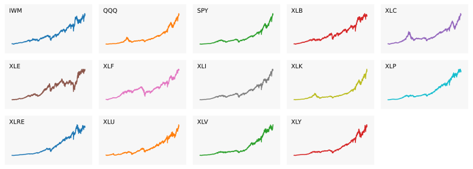
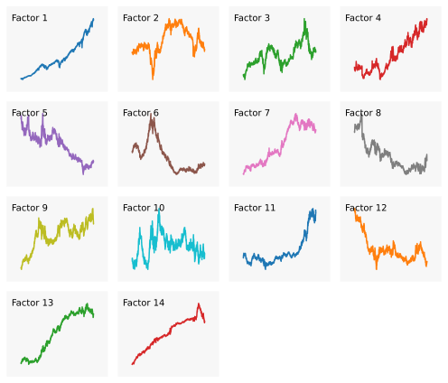
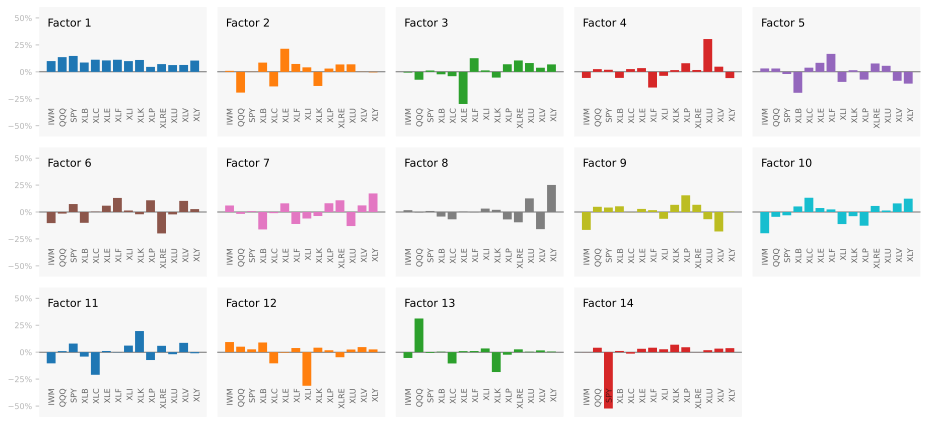
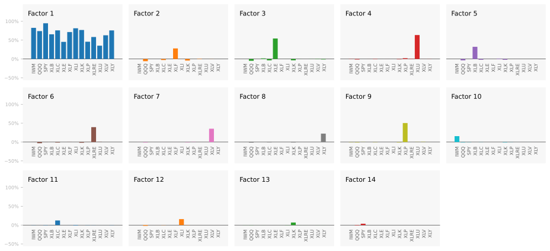
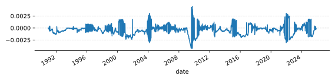
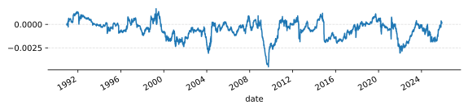
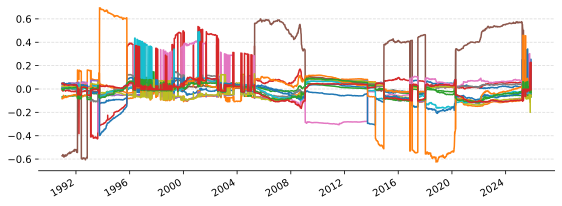
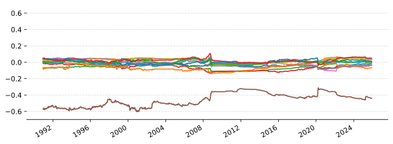
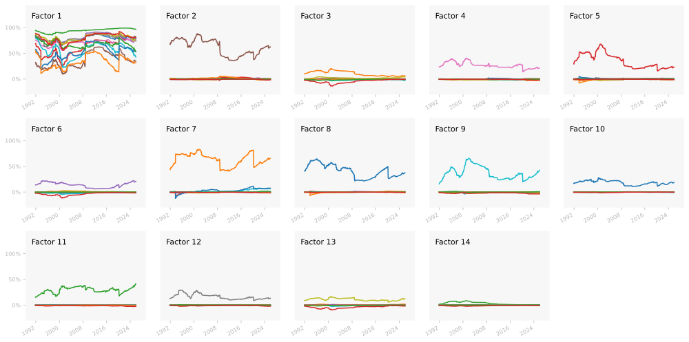
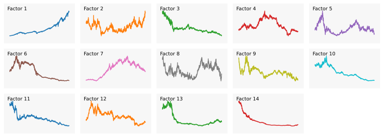

When you buy something, and the price changes, what happend? Let's say, for example, you buy shares in a made-up health company called "Orange". This company makes wearable health monitors. The price of Orange goes down by 5%. Why? It could be because the whole market went down, or because the technology sector went down, or because the health sector went down, or because Orange genuinely performed poorly. Each of these possible explanations is called a *factor*.

The idea of a factor model is that every stream of returns can be explained by a number of underlying factors. A factor model roughly says $\boldsymbol{r}_t \approx \boldsymbol{\beta} \boldsymbol{f}_t$ where $\boldsymbol{r}_t$ is a vector of returns at time $t$, $\boldsymbol{\beta}$ is a matrix of factor loadings and $\boldsymbol{f}_t$ is a vector of factor returns. If we can identify these factors, we can understand what is driving returns.

Not only does this model allow us to explain returns, we can compare the returns of different assets in a meaningful way. For example, we could break down the returns of [Apple](https://uk.finance.yahoo.com/quote/AAPL/) and [Orange](https://en.wikipedia.org/wiki/Apples_and_oranges) and see how much of their returns are explained by the same factors.

There are a handful of ways to build a factor model. (1) You know the factors $\boldsymbol{f}_t$, and want to estimate the loadings $\boldsymbol{\beta}$. This is a macroeconomic factor model. (2) You know the loadings and you want to estimate the factors. This is a characteristic factor model. (3) You don't know the factors or loadings and you want to estimate both. This is as *statical factor model* [^Conner2007].

The literature on these approaches is vast, but a fantastic overview is given in the paper [Factor Models, Machine Learning, and Asset Pricing](https://www.annualreviews.org/content/journals/10.1146/annurev-financial-101521-104735) [^Giglio2022].

In this article, we're going to explore statistical factor modelling. We will address a few issues that arise in this approach: (1) the method is data-hungry, requiring long historical return series; (2) the factors we get are often not economically meaningful; (3) the factors we get may not be stable out-of-sample.

# Factor models

For a deep dive into factor models, the best resource on the market is [The Elements of Quantitative Investing](https://www.wiley.com/en-us/The+Elements+of+Quantitative+Investing-p-9781394265466) [^Paleologo2025]. Here, we'll lightly go over everything that will be useful for this article.

A factor model is formulated as
$$
\boldsymbol{r}_t = \boldsymbol{\alpha} + \boldsymbol{\beta} \boldsymbol{f}_t + \boldsymbol{\epsilon}_t
$$

where
* $\boldsymbol{r}_t$ is a random vector of returns for $N$ assets at time $t$. Generally, the risk free rate is subtracted, making these excess returns.
* $\boldsymbol{\alpha}$ is the *alpha* vector. This is an $N \times 1$ vector of constants that represent the average return of each asset not explained by the factors.
* $\boldsymbol{\beta}$ is the factor loading matrix. This is an $N \times K$ matrix where each row represents an asset and each column represents a factor. The entries represent the sensitivity of each asset to each factor.
* $\boldsymbol{f}_t$ is a $K \times 1$ random vector of factor returns.
* $\boldsymbol{\epsilon}_t$ is a random vector of *idiosyncratic* returns. This is an $N \times 1$ vector representing the portion of each asset's return not explained by the factors.

The alpha vector $\boldsymbol{\alpha}$ is generally assumed to be $\text{E}[\boldsymbol{\alpha}] = 0$. If it is not, then we have an arbitrage opportunity. That is, we can find portfolio weights $\boldsymbol{w}$ such that $\boldsymbol{w}^\top \boldsymbol{\alpha} > 0$ and $\boldsymbol{w}^\top \boldsymbol{\beta} \boldsymbol{f}_t = 0$, meaning we can earn positive returns while having no exposure to the factors. In practice, a model that predicts asset returns is predicting this vector for time $t$, the elusive "alpha" that traders talk about.

Analogously, any model of $\text{E}[\boldsymbol{f}_t]$ is a model of the risk premia associated with each factor. 

The ideal factor returns have a covariance matrix that is the identity matrix, i.e. $\boldsymbol{\Sigma}_f = \boldsymbol{I}$. The immediate implication of this is that the covariance of $\boldsymbol{r}_t$ is
$$
\boldsymbol{\Sigma}_r = \boldsymbol{\beta} \boldsymbol{\Sigma}\_f \boldsymbol{\beta}^\top + \boldsymbol{\Sigma}\_\epsilon = \boldsymbol{\beta} \boldsymbol{\beta}^\top + \boldsymbol{\Sigma}\_\epsilon
$$
This condition turns out to be very easy to enforce as we will see later.

The idiosyncratic returns $\boldsymbol{\epsilon}_t$ are assumed to have expectation of 0 as any mean is captured with the $\boldsymbol{\alpha}$ vector. They are also assumed to be uncorrelated with the factors and generally with eachother. This means that the covariance matrix $\boldsymbol{\Sigma}\_\epsilon$ is a diagonal matrix. This is known as the *idiosyncratic risk* or *specific risk* of each asset. In practice, this assumption does not hold perfectly. Practitioners instead aim for a sparsely populated covariance matrix, meaning that most assets have little correlation with each other after accounting for the factors. Intuitively, if two assets are very similar, then they will have some correlation that is not explained by the factors.

Most factor models aim to have a small number of factors relative to the number of assets, $K \ll N$. For example, the commercially available [MSCI USA Equity Factor Models](https://www.msci.com/downloads/web/msci-com/data-and-analytics/factor-investing/equity-factor-models/MSCI%20USA%20Equity%20Factor%20Model-cfs-en.pdf) factor models have on the order of 50-100 factors for 20,000+ assets. These factor models require vast data resources and research to build. They are expensive to purchase and used by large institutions.

For our purposes, we will focus on building a useful factor model that can be built with at home resources. We will be using the same number of factors as assets, but we will see that we will still gain a large amount of insight into the returns of our assets.

# Why?

I said earlier that factor models allow us to explain returns. Why this is useful is not immediately obvious. Before we jump into the details of building these models, let's explore what we can do with them.

1. You can explain where returns come from.
    1. You can attribute performance. I.e. you can attribute portfolio performance to specific factors or to asset-specific alpha/idio-syncratic.
1. You can explicitly express risk premia.
1. You can seperate risk premia from alpha in your return predictions.
1. You can build better risk models. i.e. because we know where the risk is coming from, we can hedge it. Or, more specifically, we can invest in a single or multiple factors to the exclusion of all others.
1. You can build more diversified portfolios. I.e. you diversify across factors, not across assets all exposed to the same factors.


# Data

We're going to use real data to illustrate the modelling in this article. To keep things simple, we're going to use a selection of ETFs.

Choosing ETFs means we can focus on only a small number of assets but still capture a wide selection of the market. But more importantly, as ETFs tend to be mechanically constructed to track an index, we can extend their historical data backwards by using either the index returns or the returns of related assets before the ETF was created.

In this article, we're going to use the following U.S. based ETFs:

| Ticker  |Inception    | Description |
|:--------|:------------|:------------|
| [IWM](https://www.ishares.com/us/products/239710/ishares-russell-2000-etf)    | 22 May 2000 | Tracks the Russell 2000 --- small-capitalization equities. |
| [QQQ](https://www.invesco.com/qqq-etf/en/home.html)                           |  3 Oct 1999 | Tracks the Nasdaq-100 --- dominated by technology.         |
| [SPY](https://www.ssga.com/us/en/intermediary/etfs/spdr-sp-500-etf-trust-spy) | 22 Jan 1993 | Tracks the S&P 500 --- represents all equities.            |
| [XLC](https://www.sectorspdrs.com/mainfund/xlc)                               | 18 Jun 2018 | Tracks the communication services sector.                  |
| [XLY](https://www.sectorspdrs.com/mainfund/xly)                               | 16 Dec 1998 | Tracks the consumer discretionary sector.                  |
| [XLP](https://www.sectorspdrs.com/mainfund/xlp)                               | 16 Dec 1998 | Tracks the consumer staples sector.                        |
| [XLE](https://www.sectorspdrs.com/mainfund/xle)                               | 16 Dec 1998 | Tracks the energy sector.                                  |
| [XLF](https://www.sectorspdrs.com/mainfund/xlf)                               | 16 Dec 1998 | Tracks the financials sector.                              |
| [XLV](https://www.sectorspdrs.com/mainfund/xlv)                               | 16 Dec 1998 | Tracks the health care sector.                             |
| [XLI](https://www.sectorspdrs.com/mainfund/xli)                               | 16 Dec 1998 | Tracks the industrials sector.                             |
| [XLB](https://www.sectorspdrs.com/mainfund/xlb)                               | 16 Dec 1998 | Tracks the materials sector.                               |
| [XLRE](https://www.sectorspdrs.com/mainfund/xlre)                             |  7 Oct 2015 |  Tracks the real estate sector.                            |
| [XLK](https://www.sectorspdrs.com/mainfund/xlk)                               | 16 Dec 1998 | Tracks the technology sector.                              |
| [XLU](https://www.sectorspdrs.com/mainfund/xlu)                               | 16 Dec 1998 | Tracks the utilities sector.                               |

At first, these ETFs look like they cover unrelated parts of the market. Looking in the figure below, we can see that the energy sector (XLE) is 45% correlated with the real estate sector (XLRE). In fact, all the ETFs are highly correlated suggesting that there are similar underlying factors that they all share. 


Shows the correlations between the selected ETFs over the period 2016-01-01 to 2025-11-25. Key thing to note is that all of the ETFs are highly correlated, suggesting that there are common factors driving their returns.


The only issue with these ETFs is that that they have different inception dates and some only have a few years of history. For example, the communication sector ETF (XLC) only has data from 2018 onwards. To get around this, I construct synthetic returns for each ETF before its inception date going back to 1990-01-01. I do this by getting a large set of related stock returns and index returns and regress the first 5 years of ETF returns against these related returns. I then use the resulting regressed returns as the historical returns before the ETF's inception date.

While this is not perfect, it does give us an approximation of the returns you might have realised if you were tracking the sector (or index) before the ETF was created.

The full details of this process are in the [appendix](#appendix).

As an example, here are the returns of the materials sector ETF (XLB) spliced onto the synthetic returns before inception:


The capital over time from investing in the materials sector ETF (XLB). From 1990-01-01 to 1998-12-15, the returns are synthetic, generated by regressing related stock and index returns against the actual ETF returns for the 5 year period starting at inception. After inception, the actual ETF returns are used. The synthetic returns after inception are included in the plot to show how well the synthetic returns approximate the actual returns after inception.


<todo>Later on, we throw around the term "risk premia". This is incorrect as we are not looking at excess returns. Adjust everything by the effective federal funds rate. Can backfill this with the monthly effective federal funds rate and the plain federal funds rate.</todo>

So that you can reproduce what we do here, the full set of returns can be downloaded [here](returns.csv). And you can read them in with:
```python
import pandas as pd

R = pd.read_csv('returns.csv', index_col=0, parse_dates=True)
```

Risk adjusting the returns to have a daily volatility of 1% and plotting the capital growth gives:

<feature class="nostyle big">



</feature>

# Statistical factors

Now that we have a long history of returns, we can build a statistical factor model. For this section, we are going to work in-sample. There are unique challenges when working out-of-sample that distract from the core modelling ideas. We will address these challenges later.

## PCA

Principle component analysis [(PCA) is the workhorse](https://www.google.com/search?q=%22PCA+is+the+workhorse%22) of statistical factor modelling. It is robust and deeply understood. Many before me have written excellent explanations of PCA, see for example [this blog post](https://gregorygundersen.com/blog/2022/09/17/pca/). Here, will go through the idea and the theory behind PCA as it relates to factor modelling.

* I want to know the origins of PCA. Who invented it, when, why?
* A short paragraph on what PCA is doing.
* A visualisation of PCA in 2D. Make something of multiple panels in a similar way to quantamagazine.
* Run through the mathematics of PCA.
* Point out explicitly that PCA is just a rotation of the data. We're able to rotate the data to a new basis with certain properties. This is very powerful and will be a recurring idea in factor modelling.
* Show the factor model found with PCA. That is, how do we get the factor loadings from PCA, and show that r = LF (a=0, e=0).
* Run PCA on the ETF returns. Do all the code ourselves, do not use sklearn. This ensure no centering and drives home what we're doing.
* Show that the correlation matrix of the factors is the identity matrix.
* Convert the factor loadings to weights that we can use to interpret the factors.
* Show one of the factors and point out that it's virtually impossible to interpret.

The PCA algorithm in Python with numpy:
```python
import numpy as np

cov = R.cov()
eigvals, vecs = np.linalg.eigh(cov)

# The eigenvalues and eigenvectors are
# in ascending order. Reverse them so
# that the largest eigenvalues are first.
eigvals = eigvals[::-1]
vecs = vecs[:, ::-1]

# Converts returns to factors
iloadings = pd.DataFrame(vecs, index=R.columns)

# Converts factors to returns
loadings = pd.DataFrame(vecs.T, columns=R.columns)

# PCA has an indeterminancy where the
# sign of each factor is arbitrary.
# Try to keep loadings positive.
signs = np.median(np.sign(loadings), axis=1)
signs[signs == 0] = 1
sign = np.diag(signs)
loadings = sign @ loadings
iloadings = iloadings @ sign

factors = R @ iloadings
```

You can check for yourself that the factors are not correlated by computing their correlation matrix: `factors.corr()`.

Generally when you run PCA, the idea is that you only keep the first $K$ factors that explain most of the variance. Previous work on factor modelling shows that there are on the order of 100 factors. In our case, we only have 14 assets each of which covers a broad selection of the market. Therefore, I expect that all 14 factors are needed to explain the returns. So, we are going to keep all the factors.

Additionally, by keeping all the factors, $\boldsymbol{\beta}$ is square and invertible which means we lose the terms $\boldsymbol{\alpha}$ and $\boldsymbol{\epsilon}_t$ from the factor model:
$$
\begin{aligned}
\boldsymbol{r}_t &= \boldsymbol{\beta}\boldsymbol{f}_t \\\
\boldsymbol{\beta}^{-1}\boldsymbol{r} &= \boldsymbol{f}_t \\\
\end{aligned}
$$
The returns can be perfectly reconstructed from the factors and vice versa.

We can visualise the factors by adjusting their volatilities to be 1% per day. This dampens out the extreme movements when calculating the capital growth for each factor. The factors look like:

<feature class="nostyle big">



</feature>

The first factor is often called the "market factor" as it tends to represent the overall market movement. As we are looking at equities, we could interpret the first factor as the equity risk premia. That is, this is the return that investors expect to earn for taking on equity risk.

The other factors are generally more difficult to interpret economically. However, we can see that there may be some hits of other orthogonal risk premia. For example, many of the other factors appear to exhibit long term trending behaviour. If those factors were economically meaningful, we would interpret those trends as risk premia.

<feature class="nostyle big">



</feature>

Some observations:

* The market factor does not have any assets with large weights. This factor contributes fairly evenly to all assets.
* I've taken the absolute value of the weights. This obscures slightly the significance of the market factor having all positive weights. The market factor influences all assets by roughly the same amount in the same direction.

We're going to look at two things we can do to make these factors more interpretable: whitening and varimax rotation.

## Whitening

The idea behind whitening is to re-scale the factors to have the same variance. Generally, we set the variance to 1. Now, the factors already are uncorrelated which means that setting their variances to 1 results in the covariance matrix being the identity matrix.

To whiten, we divide the factors by their standard deviations. The eigenvalues from PCA are the variances of each factor. Therefore, we can whiten by dividing each factor by the square root of its corresponding eigenvalue:
$$
\boldsymbol{r}_t = \boldsymbol{\beta}\boldsymbol{D} \boldsymbol{f}_t
$$
where $\boldsymbol{D}$ is a diagonal matrix with entries $D\_{ii} = 1 / \sqrt{\lambda_i}$ where $\lambda_i$ is the $i$th eigenvalue. In practice, we modify the loadings matrix $\boldsymbol{\beta}$ to include this scaling:
```python
# Whiten loadings so that the factors have
# covariance = I
vecs = vecs / np.sqrt(eigvals)
```

Now, the resulting factors have the identity matrix as their covariance matrix:
$$
\boldsymbol{\Sigma}_f = \text{Cov}[\boldsymbol{f}_t] = \boldsymbol{I}
$$
we say that these factors are [*orthonormal*](https://en.wikipedia.org/wiki/Orthonormality). This setup allows us to rotate the factors by any orthogonal matrix $\boldsymbol{C}$ and still maintain the identity covariance matrix:
$$
\begin{aligned}
\boldsymbol{C}^\top \boldsymbol{C} &= \boldsymbol{I} \\\
\boldsymbol{r}_t &= \boldsymbol{\beta} \boldsymbol{C}^\top \boldsymbol{C} \boldsymbol{f}_t \\\
\\\
\text{Cov}[\boldsymbol{C} \boldsymbol{f}_t] &= \boldsymbol{C} \text{Cov}[\boldsymbol{f}_t] \boldsymbol{C}^\top \\\
&= \boldsymbol{C} \boldsymbol{I} \boldsymbol{C}^\top = \boldsymbol{I} \\\
\end{aligned}
$$
This is a powerful idea. It means we can search for a rotation $\boldsymbol{C}$ that makes the factors more interpretable while still maintaining the properties we want.

## Varimax rotation

Denote our loadings after rotation to be $\boldsymbol{L}^{(1)} = \boldsymbol{L} \boldsymbol{C}^\top$. We can make the factors more interpretable by making the loadings more sparse. That is, for each factor (column of $\boldsymbol{L}^{(1)}$), we want only a few assets to have large loadings, and the rest to be close to zero. This makes 
it easy to interpret what each factor is doing as it only strongly influences a few assets. One rotation that achieves this is called the *varimax* rotation first described in 1958 in psychometric research [^Kaiser1958].

Note again that the covariance matrix of returns under a factor model with orthonormal factors is:
$$
\boldsymbol{\Sigma}_r = \boldsymbol{L} \boldsymbol{L}^\top + \boldsymbol{\Sigma}\_\epsilon
$$

where the variance of asset $i$ is the $i$th diagonal entry of $\boldsymbol{\Sigma}\_r$:

$$
\sigma^2\_{r,i} = \sum_{j=1}^K L\_{ij}^2 + \sigma^2\_{\epsilon,i}
$$

that sum of squared loadings is the sum over the row of $\boldsymbol{L}$ corresponding to asset $i$. The value $L\_{ij}^2$ is the contribution of factor $j$ to the variance of asset $i$. Therefore, if we want each factor to only contribute to a few assets, we want the squared loadings in each column of $\boldsymbol{L}$ to be sparse.

We can formulate this sparsity requirement by saying we want each column of $\boldsymbol{L}$ to have a high variance of squared loadings. If the squared loadings are all similar, then the variance is low. If some squared loadings are large and the rest are small, then the variance is high. Recall that the variance of a random variable $X$ is given by $\text{Var}(X) = \text{E}[X^2] - (\text{E}[X])^2$. Therefore, the variance of the squared loadings for factor $j$ is:

$$
\text{Var}[L\_{\cdot j}^2] = \frac{1}{N} \sum_{i=1}^N L\_{ij}^4 - \left( \frac{1}{N} \sum_{i=1}^N L\_{ij}^2 \right)^2
$$

And the varimax objective function to maximise is the sum of these variances across all factors:
$$
\text{Varimx}(\boldsymbol{L}) = \sum_{j=1}^K \left[ \frac{1}{N} \sum_{i=1}^N L\_{ij}^4 - \left( \frac{1}{N} \sum_{i=1}^N L\_{ij}^2 \right)^2 \right]
$$

The original solution to maximising this objective rotates a single pair of factors at a time to increase the objective [^Kaiser1958]. The modern approach is to calculate the gradient and use an iterative method to find the maximum [^Jennrich2001]. We'll skip the derivation and just present the algorithm:

1. initialise $C \leftarrow I$.
2. compute $\Lambda = L C$.
3. compute column means $d_j = \tfrac{1}{p}\sum_i \Lambda_{ij}^2$.
4. compute the derivative  $\partial \text{Varimx}/\partial\Lambda = \tfrac{4}{p}Z$ where the entries are $Z_{ij} = \Lambda_{ij}^3 - d_j \Lambda_{ij}$.
5. using the chain rule, compute the derivative $M = \partial \text{Varimx}/\partial
C = L^\top Z$.
6. compute the SVD: $M = U\Sigma V^\top$.
7. update $C \leftarrow U V^\top$.
8. if the objective has not converged, go back to step 2.

For our analysis, we're going to make a small change to the algorithm. The first factor we found with PCA is the market factor. Recall that the loadings for that factor are all fairly even. If we were to use the varimax rotation, we will lose this factor as varimax does not like factors with even loadings. We want to hold this factor fixed and only rotate the other factors. We pull this off by excluding the column in $\boldsymbol{L}$ corresponding to the market factor when computing the varimax rotation. That is, we run varimax on $\boldsymbol{L}\_{2:K}$ and then the rotation matrix is:
$$
\boldsymbol{C} = \begin{bmatrix}1 & \boldsymbol{0} \\\
\boldsymbol{0} & \boldsymbol{C}\_{varimax} \\\
\end{bmatrix}
$$

The code for the varimax algorithm in Python is:
```python
# Add cod here
```

## Interpretation

Our process for finding factors is: obtain PCA factors, whiten them, then varimax rotate all but the first factor. We convert the loadings to weights for interpretation as before. The results look like:

<feature class="nostyle big">



</feature>

In comparison to the unrotated PCA factors, the varimax factors are much more interpretable. Factor 1 remains the market factor with all assets contributing fairly evenly. The other factors have become much more sparse. Keep in mind that these factors are all uncorrelated! So a factor that explains a high percentage of one asset and little of the others can be thought of as the unique source of risk and returns for that asset.

**Factor 1** is the market factor. This explains a high percentage of all assets, roughly 50% for each asset. **Factor 2** explains a high percentage of consumer staples (XLP). There is some explaining power for other ETFs, but it is very small in comparison. We should expect to see small explaining power for all the other ETFs as the sectors economically overlap. If Factor 2 has a positive average return, then it could be interpreted as the consumer staples risk premia. Each factor in our example explains a high percentage of one of the assets and thus similar conclusions can be drawn for the other factors.

At this point, we could talk about how to model the possible risk premia in each factor. We will leave that to another article. Instead, we will look at ensuring that a factor model maintains its properties out-of-sample.

# In practice

Up until now, the factor modelling has operated in-sample. That is, we have looked at factors historically computed with all available data. In practice, we want to be able to compute factor loadings and factors out-of-sample. That is, at time $t$, we want to be able to compute the factor loadings $\boldsymbol{\beta}$ using data available before time $t$ and factors $\boldsymbol{f}_t$ using only data available up to time $t$.

We're now going to switch from a fixed matrix of loadings $\boldsymbol{L}$ to time varying loadings $\boldsymbol{L}_t$. For factors at time $t$, we will compute the loadings using data up to time $t-l$ where $l$ is a suitable lag. The factor model becomes:
$$
\boldsymbol{r}_t =\boldsymbol{\alpha} + \boldsymbol{L}\_{t-l} \boldsymbol{f}_t + \boldsymbol{\epsilon}_t
$$

We will assume that $\boldsymbol{\alpha} = 0$ and we will use a cross-sectional regression to compute the factor returns once the asset returns are realised:
$$
\boldsymbol{f}_t = (\boldsymbol{L}\_{t-l}^\top \boldsymbol{L}\_{t-l})^{-1} \boldsymbol{L}\_{t-l}^\top \boldsymbol{r}_t
$$

Because our loadings are invertible, this gives us the exact factor returns that reconstruct the realised returns:
$$
\boldsymbol{r}_t = \boldsymbol{L}\_{t-l} \boldsymbol{f}_t
$$

## Exponential weighting

When computing the covariance matrix of returns to fit the PCA factor model, we could use a sliding window of historical returns. This approach gives equal weight to all returns in the window and zero weight to returns outside the window. A better approach is to use an exponentially weighted moving covariance matrix. This approach gives more weight to recent returns and less weight to older returns.

We have a whole article on the exponentially weighted variance [here](). In Python, we can compute the exponentially weighted covariance matrix with:
```python
covs = returns.ewm(halflife=252, min_periods=252).cov()
```
for a halflife of 252 trading days (1 year).

When computing the factor loadings at time $t$, we use the exponentially weighted covariance matrix up to time $t-l$.

## Loadings consistency

The first issue we'll encounter is that PCA has an indeterminancy where the sign of each factor is arbitrary. See the figure below. This means that if we compute the loadings at different times, the signs of the factors may be flipped. This means that the factors will flip signs randomly day to day, making them impossible to interpret.



The sign of the PCA factors is arbitrary. Here we illustrate two possible PCA factorizations of the same data. The difference is that the signs of the factors have been flipped. Both factorizations are equally valid PCA decompositions.


For example, we'll fit a PCA factor model to with an EWM covariance matrix with halflife of 252 days. We'll include whitenning. The loading for SPY on the first factor over time looks like:



where you can see the sign flips.

To fix this, we enforce sign consistency by ensuring that the angle of each factor with its previous day's version remains small. If the angle is larger than 90 degress, we flip the sign. The cosine of the angle between two vectors $\boldsymbol{a}$ and $\boldsymbol{b}$ is given by:
$$
\cos(\theta) = \frac{\boldsymbol{a}^\top \boldsymbol{b}}{||\boldsymbol{a}|| \cdot ||\boldsymbol{b}||} 
$$
When the angle is less than 90 degrees, the cosine is positive. When the angle is greater than 90 degrees, the cosine is negative. Therefore, we can enforce sign consistency by checking the cosine of the angle between the current PCA loadings and the previous loadings. If it is negative, we flip the sign of the current loading. We can also drop the normalization as (1) we're only interested in the sign and (2) the PCA loadings are orthonormal.

Repeating the above sliding window PCA with sign consistency enforced gives:



where we can see that the sign is no longer flipping randomly.

Upading the `pca_loadings` function to enforce sign consistency gives:

```python
def pca_loadings(
    cov: np.ndarray,
    whiten: bool = False,
    prev: np.ndarray | None = None,
) -> np.ndarray:

    # existing PCA code
    ...

    # Try to keep vecs consistent over time
    if prev is not None:
        signs = np.sign(np.diag(prev.T @ vecs))
        vecs = vecs * signs
    
    return vecs
```

### Rotational consistency

The varimax rotation is an optimisation over a non-convex objective. There are many solutions and local minima. Consider that since the factors are whitened, the order of the factors is not important. In fact, the same factors can be represented in any order which immediately gives us $K!$ equivalent solutions. This means that the factors will change meaning day to day, making them impossible to interpret consistently out-of-sample.

We can solve this by computing the varimax rotated loadings at time $t$ and rotating them to be as close as possible to the previous day's loadings. This means we want an orthornormal matrix $\boldsymbol{Q}$ such that the rotated loadings $\boldsymbol{L}_\{t+1} \boldsymbol{Q}$ are as close as possible to the previous day's loadings $\boldsymbol{L}_t$. We can formulate this as the minimisation problem:
$$
\begin{aligned}
\arg\min\_{\boldsymbol{Q}} & \ || \boldsymbol{L}\_{t+1} \boldsymbol{Q} - \boldsymbol{L}_t ||_F^2 \\\
\text{s.t.} & \  \boldsymbol{Q}^\top \boldsymbol{Q} = \boldsymbol{I} \\\
\end{aligned}
$$

This is known as the [orthogonal Procrustes problem](https://en.wikipedia.org/wiki/Orthogonal_Procrustes_problem) and has a closed form solution. The derivation of the solution is in the [appendix](#orthogonal-procrustes-problem). We'll just present the final result here. The solution is to take the following SVD: 
$$
\boldsymbol{L}_t^\top \boldsymbol{L}\_{t+1} = \boldsymbol{U} \boldsymbol{\Sigma} \boldsymbol{V}^\top
$$
and solve:
$$
\boldsymbol{Q} = \boldsymbol{U} \boldsymbol{V}^\top
$$

The code to implement this rotation matrix is:
```python
def procrustes_rotation(current, previous):
    C = previous.T @ current
    U, _, Vt = np.linalg.svd(C)
    Q = Vt.T @ U.T
    return Q
```




## Factor orthogonality


Because the loadings are changing over time, the factors we get may not be orthonormal. That is, the covariance matrix of the factors may not be the identity matrix:
$$
\boldsymbol{\Sigma}_f = \text{Cov}[\boldsymbol{f}_t] \neq \boldsymbol{I}
$$
There is no way to fix this. We can reduce the issue by further rotating the factors at each time step. However, this further rotation impacts the interpretability of the factors and in my experience, only marginally improves the orthogonality of the factors.

For now, we will accept that the factors are not perfectly orthonormal out-of-sample. We still have a significantly improved stream of returns. Recall the [correlation matrix of the ETF returns](#fig:etf_correlations) from before. Now, observe the correlation matrix of the factor returns:


Shows the correlations between the realised factor returns over the period 2016-01-01 to 2025-11-25. In comparison to the ETF correlation matrix, the factors are mostly uncorrelated, showing that the factor model has successfully identified sources of risk and return.


## Interpretation

Now that we've stabalised the out-of-sample factor model, we can inspect the factors over time to check that they are in fact stable and interpretable.

Lorem ipsum dolor sit amet, consectetur adipiscing elit. Integer odio neque, volutpat vel nunc
ut. Duis maximus massa vitae libero imperdiet feugiat quis a sapien. Quisque sodales neque dui,
a mollis justo porta eu. Nullam semper ipsum ac ante rhoncus, ac facilisis lacus posuere. Mauris
pulvinar elementum ligula in mattis. Fusce rhoncus consequat lorem accumsan rhoncus.

<feature class="nostyle big">



</feature>

Lorem ipsum dolor sit amet, consectetur adipiscing elit. Integer odio neque, volutpat vel nunc
ut. Duis maximus massa vitae libero imperdiet feugiat quis a sapien. Quisque sodales neque dui,
a mollis justo porta eu. Nullam semper ipsum ac ante rhoncus, ac facilisis lacus posuere. Mauris
pulvinar elementum ligula in mattis. Fusce rhoncus consequat lorem accumsan rhoncus.

<feature class="nostyle big">



</feature>

Lorem ipsum dolor sit amet, consectetur adipiscing elit. Integer odio neque, volutpat vel nunc
ut. Duis maximus massa vitae libero imperdiet feugiat quis a sapien. Quisque sodales neque dui,
a mollis justo porta eu. Nullam semper ipsum ac ante rhoncus, ac facilisis lacus posuere. Mauris
pulvinar elementum ligula in mattis. Fusce rhoncus consequat lorem accumsan rhoncus.

Lorem ipsum dolor sit amet, consectetur adipiscing elit. Integer odio neque, volutpat vel nunc
ut. Duis maximus massa vitae libero imperdiet feugiat quis a sapien. Quisque sodales neque dui,
a mollis justo porta eu. Nullam semper ipsum ac ante rhoncus, ac facilisis lacus posuere. Mauris
pulvinar elementum ligula in mattis. Fusce rhoncus consequat lorem accumsan rhoncus.


# Summary

Lorem ipsum dolor sit amet, consectetur adipiscing elit. Integer odio neque, volutpat vel nunc
ut. Duis maximus massa vitae libero imperdiet feugiat quis a sapien. Quisque sodales neque dui,
a mollis justo porta eu. Nullam semper ipsum ac ante rhoncus, ac facilisis lacus posuere. Mauris
pulvinar elementum ligula in mattis. Fusce rhoncus consequat lorem accumsan rhoncus.

{}

{}

{}

{}

{}