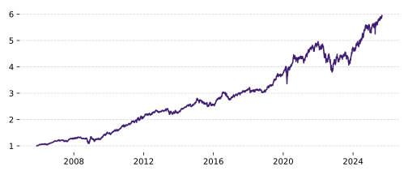

# Intro

1. Value at Risk is a ubiquitous metric for understanding and managing the risks in a portfolio.
2. It does not capture risk very well. The report from the LTCM blow up pointed the finger at the short comings of VaR.
3. A better metric which captures the tail risk in a portfolio is the condition value at risk
4. This article will run through value at risk, show how conditional value at risk works, show how to include it as a constraint in a portfolio optimisation and share code you can use yourself.


# Conditional Value at Risk

One of the most commonly used risk metrics is [Value at Risk](https://en.wikipedia.org/wiki/Value_at_risk) (VaR). It is not without it's problems. The analysis on the famous collapse of [Long Term Capital Management](https://en.wikipedia.org/wiki/Long-Term_Capital_Management) in the 1990s finds the use of VaR as the main culprit behind the collapse [^Jorion1999].

[Conditional Value at Risk](https://en.wikipedia.org/wiki/Expected_shortfall) (CVaR), is a more informative risk measure that addresses some of the shortcomings of VaR. We'll start off by covering VaR and then work our way up to CVaR.

## Value at Risk

Value at Risk (VaR) is a measure of the amount of money you could lose on a regular day. Given a time horizon (such as 1 day) and regular day frequency (such as 95% of the time), VaR tells you the maximum loss you can expect to see on those regular days.

If the frequency of regular days is 95%, and we expect to lose at most \\$1m, we say "95% of the time you expect to lose less than \\$1m". But, about 1 day in 20 you could lose \\$1m or more. You may see this written as something like "1-day 95% VaR of \\$1m".

<todo>Insert graph showing loss distribution and VaR point</todo>

VaR has some fairly serious shortcomings; tail blindness, failure to be subadditive and awkwardness for optimisation.

**Tail blindness** &nbsp;&nbsp; The critical thing to understand about VaR is that it does not tell you how much you could lose on bad days. It only tells you the maximum loss you can expect to see on regular days. It ignores the losses entirely you're past the threshold. A breach of this threshold will *always* be worse than the VaR figure. It could be a little worse, or it could be catastrophically worse.

**Fails subadditivity** &nbsp;&nbsp;  We want diversification to reduce risk. If we combine two portfolios, the risk of the combined portfolio should be no greater than the sum of the risks of the individual portfolios. This is known as [subadditivity](https://en.wikipedia.org/wiki/Subadditivity) and is a desirable property for a risk metric [^coherent]. VaR does not satisfy this property. See the [appendix](#appendix-var-is-not-subadditive) for an example.

**Awkward for optimisation** &nbsp;&nbsp; Minimising VaR is a non-convex, unstable problem. I have not seen a portfolio optimisation using VaR as a constraint or objective.

The Conditional Value at Risk (CVaR) addresses these issues.

## Conditional value at risk

*Conditional Value at Risk (CVaR) is also known as Expected Shortfall, Mean Excess Loss, Mean Shortfall or Tail VaR [^Uryasev2000].*

Rather than telling you the minimum loss you can expect to see on bad days, CVaR tells you the *average loss* you can expect to see on those bad days. This gives you a much better idea of the tail risk in your portfolio.

<todo>Insert graph showing loss distribution, VaR point and CVaR area</todo>

This change from minimum loss (VaR) to average loss (CVaR) addresses the tail blindness problem. A breach of the VaR threshold will, on average, be equal to the CVaR figure. Also, the metric is subadditive making it inline with our intuition that diversification should reduce risk. And, while on first pass the CVaR is not convex, it can be reformulated as a convex problem that can be incoprorated into a portfolio optimisation[^Rockafellar1999] as we will see later.

## Estimation

To estimate $\text{CVaR}(\alpha)$, we are going to use historical returns. Let's say we have a vector of portfolio weights $\boldsymbol{w}$ and vectors of asset returns $\boldsymbol{r}_t$ where each $t$ is a different time period over some historical window. We can estimate the CVaR at the $1 - \alpha$ confidence level as follows:
1. Calculate the portfolio returns $R_t = \boldsymbol{w}^\top \boldsymbol{r}_t$ for each time $t$.
2. Collect the worst $\alpha$ fraction of the returns.
3. Calculate the average of these worst returns.

This is the simplest method to estimate CVaR, known as historical simulation. More sophisticated methods exist, such as fitting a coupula to the returns or using Monte Carlo simulation. But, for the sake of this article, we will stick with historical simulation.

<todo>Add some references for the various methods here</todo>

## Example

Let's look at an example of what CVaR looks like in practice.

We're going to look at an equally risk weighted portfolio of the following ETFs:

- SPY -- U.S. equities (S&P 500)
- TLT -- Long-term U.S. Treasury bonds
- GLD -- Gold
- GSG -- Broad commodities
- VNQ -- U.S. real estate investment trusts (REITs)

You can grab these prices with the following Python code:
```python
import yfinance as yf

tickers = yf.Tickers("SPY TLT GLD GSG VNQ")
prices = tickers.download(period="30y", interval="1d")
returns = prices["Close"].pct_change().dropna()
```

And then use an exponentially weighted estimate of volatility to determine the portfolio weights at each time step:
```python
weights =  1 / returns.ewm(halflife=21, min_periods=21).std()
weights = weights.divide(weights.sum(1), axis=0)
```

The equity curve (barring costs and other frictions) looks like this:
```python
portfolio_returns = (returns * weights.shift(1)).sum(1)
(1 + portfolio_returns).cumprod().plot()
```



1. Run an example on an equally risk weighted portfolio
2. Graph showing the conditional value at risk over time.
3. Is there a relationship between the CVaR and future returns? (not important, but interesting if true)
    1. Ideally we’d see that the CVaR is somewhat accurate. That is, the worst % of losses match the average predicted by CVaR.

# Portfolio optimisation

Original paper [^Rockafellar1999].

1. Derivation - we want to learn the optimisation concepts and techniques
    1. how do slack variables work, substitutions, etc….
2. Optimisation problem with CVaR constraint
3. Example

# Comparison with mean-variance optimisation

1. Compare with mean–variance: composition differences, realised tail risk, turnover.

# Summary and next steps

Blah blah blah

# Appendix: VaR is not subadditive

Say we have some risk metric $\rho(\cdot)$. We say that it is subadditive if, for any two portfolios $X_1$ and $ X_2$:
$$
\rho(X_1 + X_2) \leq \rho(X_1) + \rho(X_2)
$$
which is to say that the risk of the combined portfolio is no greater than the sum of the risks of the individual portfolios.

To demonstrate that VaR is not subadditive, we will consider two **independent** loans $X_1$ and $X_2$ such that each loan loses **\\$1** with a probability of of **10%**, and **\\$0** otherwise. The two loans are independent. We'll look at the 90% VaR of each loan individually and then combined.

Single loan:


| Loss | Probability |
|------|------------:|
| 0    | 90%         |
| 1    | 10%         |

The 90% VaR of a single loan is \\$0, since 90% of the time the loss will be no more than \\$0. That gives us:
$$
\begin{align}
\rho(X_1) = 0 \\\
\rho(X_2) = 0 \\\
\end{align}
$$

Combined portfolio (two loans):

| Loss | Probability                        |
|------|-----------------------------------:|
| 0    | $0.9 \times 0.9 = 81\\%$           |
| 1    | $0.9 \times 0.1 \times 2 = 18\\%$  |
| 2    | $0.1 \times 0.1 = 1\\%$            |

The cumulative probability at \\$0 is 81% (< 90%), and at \\$1 it's 99% (> 90%). Therefore, the 90% VaR of a single loan is \\$1, since 90% of the time the loss will be no more than \\$1. That gives us:
$$
\rho(X_1 + X_2) = 1
$$
which fails the subadditivity property since:
$$
\rho(X_1 + X_2) = 1 \nleq 0 = \rho(X_1) + \rho(X_2)
$$


{}

{}

{}

[^coherent]: An ideal risk metric is said to be [coherent](https://en.wikipedia.org/wiki/Coherent_risk_measure) if it satifies a list of properties. See the Wikipedia page for more details.