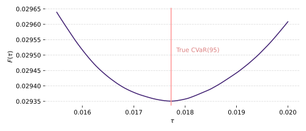
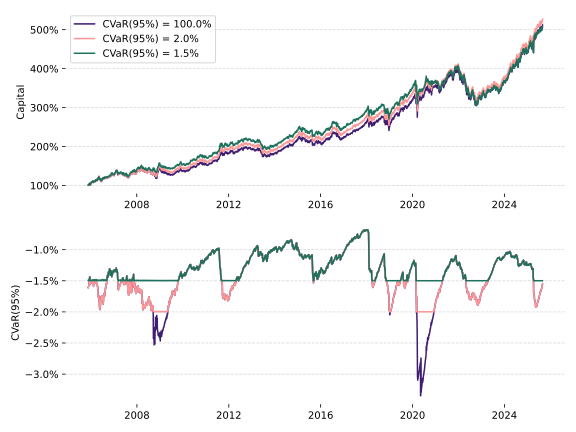

# Intro

1. Value at Risk is a ubiquitous metric for understanding and managing the risks in a portfolio.
2. It does not capture risk very well. The report from the LTCM blow up pointed the finger at the short comings of VaR.
3. A better metric which captures the tail risk in a portfolio is the condition value at risk
4. This article will run through value at risk, show how conditional value at risk works, show how to include it as a constraint in a portfolio optimisation and share code you can use yourself.


# Conditional Value at Risk

One of the most commonly used risk metrics is [Value at Risk](https://en.wikipedia.org/wiki/Value_at_risk) (VaR). It is not without it's problems. The analysis on the famous collapse of [Long Term Capital Management](https://en.wikipedia.org/wiki/Long-Term_Capital_Management) in the 1990s finds the use of VaR as the main culprit behind the collapse [^Jorion1999].

[Conditional Value at Risk](https://en.wikipedia.org/wiki/Expected_shortfall) (CVaR), is a more informative risk measure that addresses some of the shortcomings of VaR. We'll start off by covering VaR and then work our way up to CVaR.

## Value at Risk

Value at Risk (VaR) is a measure of the amount of money you could lose on a regular day. Given a time horizon (such as 1 day) and regular day frequency (such as 95% of the time), VaR tells you the maximum loss you can expect to see on those regular days.

If the frequency of regular days is 95%, and we expect to lose at most \\$1m, we say "95% of the time you expect to lose less than \\$1m". But, about 1 day in 20 you could lose \\$1m or more. You may see this written as something like "1-day 95% VaR of \\$1m".

<todo>Insert graph showing loss distribution and VaR point</todo>

VaR has some fairly serious shortcomings; tail blindness, failure to be subadditive and awkwardness for optimisation.

**Tail blindness** &nbsp;&nbsp; The critical thing to understand about VaR is that it does not tell you how much you could lose on bad days. It only tells you the maximum loss you can expect to see on regular days. It ignores the losses entirely you're past the threshold. A breach of this threshold will *always* be worse than the VaR figure. It could be a little worse, or it could be catastrophically worse.

**Fails subadditivity** &nbsp;&nbsp;  We want diversification to reduce risk. If we combine two portfolios, the risk of the combined portfolio should be no greater than the sum of the risks of the individual portfolios. This is known as [subadditivity](https://en.wikipedia.org/wiki/Subadditivity) and is a desirable property for a risk metric [^coherent]. VaR does not satisfy this property. See the [appendix](#appendix-var-is-not-subadditive) for an example.

**Awkward for optimisation** &nbsp;&nbsp; Minimising VaR is a non-convex, unstable problem. I have not seen a portfolio optimisation using VaR as a constraint or objective.

The Conditional Value at Risk (CVaR) addresses these issues.

## Conditional value at risk

*Conditional Value at Risk (CVaR) is also known as Expected Shortfall, Mean Excess Loss, Mean Shortfall or Tail VaR [^Uryasev2000].*

Rather than telling you the minimum loss you can expect to see on bad days, CVaR tells you the *average loss* you can expect to see on those bad days. This gives you a much better idea of the tail risk in your portfolio.

<todo>Insert graph showing loss distribution, VaR point and CVaR area</todo>

This change from minimum loss (VaR) to average loss (CVaR) addresses the tail blindness problem. A breach of the VaR threshold will, on average, be equal to the CVaR figure. Also, the metric is subadditive making it inline with our intuition that diversification should reduce risk. And, while on first pass the CVaR is not convex, it can be reformulated as a convex problem that can be incoprorated into a portfolio optimisation[^Rockafellar1999] as we will see later.

## Estimation

To estimate $\text{CVaR}(\alpha)$, we are going to use historical returns. Let's say we have a vector of portfolio weights $\boldsymbol{w}$ and vectors of asset returns $\boldsymbol{r}_t$ where each $t$ is a different time period over some historical window. We can estimate the CVaR at the $1 - \alpha$ confidence level as follows:
1. Calculate the portfolio returns $R_t = \boldsymbol{w}^\top \boldsymbol{r}_t$ for each time $t$.
2. Collect the worst $\alpha$ fraction of the returns.
3. Calculate the average of these worst returns.

This is the simplest method to estimate CVaR, known as historical simulation. More sophisticated methods exist, such as fitting a coupula to the returns or using Monte Carlo simulation. But, for the sake of this article, we will stick with historical simulation.

<todo>Add some references for the various methods here</todo>

## Example

Let's look at an example of what CVaR looks like in practice.

We're going to look at an equally risk weighted portfolio of the following ETFs:

- SPY -- U.S. equities (S&P 500)
- TLT -- Long-term U.S. Treasury bonds
- GLD -- Gold
- GSG -- Broad commodities
- VNQ -- U.S. real estate investment trusts (REITs)

You can grab these prices with the following Python code:
```python
import yfinance as yf

tickers = yf.Tickers("SPY TLT GLD GSG VNQ")
prices = tickers.download(period="30y", interval="1d")
returns = prices["Close"].pct_change().dropna()
```

And then use an exponentially weighted estimate of volatility to determine the portfolio weights at each time step:
```python
weights =  1 / returns.ewm(halflife=21, min_periods=21).std()
weights = weights.divide(weights.sum(1), axis=0).dropna()
```

The equity curve (barring costs and other frictions) looks like this:
```python
portfolio_returns = (returns * weights.shift(1)).sum(1)
(1 + portfolio_returns).cumprod().plot()
```


We can estimate VaR and CVaR using the historical prices as descrived above:
```python
import pandas as pd

a = 0.95

var = pd.Series(index=weights.index)
cvar = pd.Series(index=weights.index)

for date, w in weights.iterrows():
    history = returns.loc[:date]
    history_returns = (history * w).sum(1)
    
    threshold = history_returns.quantile(1 - a)

    var.loc[date] = threshold
    cvar.loc[date] = history_returns[history_returns <= threshold].mean()
```

The VaR and CVaR over time looks like:


The main point to take away from this graph is that the CVaR is always worse than the VaR. From an average loss perspective, CVaR captures the tail risk whereas VaR completely ignores it.

# Procyclical risk estimates

We now want to do a sanity check to see if our estimates are reasonable. We can do this by bucketing the VaR into 10 evenly sized buckets. Bucket 1 has the 10% worst estimaties while bucket 10 has the 10% best estimates. Then, for each bucket we'll calculate the 5% quantile of returns. The VaR figure is the 5% quantile of returns, so we expect to see a roughly linearly increasing relationship. That is, the lower buckets should have lower quantiles than higher buckets.

We can use the following code to do this:
```python
import numpy as np

df = pd.concat([var, cvar, portfolio_returns.shift(-1)], axis=1).dropna()
df.columns = ['var', 'cvar', 'portfolio_returns']

buckets = np.ceil(df['var'].rank(pct=True) * 10)
df.groupby(buckets)['portfolio_returns'].quantile(0.05).plot()
```

And we get the resulting graph:


Which is roughly the opposite of what we want to see! The worst VaR estimates have the highest 5% quantile of returns. With the exception of the 10th bucket (noisy data), the 5% quantile of returns decreases as the VaR estimate says it should increase!

This tells us that the VaR estimates are not very good. Bad, actually.

What is happening is that when the market is volatile, the historical returns have more extreme values, and when it is calm, the historical returns have less extreme values. This means that the risk metrics increase their estimates DURING (as opposed to before) a volatile market, and decrease their estimates during a calm market. This has the net affect of estimating high risk as the market is moving into a calm period and estimating low risk as the market is moving into a volatile period.

<todo>Add a chart with an example of this behaviour. Similar to the one in [^Murphy2014] on page 6. </todo>
 
This behaviour is called [*procyclical*](https://en.wikipedia.org/wiki/Procyclical_and_countercyclical_variables)[^Murphy2014].
 
If we were to use these estimates in a portfolio optimisation, we would lower our risk when we should be increasing it and vice versa. We'd make the portfolio worse, not better.

To fix this, we can normalise the historical returns by their volatility[^Perez2015]. This will remove the procyclical behaviour. We then re-scale the VaR and CVaR estimates by the current volatility to get them back into the rights units.

```python
import pandas as pd

a = 0.95

long_vols = returns.ewm(halflife=252).std()
short_vols = returns.ewm(halflife=21 * 3).std()

scaled = returns / long_vols

var = pd.Series(index=weights.index)
cvar = pd.Series(index=weights.index)

for date, w in weights.iterrows():
    history = scaled.loc[:date]
    vol = short_vols.loc[date]

    history_returns = (history * w * vol).sum(1)

    threshold = history_returns.quantile(1 - a)

    var.loc[date] = threshold
    cvar.loc[date] = history_returns[history_returns <= threshold].mean()
```

These improved eastimates look like this:


And re-running the bucketing test gives us:


# Portfolio optimisation

The CVaR is not a convex function we can use in a portfolio optimisation. At least, in it's current form presented above, it is not. Rockafellar and Uryasev show that we can reformulate the CVaR as a convex problem[^Rockafellar1999].

The derivation is clever and makes use of two tricks. Understanding it will teach you some key concepts in optimisation. We're going to work through the derivation here and show the final optimisation problem at the end.

## Derivation

The derivaiton involes rewriting the CVaR into a form that is easier to work with. Then, applying the two tricks to get it into a convex form that can be plugged into a portfolio optimisation.

### Rewriting the CVaR

Let's say that we have $N$ scenarios of returns denoted by $l_i$. We will write the VaR at level $\alpha$ as $\text{VaR}_{\alpha}(l)$. The CVaR is then:
$$
\text{CVaR}\_{\alpha}(l) = E[l \ | \ l \geq \text{VaR}\_{\alpha}(l)]
$$
We need to do-away with the expectation by replacing it with a sample average. We know that $\text{VaR}\_{\alpha}(l)$ is exactly the $\alpha$<sup>th</sup> sample quantile. That means there are exactly $(1 - \alpha) N$ scenarios in the tail. So, we can write:
$$
\text{CVaR}\_{\alpha}(l) = \frac{1}{(1 - \alpha) N} \sum\_{i=1}^N l_i \cdot \\{ l_i \geq \text{VaR}\_{\alpha}(l) \\}
$$
Where $\\{ \cdot \\}$ is the indicator function, which is 1 if the condition is true and 0 otherwise.

We can replace the indicator function with a max function as follows:
$$
l_i \cdot \\{ l_i \geq \text{VaR}\_{\alpha}(l) \\} = \max(l_i - \text{VaR}\_{\alpha}(l), 0) + \text{VaR}\_{\alpha}(l)
$$
We'll use a simpler notation for the max between a variable and 0:
$$
l_i \cdot \\{ l_i \geq \text{VaR}\_{\alpha}(l) \\} = |l_i - \text{VaR}\_{\alpha}(l)|_+ + \text{VaR}\_{\alpha}(l)
$$
Putting this into the CVaR equation gives us:
$$
\text{CVaR}\_{\alpha}(l) = \text{VaR}\_{\alpha}(l) + \frac{1}{(1 - \alpha) N} \sum\_{i=1}^N |l_i - \text{VaR}\_{\alpha}(l)|\_+
$$
This gives us a form we can now work with to get it into a convex form.

### Trick 1: VaR as an optimisation

We're going to replace the value for VaR with an unknown variable $\tau$ to give us:
$$
F(\tau) = \tau + \frac{1}{(1 - \alpha) N} \sum\_{i=1}^N |l_i - \tau|\_+
$$

Something remarkable happens here. If we minimise $F(\tau)$ with respect to $\tau$, the value of $\tau$ that minimises $F(\tau)$ is exactly $\text{VaR}\_{\alpha}(l)$. That is:
$$
\text{VaR}\_{\alpha}(l) = \underset{\tau}{\text{argmin}} \ F(\tau)
$$
To me, this is quite astonishing. Before we demonstrate this with mathematics, let's see a practical example. We'll use the negative of the SPY returns for the loss values $l_i$, and plot $F(\tau)$ for a range of $\tau$ values at the $\alpha = 95\%$ level. See figure [XXXXXXXXX] for the result. The $\tau$ that minimises $F(\tau)$ is exactly the 95% VaR of the losses.



We can see why this is true by following the usual procedure of finding the minimum of a function. We take the derivative and set it to zero. First, the derivative of $F(\tau)$ with respect to $\tau$ is:
$$
\frac{d}{d\tau}F(\tau) = 1 - \frac{1}{(1 - \alpha) N} \sum\_{i=1}^N \\{ l_i \geq \tau \\}
$$
Note that the indicator function is always either 0 or 1. That means this function is *monotonic* which means there is one and only one point where the derivative is zero minimising the function. Setting the derivative to zero and rearranging we get:
$$
\frac{1}{N}\sum\_{i=1}^N \\{ l_i \geq \tau \\} = 1 - \alpha
$$
The left hand side is the fraction of losses greater than $\tau$ and the right hand side is also the fraction of losses greater than the VaR at level $\alpha$. Therefore, the $\tau$ that minimises $F(\tau)$ is exactly the $\text{VaR}\_{\alpha}(l)$.

This allows us to rewrite the CVaR as a minimisation problem:
$$
\text{CVaR}\_{\alpha}(l) = \min\_{\tau} \  \tau + \frac{1}{(1 - \alpha) N} \sum\_{i=1}^N |l_i - \tau|\_+
$$

This minimisation is a convex problem (as shown by the derivative). However, we still have the max function to deal with.

### Trick 2: max function as a linear problem

To handle the max function, we're going to replace each $|l_i - \tau|\_+$ with a [slack variable](https://en.wikipedia.org/wiki/Slack_variable) $u_i$ with constraints:
$$
\begin{align}
u_i &\geq l_i - \tau \\\
u_i & \geq 0
\end{align}
$$
The first constraint says that $u_i$ must be greater than the excess loss $l_i - \tau$ which could be negative. The second constraint says that $u_i$ must be at least 0 (not negative). Together, these two constraints mean that:
$$
u_i \geq |l_i - \tau|\_+
$$
And if we minimise $u_i$ along with $\tau$, the optimal solution will find the smallest $u_i$ that satisfies these constraints. Which means, in the solution:
$$
u_i = |l_i - \tau|\_+
$$

Putting this all together, we can write the CVaR as:
$$
\text{CVaR}\_{\alpha}(l) = \min\_{\tau, u_i} \ \tau + \frac{1}{(1 - \alpha) N} \sum\_{i=1}^N u_i
$$
Subject to:
$$
\begin{align}
u_i &\geq l_i - \tau \\\
u_i &\geq 0 \\\
\end{align}
$$ 

## Optimisation problem

Now, we can build out a portfolio optimisation problem. We will treat risk metrics as a constraint in the optimisation. That is, we will find the portfolio with the highest return subject to a risk constraint.

**Paramters and variables**

* Let $\boldsymbol{w}$ be the portfolio weights we are trying to find.
* Let $\boldsymbol{\mu}$ be the expected asset returns.
* Let $\boldsymbol{r}_i$ be the asset returns in scenario $i$ for $i = 1, \ldots, N$.
* Let $\boldsymbol{w}^\top \boldsymbol{r}_i$ be the portfolio return under scenario $i$.
* Let the loss in scenario $i$ be $l_i = -\boldsymbol{w}^\top \boldsymbol{r}_i$ (positive means you lost money).
* Let $\alpha$ be the CVaR level (e.g. 0.95 for 95% CVaR).
* Let $\kappa$ be the maximum allowed CVaR (risk limit). This will be in percentage terms (e.g. 0.1 for 10% average loss).

**Problem**

$$
\begin{align}
\underset{\boldsymbol{w}}{\text{maximise}} \quad& \boldsymbol{w}^\top \boldsymbol{\mu} \\\
\text{s.t.} \quad
& \boldsymbol{w} \geq 0 & \textit{Long only} \\\
& \boldsymbol{w}^\top \boldsymbol{1} \leq 1 & \textit{No leverage} \\\
& \tau + \frac{1}{(1 - \alpha) N} \sum\_{i=1}^N u_i \leq \kappa & \textit{Risk limit} \\\
& u_i \geq -\boldsymbol{w}^\top \boldsymbol{r}_i - \tau \\\
& u_i \geq 0
\end{align}
$$

We can wrap this up in a Python function using [cvxpy](https://www.cvxpy.org/en/stable/) as follows:
```python
import numpy as np
import cvxpy as cp

def optimise(
    expected_returns: np.ndarray,
    scenarios: np.ndarray,
    alpha: float,
    kappa: float,
) -> pd.ndarray:
    """
    Solves a portfolio optimisation problem with a
    Conditional Value-at-Risk (CVaR) risk constraint.

    Given expected asset returns, scenario returns, a
    CVaR confidence level, and a risk limit, this
    function finds the optimal long-only portfolio
    weights that maximise expected return subject to
    a CVaR constraint and no leverage.

    Parameters
    ----------
    expected_returns : np.ndarray
        Array of expected returns for each asset.
        shape: [M], where M is number of assets.

    scenarios : np.ndarray
        Array of scenario returns.
        shape: [N, M], where N is number of scenarios.

    alpha : float
        Confidence level for CVaR. Give 0.95
        for 95% CVaR.

    kappa : float
        Maximum allowed CVaR (risk limit).

    Returns
    -------
    np.ndarray
        Optimal portfolio weights (shape: [M]) that
        maximise expected return under the constraints.
    """

    # Number of scenarios, number of assets
    N, M = scenarios.shape

    # These are the weights we want to find
    w  = cp.Variable(M)

    # These are the auxiliary variables for CVaR
    # using the Rockafellar-Uryasev formulation.
    tau = cp.Variable()
    u = cp.Variable(N, nonneg=True)

    # CVaR expression
    cvar = tau + (1/((1-alpha)*N)) * cp.sum(u)

    # Objective: maximise expected return
    objective = cp.Maximize(expected_returns @ w)

    # Constraints - the constraint for `u` to be
    # greater or equal to 0 is handled by
    # the nonneg=True argument above.
    constraints = [
        w >= 0,                     # long-only
        cp.sum(w) <= 1,             # No leverage
        cvar <= kappa,              # risk limit
        u >= -(scenarios @ w) - tau,
    ]

    prob = cp.Problem(objective, constraints)
    
    prob.solve(solver=cp.CLARABEL)

    return w.value
```

## Example

We can use the same ETFs as before and we'll do the following:

* The expected returns $\boldsymbol{\mu}$ will be the exponentially weighted historical return with a half-life of 63 days (about 3 months).
* We'll fix the CVaR level to  $\alpha = 0.95\%$.
* We'll look at three different limits $\kappa \in [1.0, 0.05, 0.025]$. We include the 1.0 limit to show that the optimiser works as expected when the risk limit has no effect.

We'll use the following code to find the weights over time:
```python
# Code here
```

The resulting equity curves and CVaR estimates are in the following figure.



# Combine with mean-variance optimisation

1. Compare with mean--variance: composition differences, realised tail risk, turnover.

# Summary and next steps

Blah blah blah

# Appendix: VaR is not subadditive

Say we have some risk metric $\rho(\cdot)$. We say that it is subadditive if, for any two portfolios $X_1$ and $ X_2$:
$$
\rho(X_1 + X_2) \leq \rho(X_1) + \rho(X_2)
$$
which is to say that the risk of the combined portfolio is no greater than the sum of the risks of the individual portfolios.

To demonstrate that VaR is not subadditive, we will consider two **independent** loans $X_1$ and $X_2$ such that each loan loses **\\$1** with a probability of of **10%**, and **\\$0** otherwise. The two loans are independent. We'll look at the 90% VaR of each loan individually and then combined.

Single loan:


| Loss | Probability |
|------|------------:|
| 0    | 90%         |
| 1    | 10%         |

The 90% VaR of a single loan is \\$0, since 90% of the time the loss will be no more than \\$0. That gives us:
$$
\begin{align}
\rho(X_1) = 0 \\\
\rho(X_2) = 0 \\\
\end{align}
$$

Combined portfolio (two loans):

| Loss | Probability                        |
|------|-----------------------------------:|
| 0    | $0.9 \times 0.9 = 81\\%$           |
| 1    | $0.9 \times 0.1 \times 2 = 18\\%$  |
| 2    | $0.1 \times 0.1 = 1\\%$            |

The cumulative probability at \\$0 is 81% (< 90%), and at \\$1 it's 99% (> 90%). Therefore, the 90% VaR of a single loan is \\$1, since 90% of the time the loss will be no more than \\$1. That gives us:
$$
\rho(X_1 + X_2) = 1
$$
which fails the subadditivity property since:
$$
\rho(X_1 + X_2) = 1 \nleq 0 = \rho(X_1) + \rho(X_2)
$$


{}

{}

{}

{}

{}

[^coherent]: An ideal risk metric is said to be [coherent](https://en.wikipedia.org/wiki/Coherent_risk_measure) if it satifies a list of properties. See the Wikipedia page for more details.