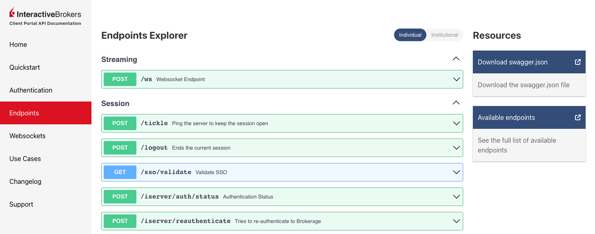

# TL;DR

Run the rest API with:
```bash
docker run -p 5000:5000 dradrian/ibportal
```

Navigate to [localhost:5000](http://localhost:5000) and login with your live or paper account.

# The Application

Interactive Brokers offers an API to interact with their regular trading client. To use it, you need to have the trading client installed and running before you can connect your app and start streaming data. To get around this need for the trading client, Interactive Brokers created a REST API for their trading platform called **Client Portal API**.

This is essentially a webserver that you install on your local system and send REST requests to. You can [download the client from here](https://www.interactivebrokers.com/en/trading/ib-api.php), you can find the [Client Portal API documentation here](https://interactivebrokers.github.io/cpwebapi/) which includes a quick start guide with download instructions and documentation for each endpoint.



# The Problem

The problem is that you need to install and run a Java runtime environment on your local machine.

If you're anything like me, the idea of installing and running an environment so that you can install and run a webserver so that you can make REST requests seems convoluted. It also means there are two new systems to manage, the Java runtime environment and the webserver.

# The Solution

I have made a Docker container for the Client Portal API. The container makes running the webserver as easy as executing one command. And you can use docker-compose to orchestrate your application and its dependencies.

The container is increadibly light weight. As of this writing, the image is less than 70MBs!

Creating the image is a matter of downloading the portal, unzipping and running. The `Dockerfile` for this is:

```Dockerfile
FROM openjdk:8u212-jre-alpine3.9

WORKDIR /app

RUN apk add wget && \
    wget https://download2.interactivebrokers.com/portal/clientportal.gw.zip && \
    unzip clientportal.gw.zip -d . && \
    rm clientportal.gw.zip && \
    apk del wget

COPY conf.yaml root/conf.yaml

EXPOSE 5000

CMD sh bin/run.sh root/conf.yaml
```

The config file `conf.yaml` is very poorly documented and required hacking around to get it working. If you're curious as to how the config works, you can checkout the full source over on Github: [https://github.com/robolyst/ibportal](https://github.com/robolyst/ibportal).

# Usage

Run the rest API with:
```bash
docker run -p 5000:5000 dradrian/ibportal
```
and navigate to [localhost:5000](http://localhost:5000). You'll get a Interactive Brokers login screen. You can login with both your live and demo account.

I use `docker-compose` to orchestrate my trading apps. I include this in my `docker-compose.yaml`:
```yaml
  ibportal:
    image: dradrian/ibportal:latest
    ports:
      - "5000:5000"
```
and once I have logged in, I can run some Python code like this:
```python
import requests

contract_id = 265598
url = f"https://ibportal:5000/v1/api/iserver/contract/{contract_id}/info"

# We need to disable SSL verification to use the API
session = requests.Session()
session.verify = False
        
session.get(url).json()
```
and I'll get back a JSON blob containing:
```JSON
{
  "symbol": "AAPL",
  "con_id": 265598,
  "industry": "Computers",
  "instrument_type": "STK",
  "local_symbol": "AAPL",
  "currency": "USD",
  "company_name": "APPLE INC",
}
```


# Show Support

If you like this, please show your support by staring the github repo at [https://github.com/robolyst/ibportal](https://github.com/robolyst/ibportal). Thank you! ❤️