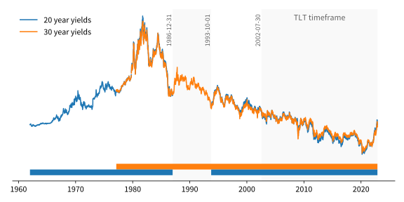
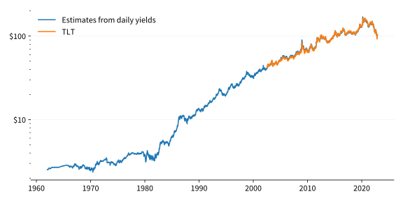
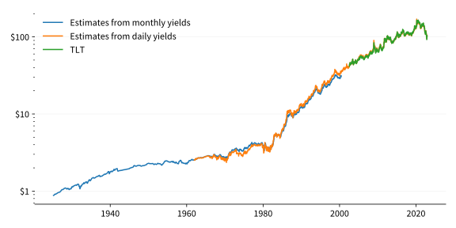

Managing a macro portfolio of ETFs can be tricky because there isn't much price history. Without enough history, asking questions like "What happens when interest rates hit zero?" become hard to answer. Bond ETFs in particular are tricky as many of them are still relatively new. Take TLT as an example, it only started operating in the early 2000s.

These bond ETFs buy and hold bonds. If you knew what they held, you could calculate their fair price by summing together the value of the bonds they hold. Some bond ETFs continuously hold one type of bond. For example, [iShares 20+ Year Treasury Bond ETF](https://www.ishares.com/us/products/239454/ishares-20-year-treasury-bond-etf) (TLT) holds US Treasury bonds with maturities greater than 20 years. We can use this information to model TLT's price as a function of bond yields without know exactly what TLT holds.

# Modelling bond ETF returns with yields

A previous paper titled [Understanding bond ETF returns]() showed that a bond ETF's daily returns can be modelled from bond yields:
$$
\text{return}\_t = \frac{r_{t-1}}{f} + \frac{r_{t-1}}{r_t} \left( 1 - (1 + \frac{r_t}{p})^{-pT} \right) + (1 + \frac{r_t}{p})^{-pT} - 1
$$
where:
* \\(r_t\\) is the yield at time \\(t\\).
* \\(p\\) is the number of coupon payments per year.
* \\(T\\) is the number of years until maturity.
* \\(f\\) is the observation frequency. For example, \\(f = 260\\) for daily and \\(f = 12\\) for monthly.

# 2002 to present

The most recent history of TLT can be downloaded from Yahoo Finance ([here](https://uk.finance.yahoo.com/quote/TLT/history?p=TLT)). As TLT pays the bond coupons as dividends, we are using the dividend adjusted price.

# 1962 to 2002

To extend TLT's price beyond 2002, we need to employ the return model from above and plug in long term yields. TLT holds U.S. treasuries maturing in 20+ years. We can download the yields for [20 year bonds](https://fred.stlouisfed.org/series/DGS20) and [30 year bonds](https://fred.stlouisfed.org/series/DGS20) from FRED:

The 20 year bond yields has a longer history than the 30 year. It goes back to 1962. However, the 20 year bonds were discontinued by the U.S. government for some time over the 1980s and 1990s. To keep things simple, we're going to use the 20 year yields from 1962 to the start of the 30 year yields and from then on use the 30 year yields.

TLT doesn't try to hold bonds maturing at 30 years, so we will estimate a maturity of 25 years (\\(T = 25\\)). The U.S. treasuries pay a coupon twice a year (\\(p = 2\\)). The frequency of this data is daily \\(f = 260\\).

Overlaying TLT's price ontop of our estimated valuation looks like:

# 1925 to 1962

FRED does not have daily yields going past 1962. However, they do have a handful of long term yields at a monthly frequency. Their series [LTGOVTBD](https://fred.stlouisfed.org/series/LTGOVTBD) is an average of all bonds maturing in over 10 years. This series spans 1925 to a little after 2000. 10 year yields is too short a time frame for TLT. However, FRED contains a dataset of monthly 20 year bond yields ([M13058USM156NNBR](https://fred.stlouisfed.org/series/M13058USM156NNBR)) over a short period. If we plot these two together, they line up closely enough that we can consider [LTGOVTBD](https://fred.stlouisfed.org/series/LTGOVTBD) a suitable estimate.

As before, we will estimate a maturity of 25 years (\\(T = 25\\)), a coupon frequency of twice a year (\\(p = 2\\)) and the data is monthly \\(f = 12\\).

Overlaying our valulation estimates so far we get:

Even though [LTGOVTBD](https://fred.stlouisfed.org/series/LTGOVTBD) is not a perfect estimate, it is extremely close!

# Putting it all together

