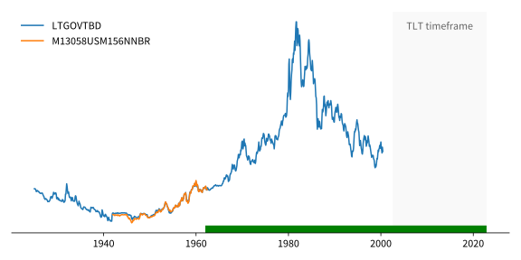
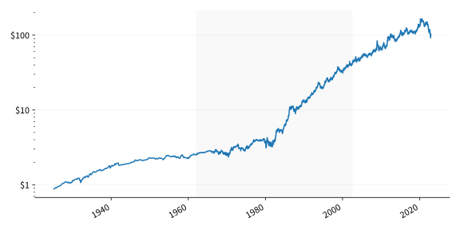

Backtesting a macro portfolio of ETFs can seem impossible because there isn’t much price history. You need enough price history to include a large sample of tumultuous markets. ETF prices provided by your broker will not go back far enough to cover a wide range of market events.

Bond ETFs in particular are tricky as many of them are still new. These bond ETFs buy and hold bonds. If you knew what they held, you could calculate their price by summing together the value of the bonds they hold. Some bond ETFs hold one type of bond. For example, iShares 20+ Year Treasury Bond ETF (TLT) holds U.S. Treasury bonds maturing in 20 years or more. We can use this information to model TLT's price as a function of bond yields. We do not need to know exactly what TLT holds.

Because there is a long history of yield data, it is possible to create a long term history for TLT's performance. We’re going to do this with three periods of time:

* 2002 to the present will be TLT's prices
* 1962 to 2002 will be estimated using daily yield quotes
* 1925 to 1962 will be estimated using monthly yield quotes

# Modelling bond ETF returns with yields

A previous paper titled [Understanding bond ETF returns]() showed that a bond ETF's daily returns can be modelled from bond yields:
$$
\text{return}\_t = \frac{r_{t-1}}{f} + \frac{r_{t-1}}{r_t} \left( 1 - (1 + \frac{r_t}{p})^{-pT} \right) + (1 + \frac{r_t}{p})^{-pT} - 1
$$
where:

* \\(r_t\\) is the yield at time \\(t\\).
* \\(p\\) is the number of coupon payments per year.
* \\(T\\) is the number of years until maturity.
* \\(f\\) is the observation frequency. For example, \\(f = 260\\) for daily and \\(f = 12\\) for monthly.

We can plug in daily or monthly yields to get an estimated return for investing in bonds.

# 2002 to present

The most recent history of TLT can be downloaded from Yahoo Finance ([here](https://uk.finance.yahoo.com/quote/TLT/history?p=TLT)). As TLT pays the bond coupons as dividends, we are using the dividend adjusted price:


# 1962 to 2002

To extend TLT's price beyond 2002, we need to employ the return model from above and plug in long term yields. TLT holds U.S. treasuries maturing in 20+ years. We can download the yields for [20 year bonds](https://fred.stlouisfed.org/series/DGS20) and [30 year bonds](https://fred.stlouisfed.org/series/DGS20) from FRED:


The 20 year bond yields have a longer history than the 30 year yields. It goes back to 1962. However, the 20 year bonds were discontinued by the U.S. government for some time over the 1980s and 1990s. To keep things simple, we're going to use the 20 year yields from 1962 to the start of the 30 year yields and from then on use the 30 year yields.

TLT doesn't try to hold bonds maturing at 30 years, so we will estimate a maturity of 25 years (\\(T = 25\\)). The U.S. treasuries pay a coupon twice a year (\\(p = 2\\)) and the frequency of this data is daily \\(f = 260\\).

Using these parameters and plugging the daily yields into the return calculation above we get an estimated return series. Converting this to a cumulative return series and overlaying TLT's price on top looks like:


# 1925 to 1962

FRED does not have daily yields going past 1962. However, they do have a handful of long term yields at a monthly frequency. Their series [LTGOVTBD](https://fred.stlouisfed.org/series/LTGOVTBD) is an average of all bonds maturing in over 10 years. This series spans 1925 to a little after 2000. 10 year yields is too short a time frame for TLT. However, FRED contains a dataset of monthly 20 year bond yields ([M13058USM156NNBR](https://fred.stlouisfed.org/series/M13058USM156NNBR)) over a short period. If we plot these two together, they line up closely enough that we can consider [LTGOVTBD](https://fred.stlouisfed.org/series/LTGOVTBD) a suitable estimate.



As before, we will estimate a maturity of 25 years (\\(T = 25\\)), a coupon frequency of twice a year (\\(p = 2\\)) and the data is monthly \\(f = 12\\).

Overlaying our valuation estimates so far we get:


Even though [LTGOVTBD](https://fred.stlouisfed.org/series/LTGOVTBD) is not a perfect estimate, it is extremely close.

# Putting it all together

To join these two estimated return streams onto TLT's price series, we need to convert them to cumulative returns and then line up the days that overlap.

Converting to cumulative returns is easy. In Python we can just go:

```python
np.cumprod(1 + returns)
```

Getting the first date of a price series to line up with the corresponding date in a cumulative return series requires a quick calculation. Let's say that \\(p_t\\) is the price of TLT at time \\(t\\) and \\(c_t\\) is the cumulative return of an estimated return stream. We can make the estimated price line up with TLT's price at time \\(i\\) with:

$$
c_t \times \frac{p_i}{c_i}
$$

Transforming the daily yield estimates onto the start of TLT and then transforming the monthly bond yields onto the start of that gives us 100 years of estimated TLT prices:


