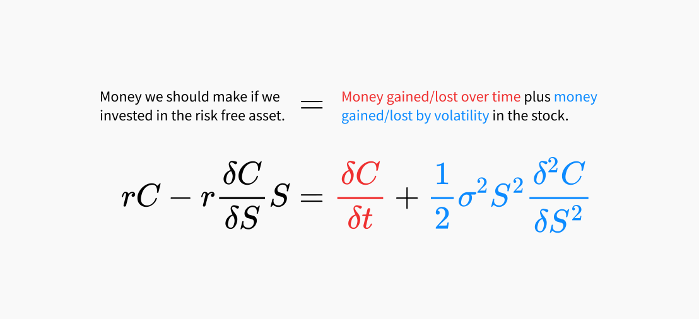

I'm a little embarrassed to admit this, I was recently in a quant interview and the interviewer quickly realised that I didn't know the Black-Scholes formula! That was definitely a moment when imposter syndrome became reality. To fix the situation, I've written up the Black-Scholes model here; being as succinct and practical as I can.

This write up deals with the ideas and mathematics behind the Black-Scholes model. I assume you know what an option contract is and you know the difference between a [call](https://en.wikipedia.org/wiki/Call_option) and a [put](https://en.wikipedia.org/wiki/Put_option) option.

I hope this helps you as much as it helped me.

# Black-Scholes setup

The Black-Scholes model answers the question: what should the price of an option be?

The idea behind the Black-Scholes model is to perfectly hedge the option with a position in the stock. Assuming the hedge breaks even, you can solve for the option's price giving us the Black-Scholes formula.

Option contract come in a [few different types](https://en.wikipedia.org/wiki/Option_style). Black-Scholes handles European style options. We'll start with a **European** style **call** option on a stock that **does not pay** dividends.

A European call option gives the purchaser the right to buy a fixed number of shares at a fixed price on a fixed dated.

If you were to buy a call option, and the price of the stock goes up, then the value of the call option also goes up. To hedge this call option so that your total position value doesn't change you would need to sell some number of the stock. We can write such a portfolio like this:
$$
\Pi = C - \Delta S
$$
Where \\( C \\) is the price of the call option, \\( S \\) is the price of the stock and \\( \Delta \\) is the number of shares we've sold to hedge the position.

For this portfolio to be "correctly hedged" we do not want it's value to change if the price of the option changes or the price of the stock changes. However, we do need to take the time value of money into account. A given amount of value ought to increase over time by the risk free rate. This means that our correctly hedged portfolio should increase in value by the risk free rate. We write this as:
$$
d\Pi = r \Pi dt = dC - \Delta dS
$$
where \\( r\\) is the risk free rate and \\( dt\\) is the amount of time that passes. Since we know the value of the portfolio \\( \Pi \\):
$$
\begin{align}
r (C - \Delta S) dt = dC - \Delta dS \label{1} \tag{1}
\end{align}
$$

The intuition here is that the return on the total position (option + stock) should be equal to the risk free rate. This is what we call an arbitrage free assumption.

The full list of assumptions required to solve for \\( C \\) are:

1. A risk free asset exists with a fixed rate of return for the life of the option.
1. The market is arbitrage free.
1. You can borrow and lend any amount of money at the risk free rate.
1. You can buy or sell any amount of the stock. This includes short selling and fractional amounts.
1. Trading does not cost money (no bid-ask spread or commissions).
1. The instantaneous log return of the stock's price is a geometric Brownian motion with constant drift and volatility.

# Deriving the Black-Scholes equation

We're assuming that the price of the stock \\( S \\) follows a [geometric Brownian motion](https://en.wikipedia.org/wiki/Geometric_Brownian_motion) process with a fixed drift and volatility. This means that the logged prices are a Brownian motion. We write this as:
$$
dS = \mu S dt + \sigma S d W
$$
where \\( \mu \\) is the mean of the stock's returns, \\( \sigma \\) is the volatility and \\(dW\\) is the change in a Brownian motion. Generally, we treat \\( \mu \\) as equal to zero.

As for \\( dC \\), all we know at the moment is that \\( C \\) is a function of \\( S \\) (the price of the stock) and \\( t \\) (time). Luckily, some clever people have already figured out what a function of a stochastic process and time looks like. Itô's lemma tells us [^ito]. Deriving Itô's lemma takes a bit of time. All it says is that such a function can be expanded in a similar way to a Taylor series where higher order terms are zero.

Applying this expansion to \\( dC \\) we get:
$$
dC = \frac{\delta C}{\delta t} dt + \frac{\delta C}{\delta S} dS + \frac{1}{2} \sigma^2S^2\frac{\delta^2 C}{\delta S^2} dt
$$

Substituting this into Eq. (\\( \ref{1} \\)) gives us:
$$
r (C - \Delta S) dt = \left(\frac{\delta C}{\delta t} + \frac{1}{2} \sigma^2S^2\frac{\delta^2 C}{\delta S^2} \right) dt + \left(\frac{\delta C}{\delta S} - \Delta \right) dS
$$

If we want the number of shares sold \\( \Delta \\) to exactly offset any change in \\( C \\), then we can imply that:
$$
\Delta = \frac{\delta C}{\delta S}
$$
substituting this in and cancelling out the \\(dt\\) term we get:
$$
\begin{align}
r C - r\frac{\delta C}{\delta S}S = \frac{\delta C}{\delta t} + \frac{1}{2} \sigma^2S^2\frac{\delta^2 C}{\delta S^2} \label{2}\tag{2}
\end{align}
$$

This is the famous Black-Scholes equation[^equation]. Before looking at the solution to this equation, it is helpful to get an appreciation for what it is saying.

## Intuition behind the equation

In a no arbitrage world, any investment should return the risk free rate. The left hand side of equation (\\(\ref{2}\\)) is the amount of money we should make if we invested in the risk free asset instead of buying the option and hedging with stock.

An option has value for two reasons. The first is that you have the choice to exercise in the future. This is know as the time value of an option. The second is that an option protects you against volatility in the stock.

The right hand side of equation (\\(\ref{2}\\)) says that the risk free returns should equal the time value and the volatility value of the option. That is, the risk free returns should equal the amount of money gained/lost over time plus any money gained/lost by the volatility in the stock.

# Solving the Black-Scholes equation

Deriving the solution to the Black-Scholes equation (\\(\ref{2}\\)) above is fairly involved and out of the scope of this article. We'll skip the derivation and go straight to the solution.

## Call options

The solution to the Black-Scholes equation above (\\(\ref{2}\\)) gives us the Black-Scholes model for the price of a call option[^Natenberg2015]:
$$
\begin{align}
C &= S \mathcal{N}(d_1) - E e^{-rt} \mathcal{N}(d_2) \label{3}\tag{3} \\\
\\\
d_1 &= \frac{\log(S/E) + [r + (\sigma^2 / 2)]t}{\sigma \sqrt{t}} \\\
d_2 &= d_1 - \sigma \sqrt{t}
\end{align}
$$
where:
- \\( C = \\) the theoretical value of a **European** style **call** option before expiration.
- \\( S = \\) the price of a stock that **does not pay** dividends.
- \\( E = \\) the exercise price.
- \\( t = \\) the time to expiration in years.
- \\( \sigma = \\) the annual standard deviation of the stock price returns.
- \\( r = \\) the annual risk free rate.
- \\( \mathcal{N} = \\) the cumulative normal distribution function.

<!-- This has an interpretation section that might be good: http://www.timworrall.com/fin-40008/bscholes.pdf -->

The value of a call option relative to the stock price looks like:


The value at expiration is know as the option's intrinsic value. The difference between the option's theoretical value and the value at expiration is the options time value.


## Put options

Let's now price a **European** style **put** option on a stock that **does not pay** dividends.

A European put option gives the purchaser the right to sell a fixed number of shares at a fixed price on a fixed dated.

To find the price of a put option, we need to use an idea call **put-call parity.**

Imagine you purchased a call option and sold a put option at the same strike. If the stock is above the strike at expiration, you would exercise the call option buying the shares at the strike. If the stock is below the strike, the purchaser will exercise resulting in you buying the shares at the strike. This portfolio of a long call option and a short put option is equivalent to a single forward contract at the same strike and expiry (assuming no arbitrage).

This means that the value of the call minus the value of the put must equal the present value of the forward price of the stock minus the exercise price:
$$
C - P = \frac{Se^{rt} - E}{e^{rt}} = S - Ee^{-rt}
$$

This equivalence is what put-call parity refers to.

If we take the put-call parity and plug in the price of a call option, we get:
$$
\begin{align}
C - P &= S - Ee^{-rt} \\\
P &= C - S + Ee^{-rt} \\\
P &= S \mathcal{N}(d_1) - E e^{-rt} \mathcal{N}(d_2) - S + Ee^{-rt} \\\
P &=E e^{-rt} (1 - \mathcal{N}(d_2)) - S (1 - \mathcal{N}(d_1)) \label{4}\tag{4} \\\
\end{align}
$$

The value of a put option relative to the stock price looks like:


The value at expiration is know as the option's intrinsic value. The difference between the option's theoretical value and the value at expiration is the options time value.


## Code

<todo>Include some basic code</todo>

# Options with Dividends

The basic Black-Scholes model only addresses options on stocks that do not pay a dividend. Let's now price a **European** style **call** option on a stock that **does pay** dividends.

When considering dividends, rather than account for a fixed amount, we work with the dividend yield. Let's say that the stock pays dividends equal to the annual yield \\( y \\). This means that over the time \\(dt\\), \\(ySdt\\) dividends are received. All else being equal, the stock will decrease in value by \\(ySdt\\). The stochastic model for the stock becomes:
$$
dS = \mu S dt + \sigma S d W - y S dt = (\mu - y) S dt + \sigma S d W
$$

Similarly to before, we construct a portfolio that is long some stock and short a call option:
$$
\Pi = \Delta S - C
$$
where \\( C \\) is the price of the call option and \\( \Delta \\) will be picked so that the option is perfectly hedged. Because the stock pays a dividend, this portfolio will increase in value by  \\(\Delta ySdt\\):
$$
d\Pi = \Delta dS - dC + \Delta y S dt
$$

If we replace \\( dC \\) with it's expansion from Itô's lemma:
$$
d\Pi = \Delta dS - \frac{\delta C}{\delta t} dt - \frac{\delta C}{\delta S} dS - \frac{1}{2} \sigma^2S^2\frac{\delta^2 C}{\delta S^2} dt + \Delta y S dt
$$

As before, we pick \\( \Delta = \frac{\delta C}{\delta S} \\) to exactly offset any change in \\( C \\):
$$
d\Pi = - \frac{\delta C}{\delta t} dt - \frac{1}{2} \sigma^2S^2\frac{\delta^2 C}{\delta S^2} dt + \frac{\delta C}{\delta S} y S dt
$$

Since the value of the portfolio is risk free we have:
$$
d\Pi = r \Pi dt = r(\frac{\delta C}{\delta S} S - C)dt = - \frac{\delta C}{\delta t} dt - \frac{1}{2} \sigma^2S^2\frac{\delta^2 C}{\delta S^2} dt + \frac{\delta C}{\delta S} y S dt
$$
rearranging:
$$
\frac{\delta C}{\delta t} + \frac{1}{2} \sigma^2S^2\frac{\delta^2 C}{\delta S^2} + (r - y)\frac{\delta C}{\delta S} S  - rC = 0
$$

We can see that this equation is nearly identical to the Black-Scholes equation (\\(\ref{2}\\)) except that the risk free rate on the value of the stock has been offset by the dividend[^dividend-yield].

## Call options

The solution to the equation above gives us the model for the price of a call option:
$$
\begin{align}
C &= e^{-yt}S \mathcal{N}(d_1) - E e^{-rt} \mathcal{N}(d_2) \\\
\\\
d_1 &= \frac{\log(S/E) + [r - y + (\sigma^2 / 2)]t}{\sigma \sqrt{t}} \\\
d_2 &= d_1 - \sigma \sqrt{t}
\end{align}
$$
where:
- \\( C = \\) the theoretical value of a **European** style **call** option.
- \\( S = \\) the price of a stock that **does pay** dividends.
- \\( y = \\) the annual dividend yield.
- \\( E = \\) the exercise price.
- \\( t = \\) the time to expiration in years.
- \\( \sigma = \\) the annual standard deviation of the stock price returns.
- \\( r = \\) the annual risk free rate.
- \\( \mathcal{N} = \\) the cumulative normal distribution function.

## Put options

If we take the put-call parity and plug in the price of a call option, we get:
$$
\begin{align}
C - P &= S - Ee^{-rt} \\\
P &= C - S + Ee^{-rt} \\\
P &= e^{-yt}S \mathcal{N}(d_1) - E e^{-rt} \mathcal{N}(d_2) - S + Ee^{-rt} \\\
P &=E e^{-rt} (1 - \mathcal{N}(d_2)) - S (1 - e^{-yt}\mathcal{N}(d_1)) \\\
\end{align}
$$

# Implied Volatility

The inputs to the option model above are the stock price, the exercise price, the time to expiration, the risk free rate and the expected volatility. All of these quantities are known except for the expected volatility.

In fact, if you look at market prices, then the current option price is also known. If you were to plug in the current option price and solve for the volatility \\( \sigma \\) you would get the market's expectation for volatility. This is called implied volatility---the volatility implied by the market price.

Unfortunately, there is no closed form solution for the implied volatility. However, the Black-Scholes model shows us that the price of an option is monotonic in \\( \sigma \\). This means that we can use any root finding method to solve for \\( \sigma \\) in:
$$
f(\sigma, S, E, t, r) - C = 0
$$
where \\( f(\cdot) \\) is the theoretical value of a call option.

<todo>Add diagram showing the monotonicity of volatility.</todo>

[SciPy](https://scipy.org/) has a bunch of [root finding algorithms](https://docs.scipy.org/doc/scipy/reference/optimize.html#root-finding) that will easily work out of the box.

<todo>Add code</todo>

# Greeks

The "Greeks" are a set of derivatives measuring how sensitive an option is to different factors. These values are used in hedging. A trader is able to isolate the various factors that impact an option's price and hedge away those risks.

## Delta

We've met delta before. Delta \\( \Delta \\) measures the change of the option value with respect to the stock's price:
$$
\Delta = \frac{\delta V}{\delta S}
$$

A neat interpretation of this is that delta \\( \Delta \\) tells you how many units of the stock you are exposed to. For example, if an option's delta is 1, then for every $1 change in the stock we would expect the option's value to change by $1. In other words, 1 option behaves just like 1 unit of the stock. If the delta was 0.5, then 1 option would behave like 0.5 units of stock.

For a long call option, delta will be between 0.0 and 1.0. Delta will be zero if the option is far out of the money or one if deep in the money. This is the same for a short put positions. For both a long put and short call, delta is between 0.0 and -1.0.

We learned before that a long call and a short put position at the same strike is equivalent to a forward contract. A forward contract has a delta of one. We can then say that the delta of a call minus the delta of a put equals one:
$$
\Delta C - \Delta P = 1
$$

## Vega

Vega[^vega] \\( \mathcal{V} \\) measures the change in option value relative to changes in the stock's volatility:
$$
\mathcal{V} = \frac{\delta V}{\delta \sigma}
$$

## Theta

Theta \\( \Theta \\) measures the change in option value relative to the passage of time:
$$
\Theta = \frac{\delta V}{\delta t}
$$
Theta is almost always negative for a long option position. This is known as "time decay." The value of the option decreases over time. For a short option position, theta is positive.

You can break down the value of an option into two parts, the intrinsic value and the time value. The intrinsic value of an option is the money you would make if you exercised the option immediately. For example, a call option whose strike is $10 below the current price has an intrinsic value of $10. The remaining value of the option is the time value--the value in being able to wait to exercise.

## Rho
Rho \\( \rho \\) measures the change in option value relative to the changes in the risk free interest rate:
$$
\rho = \frac{\delta V}{\delta r}
$$
An option's value is least sensitive to the risk free rate making this a little used Greek.

## Gamma
Gamma \\( \Gamma \\) measures the change in the delta with respect to the stock's price:
$$
\Gamma = \frac{\delta \Delta}{\delta S} = \frac{\delta^2 V}{\delta S^2}
$$

A positive gamma means you will benefit from price movements. A negative gamma means you will be hurt from price movements and prefer the price stays the same.

For a long options position gamma is positive. This is true for both calls and puts.

Most options have opposite sign theta and gamma. For example, a long call has negative theta and positive gamma. That is, a long call's value decreases over time and increases with volatility.

## Table of Greeks

Here are the calculations for the Greeks for both calls and puts[^greeks]:

|                      | Call                     | Put                          |
| ---------------------|--------------------------|------------------------------|
| **Delta** \\( \Delta \\) | \\( e^{-yt} \mathcal{N}(d_1) \\) | \\( e^{-yt}(\mathcal{N}(d_1) - 1) \\) |
| **Gamma** \\( \Gamma \\) <td colspan=2> \\( e^{-yt} \frac{ \mathcal{N}^{\prime}(d_1)}{S \sigma \sqrt{t}} \\) |
| **Vega** \\( \mathcal{V} \\) <td colspan=2> \\( S e^{-yt} \mathcal{N}^{\prime}(d_1) \sqrt{t} \\) |
| **Rho** \\( \rho \\) | \\( E t e^{-rt}\mathcal{N}(d_2) \\) | \\( -E t e^{-rt}\mathcal{N}(-d_2) \\) |

|      | Theta \\( \Theta \\)     |
| -----|--------------------------|
| **Call** | \\( - e^{-yt}\frac{S\mathcal{N}^{\prime}(d_1) \sigma}{2\sqrt{t}} - r E e^{-rt}\mathcal{N}(d_2) + y S e^{-yt} \mathcal{N}(d_1) \\)   |
| **Put**  | \\( - e^{-yt}\frac{S\mathcal{N}^{\prime}(d_1) \sigma}{2\sqrt{t}} + r E e^{-rt}\mathcal{N}(-d_2) - y S e^{-yt} \mathcal{N}(-d_1) \\) |

# Portfolio analysis

In a simplified world, traders who are trading stocks only have to worry about one risk, the price changing. However, as we've learned, the value of an option contract changes based on a number of different factors. These factors are mainly the price of the stock, the expected volatility, the risk free rate and the passage of time.

The Greeks above all measure an option's sensitivity to changes in each of these factors and are a way of measuring and tracking risks.

These risk measures (delta, gamma, theta, vega and rho) are all additive. This means that if you have a complex portfolio of call and put options at varying strikes and expiries (but the same stock) then you can sum together their Greeks to estimate the risks of the whole portfolio.

<todo>Add example table of a portfolio. Can lift from the book.</todo>

# Option hedging

If you wanted to capture the value of an option you would have to buy or sell that option. As we've learned, an option's value changes with the stock price. Which means that buying or selling an option contract means you are exposed to the risk that the stock's price moves against you.

We learned before that an option's delta tells you how many units of the stock you are exposed to. For example, if you had a call option with a delta of 1, you could sell one unit of stock and be theoretically protected against movements in the stock's price. This kind of hedge is called **delta-hedging.** We say theoretically because the delta is the instantaneous delta. After some time, your option's delta will not be 1 anymore.

The idea behind delta-hedging is to always maintain a total delta of 0. We can look at the deltas in our entire portfolio and sum them together. We want to maintain a total delta of 0. The delta of the stock is always 1. If the portfolio has a net delta above zero, we need to sell the stock. If the portfolio has a net delta below zero, we need to buy the stock. As you can imagine, doing this repeatedly incurs transaction costs and becomes expensive. It wouldn't be practical to constantly hedge your option positions, you have to periodically hedge. Either re-heding every fixed period or re-hedging when your delta becomes too large.

<todo>Add example table of a hedged portfolio. Can lift from the book.</todo>

# Summary

This write up provides an introduction to the Black-Scholes model and how to use it to estimate implied volatility and hedge option positions. I have only covered the surface of this topic. I'd encourage you to read through the book "Option Volatility & Pricing" [^Natenberg2015] to dive deeper into options.

[^ito]: Itô's lemma. If \\(X_t\\) is a stochastic process with infinitesimal variance \\(v(X_t)\\) and if \\( u(X_t, t) \\) is a function with enough derivatives then \\( u(X_t, t) \\) is another stochastic process that satisfies:
$$
d u(X_t, t) = \frac{\delta u(X_t, t)}{\delta t} dt + \frac{\delta u(X_t, t)}{\delta X_t} d X_t + \frac{1}{2} \frac{\delta^2 u(X_t, t)}{\delta X_t^2} v(X_t)dt
$$
A good explanation of Itô's lemma can be found [here](https://math.nyu.edu/~goodman/teaching/StochCalc2018/notes/Lesson4.pdf).

[^vega]: "Vega" is not a Greek letter! [Wikipedia](https://en.wikipedia.org/wiki/Greeks_(finance)#Vega) suggests that it is a variation on the Greek letter nu (\\( \nu \\)) which looks like a "v" and "-ega" was added to the end to make it sound like the Greek letters beta, eta and theta.

[^greeks]: Greeks calculations lifted from Wikipedia's ["Greeks (finance)"](https://en.wikipedia.org/wiki/Greeks_(finance)#Formulae_for_European_option_Greeks) page.

[^dividend-yield]: The derivation of dividends was inspired by [this article](https://www.math.tamu.edu/~mike.stecher/425/Sp12/optionsForDividendStocks.pdf).

[^equation]: The derivation of the Black-Scholes equation was inspired by [this article](https://www.linkedin.com/pulse/option-pricing-how-its-related-simulating-temperature-yafus-siddiqui/).

{}
