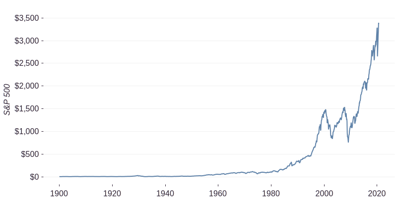
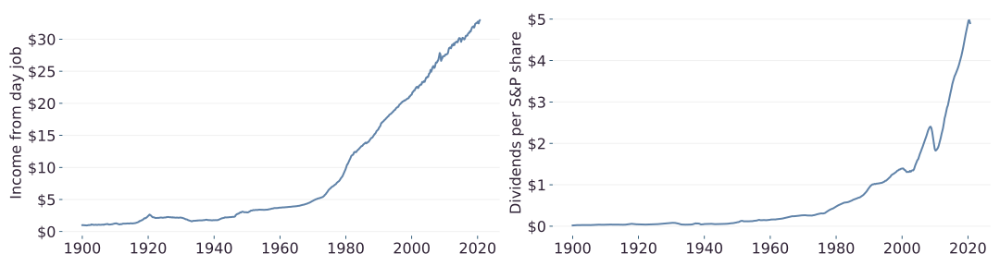
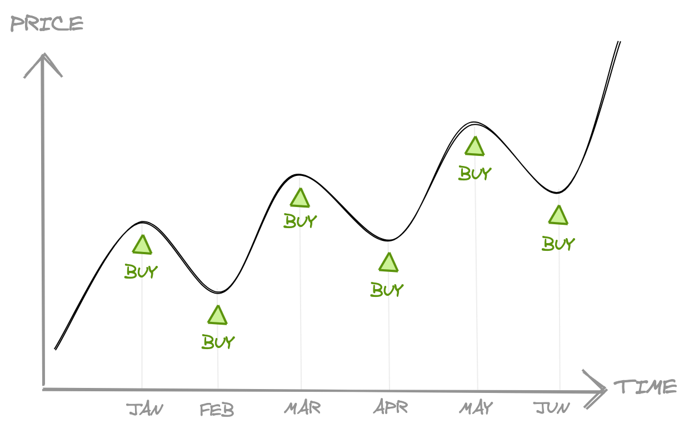
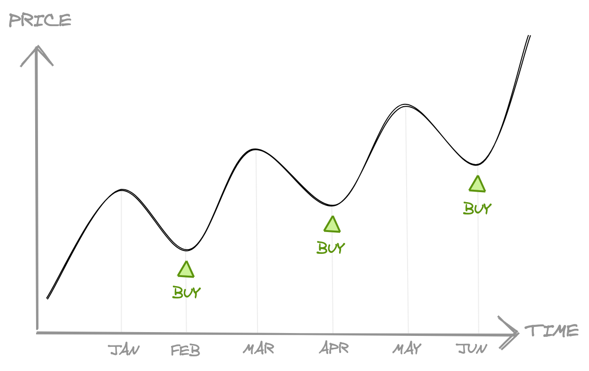
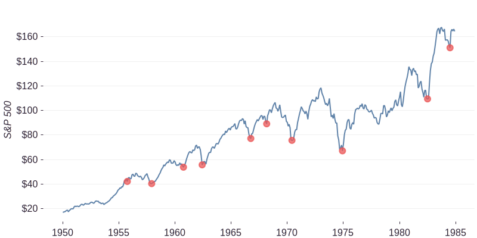
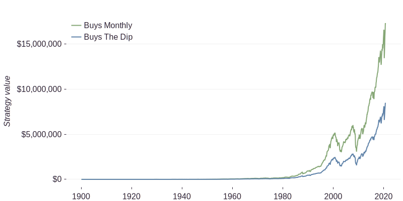
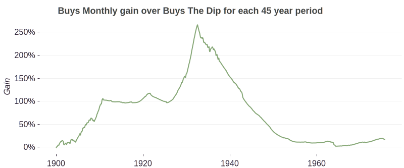
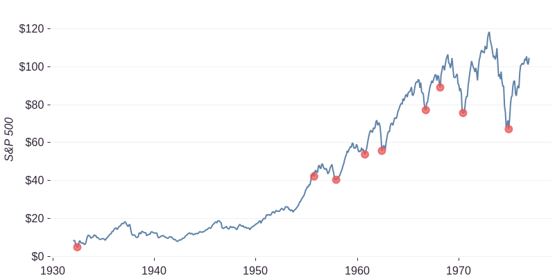
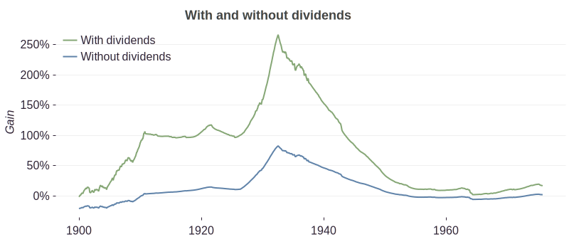

The ups and downs of markets can seem exciting in some moments and scary in others. The alternative to investing regularly is to hold off purchasing more investments during these scary times until you believe the market has reached a bottom. You then purchase at a cheap price and watch your investment increase in value. To pull this off, you will need to have perfect market timing.

It turns out, no matter the market condition, investing regularly gives you a small advantage. Let's explore the idea of perfectly timing the market and see what we get.

# Pretend perfect market timing

Let's play a game. We're going to trade two different investment strategies. The first one we'll call **Invest Monthly** where we will invest in the S&P 500 every single month. The second one we'll call **Perfect Timing**. This strategy will be setup for success. We can look into the future. We will only buy more share in the S&P 500 when the market has reached a bottom. This means that the Perfect Timing strategy can time the market perfectly.

We'll play this game from January 1900 all the way until September 2020. This time period ensures we cover many different kinds of economic situations from depressions (1930s) to currency devaluation (1970s) and pandemics (2020s). See below for the full 120 year history of S&P prices.

We'll assume that every month, we'll have $1 to invest in the market from our day job. This will be $1 in January 1900 and will be adjusted for inflation every month. We'll also be receiving an income from our investments in the form of dividends.

Here are the investment strategies:

* **Invest Monthly** - Every month, take our income (monthly income from job + dividends) and buy shares in the S&P 500 index.

* **Perfect Timing** - Every month, collect our income (monthly income from job + dividends) and hold it. Only buy shares when the market has reached the lowest point between two consecutive market highs. We can only do this if we're able to have perfect knowledge about the future. Obviously, we cannot do this in real life, this is just a game.

In our experiment period of 1900 to 2020 there are 1,449 months. The Invest Monthly strategy will purchase shares in the S&P 500 1,449 times. This period also contains 94 market bottoms. The Perfect Timing strategy will purchase shares 94 times.

Let's see what happens when we play through these investment strategies. The chart below shows the portfolio value from 1900 to 2020. It may be surprising to see that Buys Monthly greatly outperforms Buys The Dip. Even when Buys The Dip has knowledge of the future, Buys Monthly still out performs. At the end of the 120 year period, Buys Monthly has made a little over 17 million dollars while Buys The Dip made a little over 8 million dollars.

If you started investing when you were 20 years old and continued every month until you retired at say 65 you'd have been investing for 45 years. The lead that Buys Monthly has over a 45 year period is astonishing. If you started in 1932, you'd have a 250% lead over Buys The Dip. If you were retiring now (you started investing in 1975) you'd have a 16% lead. These are quite large numbers for such a simple decision as investing regularly.

# Why?

The main reason why Buys Monthly outperforms Buys The Dip is that your money spends more time in the market and less time on the sidelines waiting. This has an impact in two ways.

## Missing out

The first way that time in the market has an impact is missing out on bull markets. Remember that if you started investing in 1932 you'd have a 250% lead. Let's have a closer look at that 45 year period of the S&P 500:

The red markers indicate a market bottom which is when the Buys The Dip strategy purchases shares. Look at the beginning. There's a 22 year gap between the first purchase and the second. Not only that, but the second purchase was at a considerably higher price. Right at the beginning you'd have bought shares for about $5 but then you'd wait over 20 years to buy again at $45 dollars. That whole time, the Buys Monthly strategy was slowly buying shares at a cheap price ready for the coming jump in value.

If you wait to buy the dip, you miss out on the bull markets and potentially long periods of cheap prices.

## Dividends

The second way that time in the market has an impact is not reinvesting dividends. Every month, some of the companies in the S&P 500 pay a dividend. If you were waiting to buy the dip, these dividends sit in your cash account waiting for the next dip. Whereas, if you invest every month, then every month the dividends are reinvested and are able to compound.

The impact of dividends is quite profound. Have a look at the difference in lead of the Buys Monthly strategy when we ignore dividends:

Not only has the gain reduced, but during the 1900s, 1950s, 1960s and 1970s Buys Monthly is actually under-performing.

# Summary

Contrary to intuition, waiting to invest your money when the time is right is not a good strategy. You are better off investing on a regular basis no matter the condition of your investments. Trying to time the market results in missing out on bull markets, cheap prices and the compounding effect on dividends.
