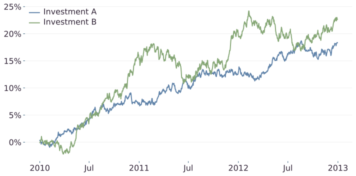
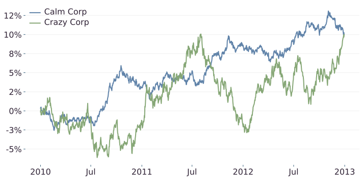
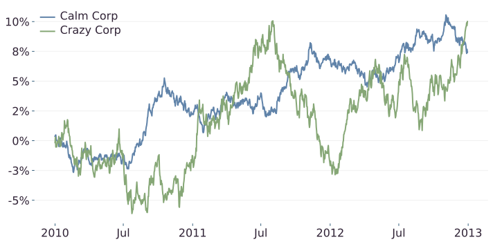
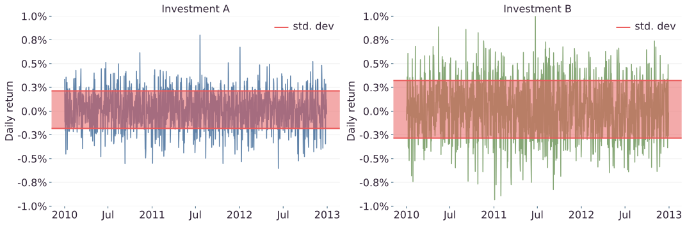
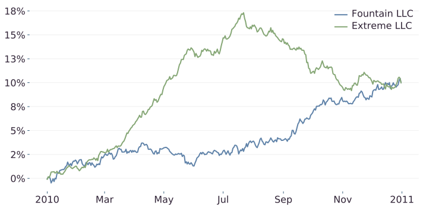
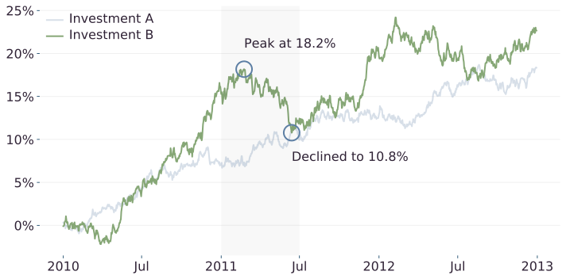
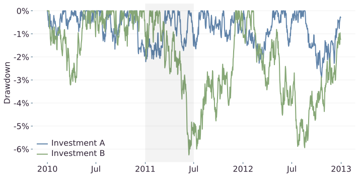
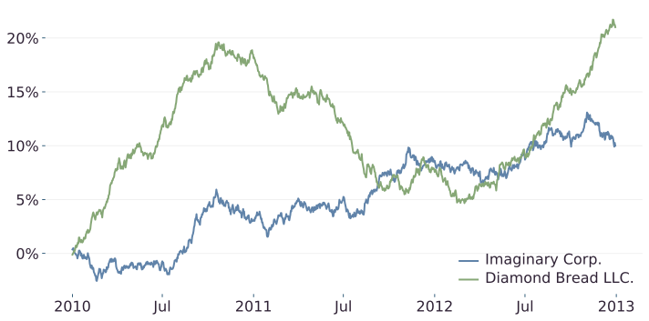

# How to think about performance

A quick way of quantifying an investment's performance is to measure how much money it made. If you invested $100 and at the end of the year you have $108, you made $8. We express this as a percentage and call it the **return**.  In this example, you made an 8% return. Because we expressed this as a percentage, you can quickly figure out how much money you would have made if you invested $1,000. Eight percent of $1,000 is $80.

When assessing two different investments, we can compare their returns. We could say the investment with the best return was the better investment over that time period. Let's have a look at an example.

In the figure above we can see the value of two different investments over 3 years. Investment A returned about 18.3% while investment B returned 22.7%. Should we conclude investment B was better because it made 22.7% vs 18.3%? The answer is no!

Have another look at the returns from both investments. Investment B seems to wiggle around much more than investment A. Take a look at the worst days:

| Investment   | Worst day return  |
|--------------|-------------------|
| Investment A | -0.6%             |
| Investment B | -0.9%             |

Investment B's worst day lost 50% more than investment A's worst day! Investment B is riskier than investment A. Ah ha! We have found another dimension to performance: risk.

We will loosely define **risk** as the amount of money you could lose over the short term. For any investment we make, we expect to increase our capital over the long term. But, short term fluctuations mean we might see our capital shrink over the short term. That is a risk.

Look at the example below. There are two investments with the same return but one fluctuates more than the other. If you invested in Crazy Corp, you would have experienced wild swings in value only to land at the same return as Calm Corp.

As investors, we must prefer the safer investment. Both of these investments finished with a 10% return by the end of 2012. What if you withdrew your money at the start of 2012? Crazy Corp. would have lost you 2% while Calm Corp would have gained you about 8%. Very different results, and the only difference is the magnitude of fluctuations in the price of the investments.

Let's change Calm Corp to have a slightly lower return, 7.4%:

Now, which investment would you prefer? I hope you still said Calm Corp. While the return is almost 3% lower, the risk in that investment is still considerably lower. We would not experience wild swings in value if we were to invest in Calm Corp.

What we've just done is realise we are happy to accept a lower return if the risk is also lower.

In the charts so far, we can use our eyes to see which investment is better. But, how do we quantify these investments so we can objectively say which one is better? We've realised we can accept a lower return if we have a lower amount of risk. We can now define our goal. Our goal as an investor is to maximise our return relative to our risk. We can loosely write this out mathematically as the return divided by the risk:

$$
\frac{\text{return}}{\text{risk}}
$$

The higher this ratio for any given investment, the more return it makes for the amount of risk there is. 

This is an excellent way to think about investment performance. It means if an investment is riskier, that's ok, so long as it has a higher return to match the risk. And if an investment returns very little, that is also ok if the risk is also small enough to match the return. As investors, we are looking for investments that make this ratio as big as possible. We want as much return as we can get for each unit of risk.

# The Sharpe ratio

The Sharpe ratio is a common metric for measuring returns relative to risk. It was developed by William F. Sharpe in 1966 [^1][^2] who was awarded the Nobel Memorial Prize in Economic Sciences in 1990. The Sharpe ratio is defined as the average return divided by the standard deviation of returns:

$$\frac{\text{avg return}}{\text{std deviation}} = \frac{\bar{r}}{\sigma}$$

The average return measures the return of the investment, and the standard deviation measures the variability of the returns and is a proxy for risk. This is one of the industry-standard methods of measuring the performance of an investment.

Let's go back to Investment A and Investment B. We know Investment B is riskier. So, we should expect that its returns vary more than Investment A's returns. Look at the chart below. 

It shows the daily returns for each investment. The standard deviation is shown in red. The average returns are similar, but the returns vary more in Investment B:

|                    |  A |  B |
|--------------------|--------------|--------------|
| Average return     | 0.0156%      | 0.0191%      |
| Standard Deviation | 0.1979%      | 0.3034%      |
| Sharpe ratio       | 0.0787       | 0.063        |

As expected, the Sharpe ratio for Investment A is greater than Investment B. So, the Sharpe ratio correctly identifies the better investment.

# Unit returns

I do not use the Sharpe ratio. We've already established that measuring returns relative to risk is a great idea. However, I do not like how the Sharpe ratio calculates return and risk. There are two problems with the Sharpe ratio that should make us uncomfortable.

## Problem of arithmetic average

The first problem is that the measure of return is an arithmetic average. An **arithmetic average** sums the returns together and then divides by the number of returns. At first that makes sense. However, returns cannot be added together. Returns are multiplied! Let me give you an example. Let's say we have an investment that make 50% one year and loses 45% the next year:

| Year 1 | Year 2 |
|--------|--------|
| 50%    | -45%   |

The average return (arithmetic average) is 50% + -45% divided by 2. which equals about a 3% average return. A positive return. But what happens if we play this through with actual dollars? Let's say we invest $1,000. After the first year we make 50% which means we have $1,500. In the second year, we lose 45% which leaves us with $825. That is less than the $1,000 we started with! That is definitely not a 3% return. That is a 17.5% loss!

What happened here? Well, the arithmetic average assumes the returns are added together. It tries to find one number which, when added together 2 times, is the same as the sum of the two returns. The arithmetic average tries to find the \\(x\\) in:

$$
50\\% + - 45\\% = 2 \times x
$$

But we know returns don't add, they multiply. We instead should use the **geometric average**. The geometric average assumes the returns are multiplied together. It tries to find one number which, when multiplied together 2 times, is the same as the multiple of the two returns. The geometric average tries to find the \\(x\\) in:

$$(1 + 50\\%) \times (1 - 45\\%) = (1 + x)^2 $$

We have to add the ones because a 50% return on $1,000 doesn't leave us with $500, it leaves us with $1,500. That is \\(\\$1,000 \times (1 + 50\\%) = \\$1,500\\).

So, we should not use the arithmetic average of returns. we should use the geometric average of returns.

## Problem of order of returns

The second problem with the Sharpe ratio is it doesn't take into account the order of returns. At first this feels a bit abstract. Let's go straight to a chart to see what I mean.

Have a close look at the two investments in the chart above. Which one do you prefer? Hopefully, you said you prefer Fountain LLC. That decline in Extreme LLC is about a 7% loss of capital. But there is something surprising here. Both investments have the same return: 10% and both have the same Sharpe ratio 0.13! In fact, Extreme LLC is exactly the same as Fountain LLC, I just reordered the returns! I moved some of the positive returns to the start of the period and some of the negative returns to the end of the period.

Remember, the Sharpe ratio is the average return divided by the standard deviation of returns. Neither of those metrics take into account the order of the returns. Because of this, the Sharpe ratio isn't able to capture the huge risk revealed in Extreme LLC.

We should not use the standard deviation of returns as our measure of risk. Instead, we calculate the average drawdown.

To understand drawdown, let's go back to our example of Investments A & B at the start of this article. Have a closer look at what happened in Investment B in the first half of 2011:

There was a huge decline in value. Shortly after the start of 2011, the investment peaked at 18.2% then fell to a return of 10.8%. Let's go back to our example of investing $100. At the peak, that $100 would be worth $118.2 and at the bottom of the decline, it would be worth $110.8. That's a decline in value of 6.3%. We call this drawdown.

**Drawdown** is the amount the investment has lost since its last high. We can actually chart the drawdown day by day for both of the investments.

We can see Investment A doesn't drawdown more than 3% and Investment B can drawdown as much as 6%.

## Building our ratio

We measure risk as the average drawdown of an investment. We use the arithmetic average as drawdowns don't get combined, so there is no need to worry about arithmetic vs geometric. Our risk measure then looks like:

$$
\frac{\text{geometric average of returns}}{\text{arithmetic average of drawdowns}}
$$

Using the unit returns as our performance metric allows us to capture more of an investment's behaviour than the Sharpe ratio. Have a look at the example below.

Which investment do you think is better? By now, you'll probably instantly say it's the calmer looking investment, Imaginary Corp. We've measured the Sharpe ratio and unit returns in the table:

| Investment         | Sharpe | Unit return |
|--------------------|--------|-------------|
| Imaginary Corp.    | 0.043  | 0.012       |
| Diamond Bread LLC. | 0.087  | 0.006       |

The unit returns correctly identifies the risk in Diamond Bread LLC and considers it the worst investment. The Sharpe ratio is the opposite. It incorrectly considers Diamond Bread to be the better investment.

# Summary

Measuring an investment's performance with only returns leaves you open to taking on huge risks and losing money. A better way to think about performance is how much return you are getting relative to risk. We calculate this as return divided by risk. The classic method of measuring this is the Sharpe ratio, however there are a couple of problems that still put us at risk. I use a measure that I call the unit return. This metric captures more of the risk revealed in an investment's return stream.

You can use this metric yourself to compare different investments and make better decisions.

[^1]: Sharpe, William F. "Mutual Fund Performance." Journal of Business, January 1966, pp. 119-138.
[^2]: Sharpe, William F. ["The Sharpe Ratio"](http://web.stanford.edu/~wfsharpe/art/sr/sr.htm) The Journal of Portfolio Management, 1994.