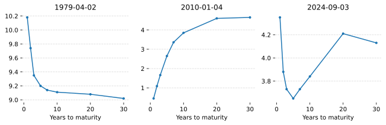
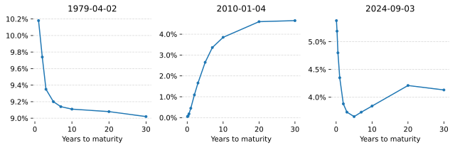

The interest rate is a key input to pricing many instruments. For example, the price of an option depends on the interest rate. The value of treasury ETFs (such as TLT) depend on the yields of government bonds which are dependent on the interest rate. Having a good model of interest rates means you can better price these interest rate derived products.

The fiddly thing is that there is no one single interest rate. The yield that you can earn risk free is dependent on how much time you are willing to wait. For example, you could put your money into a bank account for 1 day, you could buy a 3 month bond or even a 30 year bond. Each of these instruments will have a different yield or interest rate.

From here on we'll use the term "yield" rather than "interest rate" as this is the prevailing term in the industry.

These different time horizons with different yields are referred to as the yield curve. And this yield curve is changing over time. For example, on the dates X, Y and Z, the US government bond yield curve looked like this:

And over time, the yields have looked like this:

You can see periods of very high rates and periods of very low rates. You can see when investing in longer term bonds gives you a higher return and periods where investing in short term bonds gives you a higher return.

In this article, we're going to learn how to model this yield with a factor model and how to forecast the future term structure. We'll write the yield at time $t$ for a term of $\tau$ (in years) as:

$$
y_t(\tau)
$$

and we'll write the forecast h steps ahead as:

$$
\hat{y}_{t+h}(\tau)
$$

# Factors

-   Yields can be explained with very few factors.
    -   Do a PCA
    -   Show the high explainability
    -   show the factor loadings
    -   The literature have given these factors names

# Modelling the factor loadings

-   Model the factor loadings
    -   Explain why knowing factor loadings ahead of time is a good idea
    -   Present a model of the factor loadings
    -   Produce the factors
    -   Visually show how well the factor model replicates the yields over time.
    -   Visually show various different yield curves. Maybe make a slide over time so the user can see the real and fitted curve at any point in time.

# Modelling the factors

-   Model the factors
    -   Show the statistical features of each of the factors
    -   Show the models that suitable given the statistical features
    -   Produce the forecasts of each of the factors and show the r2 scores and correlation plots.
    -   Make some fun interactive visuals to explore the model

# References

-   **Characteristics of Factor Portfolios:** https://papers.ssrn.com/sol3/papers.cfm?abstract_id=1601414
-   **Relationship between Ridge regression and PCA:** https://yuhuini.github.io/2018-12-01-relationship-between-ridge-regression-and-pca
-   Global equity model handbook: https://www.alacra.com/alacra/help/barra_handbook_gem.pdf
-   United States Equity (E3): https://www.alacra.com/alacra/help/barra_handbook_US.pdf
-   Barra Risk Model Handbook (I downloaded too): https://roycheng.cn/files/riskModels/barra_risk_model_handbook.pdf
-   **Forecasting the Term Structure of Government Bond Yields:** https://papers.ssrn.com/sol3/papers.cfm?abstract_id=461369
