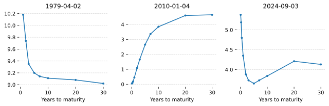
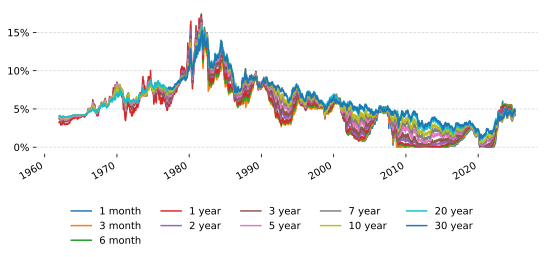
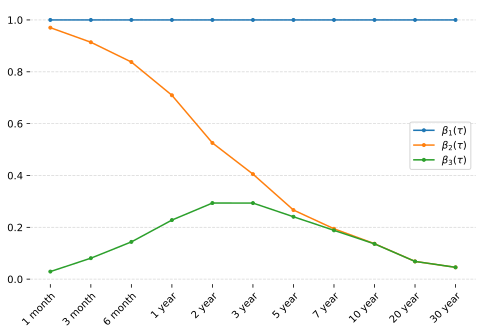
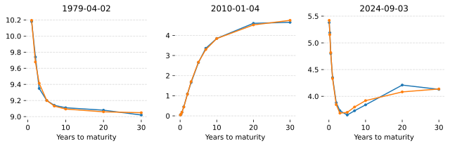

The interest rate is a key input to pricing many instruments. For example, the price of an option depends on the interest rate. The value of treasury ETFs (such as TLT) depend on the yields of government bonds which are dependent on the interest rate. Having a good model of interest rates means you can better price these interest rate derived products.

The fiddly thing is that there is no one single interest rate. The yield that you can earn risk free is dependent on how much time you are willing to wait. For example, you could put your money into a bank account for 1 day, you could buy a 3 month bond or even a 30 year bond. Each of these instruments will have a different yield or interest rate.

From here on we'll use the term "yield" rather than "interest rate" as this is the prevailing term in the industry.

These different time horizons with different yields are referred to as the yield curve. And this yield curve is changing over time. For example, on the dates X, Y and Z, the US government bond yield curve looked like this:

And over time, the yields have looked like this:

You can see periods of very high rates and periods of very low rates. You can see when investing in longer term bonds gives you a higher return and periods where investing in short term bonds gives you a higher return.

In this article, we're going to learn how to model this yield with a factor model and how to forecast the future term structure. We'll write the yield at time $t$ for a term of $\tau$ (in years) as:

$$
y_t(\tau)
$$

and we'll write the forecast h steps ahead as:

$$
\hat{y}_{t+h}(\tau)
$$

# Factors

Have a close look at the chart showing the different yields over time. Notice how they're all very similar. They're not all exactly the same, but they generally follow the same path. We could say that all these different yields have some common factors--they are related somehow.

The idea behind factors is that some series $x$ can be written as a linear combination of some number of factors plus an error term:
$$
x_t = \beta_1 f_1 + \beta_2 f_2 + \dots + \beta_n f_n + e_t
$$
These factors become extremely useful when you use the same factors to model a multivariate series:
$$
\boldsymbol{x}_t = \boldsymbol{\beta}\boldsymbol{f}_t + \boldsymbol{e}_t
$$

The most common way of investigating factors when you have a multivariate time series is to use PCA. The idea behind PCA is to find a set of completely uncorrelated time series to act as factors and the corresponding factor loadings. PCA is a very old, roboust and well studied algorithm. If you want to learn about it I recommend you read [Principal Component Analysis](https://gregorygundersen.com/blog/2022/09/17/pca/) which is a fantastic overview.

Running a PCA over the treasury yields confirms out intuition that there are common factors. We can plot the percentage of variance explained by the first n factors and we see that `98.33%` of the variance is explained by the first factor and `99.98%` of the variance is explained by the first 3 factors.

Using PCA, we've found 3 factors that explains just about 100% of 8 treasury yields. These three factors do have some intuition behind them. Take a look at the three factors:

The first factor looks like the long term interest rate from figure X. This makes sense. All the yields appear to mostly follow the long term rate (30 year yield) with larger deviations for shorter yields. These deviations must be captured in the other two factors--they explain short term deviations in yield.

The real insight comes from looking at the factor loadings. Let's see the factor loadings plotted against the time to maturity:

The first factor loading is virtually unchanged across the terms. This means that the first factor contributes the same amount for each yield series. This makes sense as we've discovered that it represents the long term yield and explains over 98% of all the variance across all yields. We cal also see that the remaining two factors peak on the short terms and are small on the long term. So, we can safely conclude that the first factor represents the long term yield.

The second factor loading peaks for the shortest yields and then declines. We can interpret this factor as the short term yield.

The third factor loading peaks for more medium term yilds. We can interpret this factor as the medium term yield.

The idea of a three factor yield model is fairly well covered in the literature. The long term, medium term and short term factors are sometimes referred to as level, slope and curvature.

#### Drawback of PCA

There are two drawbacks with PCA. The first is that you need clean timeseries to fit the PCA model to. For the yields that we are working on, there are gaps in the data. The most notable gap is that the 20 year yields start the early 60s but the 30 year yields do not start until the late 70s. And then, the 20 year yields stop for an extended period of time around 1990.

The second drawback is that we will need to calculate the PCA factors and factor loadings in a rolling window style fashion. This means that from time point to time point, the entire history of the factors are changing and the future of the factors might not be statistically similar to their point in time estimate.

The next section gets around PCA entirely.

# Fundamental loadings

The factor loadings shown in figure XX appear to be quite smooth with respect to the maturity term. This suggests that we could model the factors as a function of maturity. This means, we can know the factor loadings without knowing the factors.

If we knew the factor loadings but didn't know the factors, we can easily solve equation XX with a least squares regression. We would do this regression cross-sectionally. That is, at each time $t$ we would take the known yields, the known factor loadings and regress the factors. This has the huge advantages that if there are any yields missing they are simply excluded from the regression and that the factor values at time $t$ do not depend on the historical values of the yields. This solves the two drawbacks of PCA.

## Modelling the loadings

The paper by Diebold and Li present what they call the Nelson-Siegel yield curve [^Diebold2003]:
$$
y_t(\tau) = f_{1,t} + f_{2,t}\left(\frac{1 - e^{\lambda \tau}}{\lambda \tau}\right) + f_{3,t}\left(\frac{1 - e^{\lambda \tau}}{\lambda \tau} - e^{\lambda \tau}\right)$$
In their paper, they call this model the "Nelson-Siegel yield curve" as they base it on another paper. However, they do make some modifications of their own.

The equation says that the yield $y$ of maturity $\tau$ at time $t$ is a function of three factors ($f_{1,t}$, $f_{2,t}$ and $f_{3,t}$) weighted by the following factor loadings:
$$
\begin{aligned}
  \beta_1(\tau) &= 1 \\\
  \beta_2(\tau) &= \frac{1 - e^{\lambda \tau}}{\lambda \tau} \\\
  \beta_3(\tau) &= \frac{1 - e^{\lambda \tau}}{\lambda \tau} - e^{\lambda \tau} \\\
\end{aligned}
$$

These three factor loadings look like this:

The parameter $\lambda$ control how quickly the curve decays to the right. When $\lambda$ is large the decay is fast providing a better fit for short term maturities. In the original Nelson-Siegel model, $\lambda$ varies with time. However, in Diabold and Li's paper they note that $\lambda$ controls which maturity $f_3(\tau)$ reaches its maximum value. They fix $\lambda = 0.0609$ which corresponds to maximising $f_3(\tau)$ at a maturity of about 30 months.

Diebold and Li point out the following about this model [^Diebold2003]:

-   When the time to maturity $\tau = \infty$ then $\beta_2(\infty) = 0$ and $\beta_3(\infty) = 0$ meaning that $y_t(\infty) = f_{1,t}$. This means that $f_{1,t}$ is the long-term factor which corresponds to what we noted in the PCA analysis.

-   The loading $\beta_2(\tau)$ starts at 1 for a maturty of 0 and decays to 0 as the maturity increaess. This factor ($f_{t,2}$) can been seen as a short-term factor.

-   The loading $\beta_3(\tau)$ starts at 0 and ends at 0. Thus, $f_{t,3}$ is neither a short term nor long term factor. This is viewed as a medium-term factor.

-   The short term factor can vew viewed as related to the yield curve slope; that is, the increase in yield from a short maturity to a long maturity. In fact, $y_t(\infty) - y_t(0) = -f_{t,2}$.

-   The instantaneous yield depends on both the long-term and short-term factors: $y_t(0) = f_{t,1} + f_{t,2}$.

We can take this Nelson-Siegel yield curve and add on an error term at the end to turn it into a full factor model:
$$
y_t(\tau) = \beta_1(\tau)f_{1,t} + \beta_2(\tau)f_{2,t} + \beta_3(\tau)f_{3,t} + e_t(\tau)
$$

## Calculating factors

We can take this Nelson-Siegel yield curve, combine the different yields into a vector and add on an error term at the end to turn it into a full factor model:

$$
\left[
    \begin{matrix}
        y_t(\tau_1) \\\
        y_t(\tau_2) \\\
        \vdots \\\
        y_t(\tau_n) \\\
    \end{matrix}
\right] = 
\left[
      \begin{matrix}
        \beta_1(\tau_1) & \beta_1(\tau_1) & \beta_1(\tau_1) \\\
        \beta_1(\tau_2) & \beta_1(\tau_2) & \beta_1(\tau_2) \\\
        \vdots & \vdots & \vdots \\\
        \beta_1(\tau_n) & \beta_1(\tau_n) & \beta_1(\tau_n) \\\
    \end{matrix}
 \right] \left[\begin{matrix}
        f_{1,t} \\\
        f_{2,t} \\\
        f_{3,t} \\\
    \end{matrix}\right] + \boldsymbol{e}_t
$$

$$
\boldsymbol{y}_t = \boldsymbol{\beta}_t\boldsymbol{f}_t + \boldsymbol{e}_t
$$

At each time step $t$ we do a cross-sectional regression of $\boldsymbol{\beta}_t\boldsymbol{f}_t = \boldsymbol{y}_t$. Giving us a time series of three factors.

The model appears to capture the general shape of the yield curve:

There do appear to be persistent errors.

# Modelling the factors

We now have a model $\boldsymbol{y}_t = \boldsymbol{\beta}_t\boldsymbol{f}_t + \boldsymbol{e}_t$ where we know the factor loadings $\boldsymbol{\beta}_t$ ahead of time and we know the factors $\boldsymbol{f}_t$ once time $t$ is known. We'd like to be able to predict the factors so that we can predict $\boldsymbol{y}_t$.

-   Model the factors
    -   Show the statistical features of each of the factors
    -   Show the models that suitable given the statistical features
    -   Produce the forecasts of each of the factors and show the r2 scores and correlation plots.
    -   Make some fun interactive visuals to explore the model

{}
