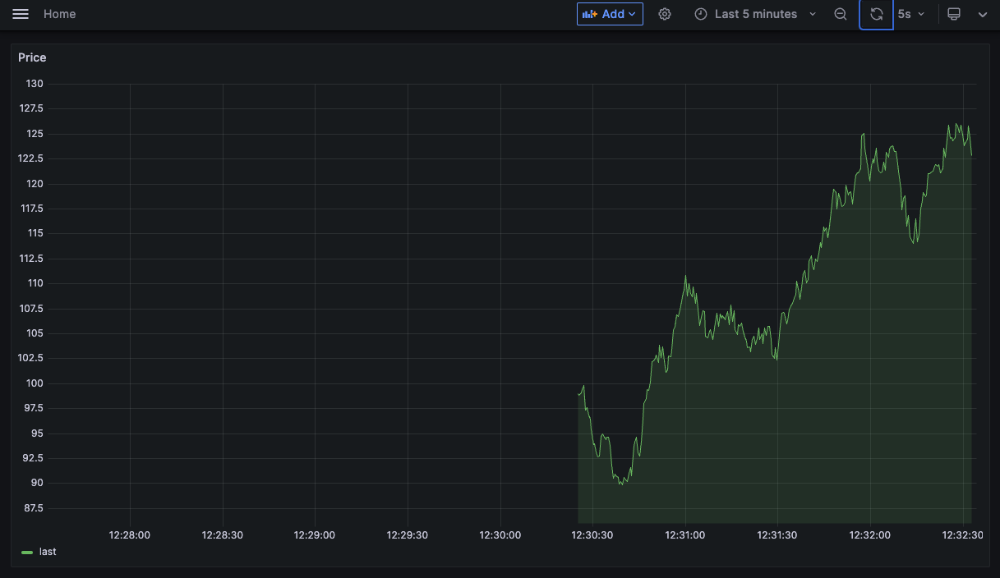

If you're using logs to monitor your trading system, then this is the article for you.

I've come across trading systems that spew out 10s of gigabytes of logs per day. When something goes wrong, some poor intern has to `grep` through these log files for days figuring out why something broke.

The thing is, logs should not be human readable. When you're working with a trading system, you want to have a real time understanding of what your system is doing. You want an immediate diagnosis if something goes wrong. Ideally, logs should be machine readable and visualised.

When coming across systems spewing out gigabytes of logs, I bank a quick win by converting these logs into JSON. I can then stream these logs into a time series database and visualise them with my favourite dashboard.


Here, we're going to create a trading app demo that logs to JSON, ships these logs into an Elastic Search index and visualises them with Grafana.

You can find all the code here in a Github repository [monitoring-trading-systems](https://github.com/robolyst/trading-monitoring-demo).

# Trading app

For our trading app, we'll use a script that logs a random price:

```python
from time import sleep
import numpy as np
import logging

logger = logging.getLogger()
logger.setLevel(logging.DEBUG)
console_handler = logging.StreamHandler()
logger.addHandler(console_handler)
file_handler = logging.FileHandler('/var/log/trader/trader.logs')
logger.addHandler(file_handler)

price = 100

logger.info("startup")

while True:
    sleep(0.5)

    price = price * (1 + np.random.randn() * 0.01)
    logger.info(f"price {price}")
```

This app sets up a logger that prints to the console and dumps to a log file `trader.logs`. The logs look like:

```bash
startup
price 101.50747597319688
price 101.45122289615952
price 102.82811428242694
```

# JSON Logs

The Python package [structlog](https://www.structlog.org/en/stable/) creates structured (and often beautiful) logs for you. The package includes a JSON format out of the box which we're going to use.

Setting up JSON logs is as easy as wrapping the default logger from our demo trading app above:

```python
import structlog

structlog.configure_once(
    processors=[
        structlog.processors.JSONRenderer(),
    ],
)

json_logger = structlog.wrap_logger(logger)
```

In our app, we convert the logs like this:

```python
logger.info("startup") -> json_logger.info(event="startup")
logger.info(f"price {price}") -> json_logger.info(event="price", price=price)
```

A log is a statement that something happened. In other words, an event. `structlog` has the required argument `event="NAME"`. Best practice is for each of your logs to have their own event name. That way, you can always pick out the exact logs you want down stream.

Now, the trading app's logs look like:

```json
{"event": "startup"}
{"price": 102.17102615753684, "event": "price"}
{"price": 102.95998265527092, "event": "price"}
{"price": 103.19691296599979, "event": "price"}
```

Perfectly machine readable.

We can add a bit more information by adding more processors to the logs:

```python
structlog.configure_once(
    processors=[
        structlog.stdlib.add_log_level,
        structlog.processors.TimeStamper(fmt="iso", utc=True),
        structlog.processors.JSONRenderer(),
    ],
)
```

Giving us:

```json
{"event": "startup", "level": "info", "timestamp": "2022-12-14T06:21:05.373044Z"}
{"price": 98.29655117355337, "event": "price", "level": "info", "timestamp": "2022-12-14T06:21:05.874105Z"}
{"price": 99.25440619746382, "event": "price", "level": "info", "timestamp": "2022-12-14T06:21:06.375861Z"}
{"price": 100.36139973205326, "event": "price", "level": "info", "timestamp": "2022-12-14T06:21:06.877588Z"}
{"price": 98.746303446643, "event": "price", "level": "info", "timestamp": "2022-12-14T06:21:07.380507Z"}
```

# Time series database

 We're going to use [Elastic Search](https://www.elastic.co/) as our time series database and [Filebeat](https://www.elastic.co/beats/filebeat) as a log shipper. Filebeat will listen to changes to the `trader.logs` file and send new lines to Elastic Search.

 This is setup by:

* Dockerising the trading app with `docker-compose`
* Adding Elastic Search
* Adding and configuring Filebeat

## Dockerising the app

This is a little boring and is nothing more than setting up a Docker file and running the script. If you're curious, you can checkout the `docker-compose.yaml` file [here](https://github.com/robolyst/trading-monitoring-demo/blob/main/docker-compose.yaml). The trader service is called `trader` and should be the first one in the file.

## Elastic Search

Add a new service to your `docker-compose.yaml` file:

```yaml
  elasticsearch:
    image: docker.elastic.co/elasticsearch/elasticsearch:7.13.0
    container_name: elasticsearch
    environment:
      - discovery.type=single-node
    ports:
      - "9200:9200"
      - "9300:9300"
    healthcheck:
      test: curl -s http://elasticsearch:9200 >/dev/null || exit 1
      interval: 5s
      timeout: 10s
      retries: 50
```

Take note of the health check. Elastic Search can take a few moments to start up. We'll want Filebeat to wait before it tries to connect. By adding the health check, Docker will know to wait until Elastic Search is ready.

## Filebeat

Filebeat uses a `filebeat.yaml` file for configuration. We want to tell Filebeat where the log file lives, where elastic search lives, and what index to put the logs into. We can do this with:

```yaml
filebeat.inputs:
- type: log
  paths:
  - '/var/log/trader/trader.logs'
  json.fields_under_root: true
  json.ignore_decoding_error: true
  tags: ["trader"]

output.elasticsearch:
  hosts: "elasticsearch:9200"
  index: "trader-%{+yyy.MM.dd}"

setup.ilm.enabled: false
setup.template.name: "trader"
setup.template.pattern: "trader-*"
```

We then create a shared volume in docker for the logs:

```yaml
volumes:
  logdata:
```

Make sure the `trader` service has:

```yaml
volumes:
    - logdata:/var/log/trader
```

The Filebeat service can be created with:

```yaml
  filebeat:
    image: docker.elastic.co/beats/filebeat:7.13.0
    command: filebeat -e -strict.perms=false
    volumes:
      - logdata:/var/log/trader
      - ./filebeat/filebeat.yml:/usr/share/filebeat/filebeat.yml:ro
    depends_on:
      elasticsearch:
        condition: service_healthy
```

Take note that Filebeat depends on Elastic Search and waits for it to be healthy. Without this, Filebeat would try and connect to Elastic Search before the index is ready and then crash.

# Visualise

We've now got a trading app dumping JSON logs to a file and these logs are being streamed into a database. All we have left to do is visualise the data.

[Grafana](https://grafana.com/grafana/) is an open source visualisation tool that excels at metrics and time series.

You can spin up a Grafana instance and use their UI to connect to Elastic Search and create your dashboards.

Add this to your `docker-compose` file and navigate to `localhost:3000`:

```yaml
  grafana:
    image: grafana/grafana:9.3.1
    ports:
      - "3000:3000"
    environment:
      - GF_SECURITY_ADMIN_USER=admin
      - GF_SECURITY_ADMIN_PASSWORD=admin
      - GF_AUTH_BASIC_ENABLED=false
      - GF_AUTH_ANONYMOUS_ENABLED=true
      - GF_AUTH_ANONYMOUS_ORG_ROLE=Editor
    depends_on:
      elasticsearch:
        condition: service_healthy
```

A fantastic feature of Grafana is defining all configuration in code. This includes the database connection and dashboards. That's all a little involved to walk through here. However, the accompanying Github repository is setup with a Grafana service, configured to talk to the Elastic Search database, and has ready built dashboards included for you to explore.

# Accompanying Repository

To see this whole monitoring system in action, clone [the repository](https://github.com/robolyst/trading-monitoring-demo) and spin up the stack:

```bash
git clone https://github.com/robolyst/trading-monitoring-demo
cd trading-monitoring-demo
docker-compose up
```

You'll get a spew of logs on the screen. Wait a moment and then open the dashboard at [http://localhost:3000/d/RQ9erYFVk/trader-log-dashboard?orgId=1&refresh=5s](http://localhost:3000/d/RQ9erYFVk/trader-log-dashboard?orgId=1&refresh=5s)


