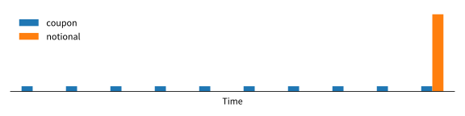

A simple model of a bond ETF is that every day, the fund buys a bond on the open market, holds it for a day collecting interest and then sells the bond at the end of the day. The fund's return for the day is the interest earned and any capital made or lost on the price of the bond.

$$
\text{ETF return} = \text{interest} + \text{capital gains}
$$

The bond's yield tells us the interest that we earn. To calculate the capital gains, we need to know how to calculate a bond's price. The capital gain is then the return on the price of the bond.

# Bond price

A bond is a cashflow producing instrument. Throughout the holding period, the buyer receives periodic **coupons** and at the end of the bond the buyer receives the **notional** amount. The cashflow looks like this:



The key thing to note with a bond's cashflow is that it is future cashflow. A promise of $100 in 1 years time is not worth $100 today. If the current interest rate is 5%, then you can lend out $95.24 today and receive back $100 in 1 year. You could say that $100 in a years time is worth $95.24 today if the interest rate is 5%.

This idea of using interest rates to value future cashflow is call the [present value approach](https://en.wikipedia.org/wiki/Bond_valuation#Present_value_approach) to valuing a bond. More succinctly, the value of a bond is:
$$
P = \text{present value of coupons} + \text{present value of notional}
$$

Breaking this down we get:
$$
P = \sum^{T}_{i=1} \frac{CN}{(1 + r)^{i}} + \frac{N}{(1 + r)^{T}}
$$
Where \\(P\\) is the price of the bond, \\(N\\) is the notional value, \\(T\\) is the number of years until maturity, \\(C\\) is the annual coupon as a percentage of the notional, and \\(r\\) is the current interest rate.

Bonds in the U.S. pay a coupon twice a year. If we set \\(p=2\\) to be the number of coupon payments in a year then the bond price \\(P\\) is:
$$
P = \sum^{pT}_{i=1} \frac{\frac{C}{p}N}{(1 + \frac{r}{p})^{i}} + \frac{N}{(1 + \frac{r}{p})^{pT}}
$$

The price can be simplified to:
$$
P = \frac{CN}{r}\left( 1 - (1 + \frac{r}{p})^{-pT} \right) + N (1 + \frac{r}{p})^{-pT}
$$

A key thing to note is that if the coupon equals the rate (\\(C = r\\)) then the price of the bond is equal to the notional \\(P = N\\). This is exactly what happens when a new bond is issued. The price of the bond that the buyer pays is the notional amount and the coupons that they'll receive match the rate at the time of issue.

# ETF Returns

Earlier we stated that a bond ETF's return is the sum of the interest earned plus the return made on the value of the bonds (capital):
$$
\text{return}_t = \text{interest}_t + \text{capital}_t
$$

If we imagine the ETF buying a bond, holding for a period of time and then selling it, the fund earns a fraction of the annual yield. If the fund held the bond for one business day then the interest earned is one day's worth of the bond's yield:
$$
\text{interest}\_{t} = \frac{r_{t-1}}{260}
$$
Here, we are going to assume that the bond's yield is equal to the market interest rate. The bond's yield at the time of purchase (yesterday) is \\(r_{t-1}\\).

If we assume that the ETF is always buying bonds at par value (\\(C = r_{t-1}\\)) with a notional of $1 (\\(P_{t-1} = N = 1\\)) then the return on capital is:
$$
\begin{aligned}
\text{capital}\_t &= \frac{P_{t}}{P_{t-1}} - 1 \\\
&= \frac{r_{t-1}}{r_t} \left( 1 - (1 + \frac{r_t}{p})^{-pT} \right) + (1 + \frac{r_t}{p})^{-pT} - 1
\end{aligned}
$$

The fund's return is then:
$$
\begin{aligned}
\text{return}\_t &= \text{interest}\_t + \text{capital}\_t \\\
 &= \frac{r_{t-1}}{260} + \frac{r_{t-1}}{r_t} \left( 1 - (1 + \frac{r_t}{p})^{-pT} \right) + (1 + \frac{r_t}{p})^{-pT} - 1
\end{aligned}
$$

If we plot the estimated returns against changes in yield, we find a key fact of bond returns. Positive changes in yields creates negative returns and negative changes in yields creates positive returns.


# Example

We can test out this ETF model on [iShares 20+ Year Treasury Bond ETF](https://www.ishares.com/us/products/239454/ishares-20-year-treasury-bond-etf) (TLT). This is a US based ETF that holds U.S. Treasury bonds that mature in 20+ years.

We will need to use dividend adjusted prices as TLT distributes the coupons via dividends. As the maturity of the bonds held by TLT at any particular time will not exactly equal a fixed maturity, we can use 30 year yields as an estimate and assume the maturity is 25 years. The dividend adjusted prices are fetched from Yahoo ([link](https://uk.finance.yahoo.com/quote/TLT/history?p=TLT)) and 30 year US treasury bond yields from FRED ([link](https://fred.stlouisfed.org/series/DGS30)).


The results look like:


The code to fetch the data and calculate the returns is:

```python
from datetime import datetime
import pandas as pd
from pandas_datareader import data
import matplotlib.pyplot as plt

def bond_etf_returns(series, maturity, freq, p):
    """
    Estimates bond ETF returns based on bond yields.
    
    Args:
        series (pd.Series): Bond yields
        maturity (int): Number of years until maturity
        freq (int): Number of observations in a year
        p (int): Number of coupon payments in a year
    """
    rates = series.copy().to_frame()
    rates.columns = ['rate']
    rates['capital'] = (1 + rates['rate'] / p)**(-p * maturity)
    rates['coupon'] = rates['rate'].shift(1) / rates['rate'] * (1 - rates['capital'])
    rates['interest'] = rates['rate'].shift(1) / freq
    rates['returns'] = rates['capital'] + rates['coupon'] + rates['interest'] - 1
    return rates

# Fetch data
start = datetime(2002, 7, 30)
tlt = data.get_data_yahoo('TLT', start)['Adj Close']
dgs30 = data.get_data_fred('DGS30', start)

# Clean data
df = pd.concat((tlt, dgs30), axis=1).resample('B').last().fillna(method='ffill')
df['returns'] = df['Adj Close'].pct_change()

# Estimated returns
estimated = bond_etf_returns(df['DGS30'] / 100, maturity=25, freq=260, p=2)

plt.figure()

plt.subplot(1, 2, 1)
plt.plot(estimated['returns'], df['returns'], '.')

plt.subplot(1, 2, 2)
plt.plot((1 + estimated['returns']).cumprod())
plt.plot((1 + df['returns']).cumprod())
```

# Distribution of returns

The previous section found that a fund's return can be estimated with:
$$
\text{return}\_t = \frac{r_{t-1}}{f} + \frac{r_{t-1}}{\textcolor{red}{r_t}} \left( 1 - (1 + \frac{\textcolor{red}{r_t}}{p})^{-pT} \right) + (1 + \frac{\textcolor{red}{r_t}}{p})^{-pT} - 1
$$
In Python this looks like:

```python
def etfret(r1, r, f=260, p=2, T=25):
    """Estimated return for a bond ETF."""
    interest = r1 / f
    capital = (1 + r / p)**(-p * T)
    annuity = r1 / r * (1 - capital)
    return interest + annuity + capital - 1
```

If we assume that yields cannot go negative, then we can think of the yield \\(r_t\\) as drawn from a [log-normal distribution](https://en.wikipedia.org/wiki/Log-normal_distribution). That is, the logged changes in the yield follows a Gaussian distribution:
$$
\begin{aligned}
\log(r_t) - \log(r_{t-1}) &\sim \mathcal{N}(\mu, \sigma^2) \\\
\log(r_{t}) &\sim \mathcal{N}(\mu + \log(r_{t-1}), \sigma^2) \\\
r_{t} &\sim \text{Lognormal}(\mu + \log(r_{t-1}), \sigma^2)
\end{aligned}
$$

This is similar to the [Black-Karansinski interest rate model](https://en.wikipedia.org/wiki/Black%E2%80%93Karasinski_model) (BK). The BK model assumes that the logged interest rates follow a stochastic mean reversion processed called the [Ornstein-Uhlenbeck process](https://en.wikipedia.org/wiki/Ornstein%E2%80%93Uhlenbeck_process). Here we're going to drop the mean reversion assumption and just model the changes as a random process.

Using this log-normal interest rate model, we can simulate a return distribution with:

```python
def sim_etfret(rate, mu, std, samples):
    """Returns an array of simulated bond ETF returns."""
    sim_rates = np.exp(np.log(rate) + mu + std * np.random.randn(samples))
    return etfret(r1=rate, r=sim_rates)
```

By picking an extreme value for the standard deviation (std = 0.3) we can compare a low interest rate environment with a high interest rate environment. When yields are low, bond returns are negatively skewed. When yields are high, they are positively skewed.


The negative skew occurs because when bond yields are low a positive change in yield has a larger impact than a negative change in yield. A positive change in yield causes negative returns. When bond yields are high this relationship reverses. Negative changes in yield have a larger impact than positive changes. A negative change in yield causes positive returns.


As yields decrease, returns skew to the negative. As they increase, returns skew positive.


We can estimate skew for TLT by using the exponentially weighted moving average and standard deviation of the logged rates for the inputs to `sim_etfret`. I'm using a half-life of 25 days on daily data. Running this simulation for 10 millions samples per day gives us:


<!-- 
# Analytical

$$
\text{return}\_t = \frac{r_{t-1}}{f} + \frac{r_{t-1}}{r_t} \left( 1 - (1 + \frac{r_t}{p})^{-pT} \right) + (1 + \frac{r_t}{p})^{-pT} - 1
$$

variable substitution:

$$
\begin{aligned}
x &= (1 + \frac{r_t}{p})^{-pT} \\\
e^{\log(x)\frac{1}{-pT}} &= 1 + \frac{r_t}{p} \\\
x^{\frac{1}{-pT}} &= 1 + \frac{r_t}{p} \\\
x^{\frac{1}{-pT}} - 1 &= \frac{r_t}{p} \\\
x^{\frac{1}{-pT}}p - p &= r_t \\\
\end{aligned}
$$

giving:

$$
\text{return}\_t = \frac{r_{t-1}}{f} + \frac{r_{t-1}}{x^{\frac{1}{-pT}}p - p} \left( 1 - x \right) + x - 1
$$

$$
\begin{aligned}
y &= \frac{a}{x^bc - c}(1 - x) + x \\\
y(x^bc - c) &= a(1 - x) + x(x^bc - c) \\\
x^bcy - cy &= a - xa + x^{b+1}c - xc \\\
x^bcy - cy &= a + x^{b+1}c - x(a + c) \\\
-cy -a &= x^{b+1}c - x(a + c) - x^bcy \\\
cy + a &= x(a + c) + x^bcy  - x^{b+1}c \\\
\end{aligned}
$$

# Appendix

## Taylor expansion

### First derivative

$$
\begin{aligned}
\text{return}\_t^\prime(r_t) &= \frac{d}{dr_t}\left[\frac{r_{t-1}}{r_t} \left( 1 - (1 + \frac{r_t}{p})^{-pT} \right)\right] + \frac{d}{dr_t}(1 + \frac{r_t}{p})^{-pT} \\\
&= \frac{d}{dr_t}\left[\frac{r_{t-1}}{r_t} \left( 1 - (1 + \frac{r_t}{p})^{-pT} \right)\right] - pT(1 + \frac{r_t}{p})^{-pT-1}\frac{1}{p} \\\
&= \frac{d}{dr_t}\left[\frac{r_{t-1}}{r_t} \left( 1 - (1 + \frac{r_t}{p})^{-pT} \right)\right] - T(1 + \frac{r_t}{p})^{-pT-1} \\\
&= \frac{d}{dr_t}\left[\frac{r_{t-1}}{r_t}\right] \left( 1 - (1 + \frac{r_t}{p})^{-pT} \right) + \frac{r_{t-1}}{r_t} \frac{d}{dr_t}\left[ \left( 1 - (1 + \frac{r_t}{p})^{-pT} \right) \right] - T(1 + \frac{r_t}{p})^{-pT-1} \\\
&= -\frac{r_{t-1}}{r_t^2} \left( 1 - (1 + \frac{r_t}{p})^{-pT} \right) + \frac{r_{t-1}}{r_t} \frac{d}{dr_t}\left[ \left( 1 - (1 + \frac{r_t}{p})^{-pT} \right) \right] - T(1 + \frac{r_t}{p})^{-pT-1} \\\
&= -\frac{r_{t-1}}{r_t^2} \left( 1 - (1 + \frac{r_t}{p})^{-pT} \right) - \frac{r_{t-1}}{r_t} \frac{d}{dr_t} (1 + \frac{r_t}{p})^{-pT} - T(1 + \frac{r_t}{p})^{-pT-1} \\\
&= -\frac{r_{t-1}}{r_t^2} \left( 1 - (1 + \frac{r_t}{p})^{-pT} \right) + \frac{r_{t-1}}{r_t}  T(1 + \frac{r_t}{p})^{-pT-1} - T(1 + \frac{r_t}{p})^{-pT-1} \\\
&= -\frac{r_{t-1}}{r_t^2} \left( 1 - (1 + \frac{r_t}{p})^{-pT} \right) + (\frac{r_{t-1}}{r_t} - 1)T(1 + \frac{r_t}{p})^{-pT-1} \\\
\end{aligned}
$$

### Second derivative

$$
\begin{aligned}
\text{return}\_t^{\prime\prime}(r_t) &= -\frac{d}{dr_t}\left[\frac{r_{t-1}}{r_t^2} \left( 1 - (1 + \frac{r_t}{p})^{-pT} \right)\right] + \frac{d}{dr_t}\left[(\frac{r_{t-1}}{r_t} - 1)T(1 + \frac{r_t}{p})^{-pT-1}\right] \\\
&= -\frac{d}{dr_t}\left[\frac{r_{t-1}}{r_t^2} \left( 1 - (1 + \frac{r_t}{p})^{-pT} \right)\right] + T\left[\frac{r_{t-1}}{r_t^2}(1 + \frac{r_t}{p})^{-pT-1} + (-pT-1)(\frac{r_{t-1}}{r_t} - 1)(1 + \frac{r_t}{p})^{-pT-2} \right] \\\
&= -\left[-2\frac{r_{t-1}}{r_t^3} \left( 1 - (1 + \frac{r_t}{p})^{-pT} \right) + T(1 + \frac{r_t}{p})^{-pT - 1} \right] + T\left[\frac{r_{t-1}}{r_t^2}(1 + \frac{r_t}{p})^{-pT-1} + (-pT-1)(\frac{r_{t-1}}{r_t} - 1)(1 + \frac{r_t}{p})^{-pT-2} \right] \\\
&= 2\frac{r_{t-1}}{r_t^3} \left( 1 - (1 + \frac{r_t}{p})^{-pT} \right) - T(1 + \frac{r_t}{p})^{-pT - 1} + T\left[\frac{r_{t-1}}{r_t^2}(1 + \frac{r_t}{p})^{-pT-1} + (-pT-1)(\frac{r_{t-1}}{r_t} - 1)(1 + \frac{r_t}{p})^{-pT-2} \right] \\\
&= 2\frac{r_{t-1}}{r_t^3} \left( 1 - (1 + \frac{r_t}{p})^{-pT} \right) - T(1 + \frac{r_t}{p})^{-pT - 1} + T\frac{r_{t-1}}{r_t^2}(1 + \frac{r_t}{p})^{-pT-1} + T(-pT-1)(\frac{r_{t-1}}{r_t} - 1)(1 + \frac{r_t}{p})^{-pT-2} \\\
&= 2\frac{r_{t-1}}{r_t^3} \left( 1 - (1 + \frac{r_t}{p})^{-pT} \right) + (\frac{r_{t-1}}{r_t^2} - 1)T(1 + \frac{r_t}{p})^{-pT-1} + T(-pT-1)(\frac{r_{t-1}}{r_t} - 1)(1 + \frac{r_t}{p})^{-pT-2} \\\
\end{aligned}
$$

### Expansion
Adding \\(a\\) to allow for adjustments.

$$
\begin{aligned}
\text{return}\_t^\*(r_t) = \text{return}\_t(r_{t-1}) + \text{return}\_t^\prime(r_{t-1})(r_t - r_{t-1})  + a\frac{\text{return}\_t^{\prime\prime}(r_{t-1})}{2!}(r_t - r_{t-1})^2
\end{aligned}
$$

Because we are expanding around \\(r_{t-1}\\) many of the functions thin down. Filling in we get:

$$
\begin{aligned}
\text{return}\_t^\*(r_t) &= \text{return}\_t(r_{t-1}) + \text{return}\_t^\prime(r_{t-1})(r_t - r_{t-1})  + a\frac{\text{return}\_t^{\prime\prime}(r_{t-1})}{2!}(r_t - r_{t-1})^2 \\\
\text{return}\_t^\*(r_t) &= \frac{r_{t-1}}{f} + \text{return}\_t^\prime(r_{t-1})(r_t - r_{t-1})  + a\frac{\text{return}\_t^{\prime\prime}(r_{t-1})}{2!}(r_t - r_{t-1})^2 \\\
\text{return}\_t^\*(r_t) &= \frac{r_{t-1}}{f} + \left(-\frac{1}{r_{t-1}} \left( 1 - (1 + \frac{r_{t-1}}{p})^{-pT} \right)\right)(r_t - r_{t-1})  + a\frac{\text{return}\_t^{\prime\prime}(r_{t-1})}{2!}(r_t - r_{t-1})^2 \\\
\end{aligned}
$$

 -->
