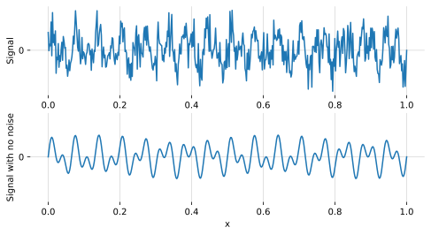
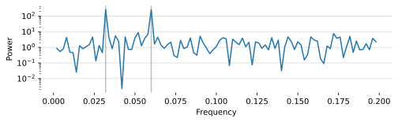
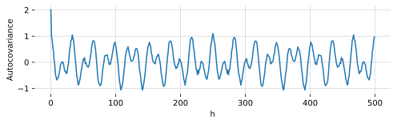
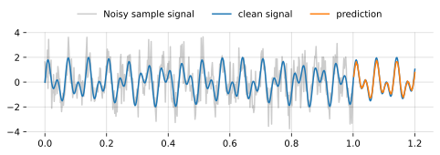

The [Wiener-Khinchin theorem](https://en.wikipedia.org/wiki/Wiener%E2%80%93Khinchin_theorem) provides a clever way of building Gaussian processes for regression. I'll show you this theorem in action with some Python code and how to use it to model a process.

The Wiener-Khinchin theorem states that an [autocovariance](https://en.wikipedia.org/wiki/Autocovariance) function of a [weakly stationary process](https://en.wikipedia.org/wiki/Stationary_process#Weak_or_wide-sense_stationarity) is a function of the [power spectral density](https://en.wikipedia.org/wiki/Spectral_density) and vice versa. These two are called Fourier duals and can be written as[^Wilson-2013]:
$$
\begin{align}
\kappa(h) &= \int S(\omega) e^{2 \pi i \omega h} d \omega \label{1}\tag{1} \\\
S(\omega) &= \int \kappa(h) e^{-2 \pi i \omega h} d h \\\
\end{align}
$$
Where \\(\kappa(h)\\) is an autocovariance function of a process at lag \\(h\\) and \\(S(\omega)\\) is the power spectral density of the same process at frequency \\(\omega\\). They are Fourier transforms of each other---hence the term Fourier duals.

The idea here is that if you want to model a process, you could estimate its power spectrum (\\(S\\)), calculate the autocovariance function using equation (\\(\ref{1}\\)) and construct a Gaussian process.

The problem is that equation (\\(\ref{1}\\)) is in continuous time and we generally work with discretely sampled time series. Luckily, there is a method known as the [periodogram](https://en.wikipedia.org/wiki/Periodogram) which is a discrete estimate of the power spectral density. SciPy provides this estimate under `scipy.signal.periodogram`. Now, equation (\\(\ref{1}\\)) can be treated discretely as:

$$
\kappa(h) = \sum_{\omega} S(\omega) e^{2 \pi i \omega h} d \omega  \label{2}\tag{2}
$$


Let's try this out with some Python code.

# Estimating the autocovariance function

Generate a time series made up of two frequencies and some noise:
```python
from numpy import sin, pi, cumsum, linspace
from numpy.random import seed, randn

seed(1)

N = 500  # Number of samples
x = linspace(0, 1, N)  # One interval
y = (
    sin(x * 2 * pi * 16)    # Oscillate 16 times per interval
    + sin(x * 2 * pi * 30)  # + 30 times per interval
    + randn(N)              # + some noise
)
```

Which looks like this:


We can get the periodogram with:
```python
from scipy.signal import periodogram
frequency, power = periodogram(y)
```

The array `power` is a noisy power spectrum with two spikes. One spike at \\(\frac{16}{N}\\) and the other at \\(\frac{30}{N}\\). It looks like:


We can create a function that uses `periodogram` and equation (\\(\ref{2}\\)) to give us the autocovariance at each \\(h\\) from \\(0\\) to \\(N\\):
```python
import numpy as np
from scipy.signal import periodogram

def spectral_autocov(y):
    N = len(y)
    
    frequency, power = periodogram(y, nfft=N)
    d = np.mean(np.diff(frequency))
    
    autocov = np.real([
        np.sum(np.exp(2 * np.pi * 1j*frequency*h) * power * d)
        for h in range(N)
    ])

    return autocov
```

Running the time series `y` through the `spectral_autocov` function gives us an array where the \\(h^{\text{th}}\\) element is the autocovariance at lag \\(h\\):
```python
autocov = spectral_autocov(y)
```


# Building a Gaussian process

We can use this autocovariance function to construct a covariance matrix and make a prediction with a conditional Gaussian. I've talked about the maths of conditional Gaussians in [the appendix of a previous article]({}#conditional-gaussian-distribution). Knocking this together looks like:
```python
from scipy.linalg import toeplitz

# Forecast this many steps ahead
horizon = 100

# Turn the autocovariance series into a
# covariance matrix plus a noise term
cov = toeplitz(autocov) + np.eye(N) * 20

# Make a forecast using a conditional
# Gaussian process
AA = cov[:(N-horizon), :(N-horizon)]
BA = cov[(N-horizon):, :(N-horizon)]
forecast = BA @ np.linalg.inv(AA) @ y[horizon:]
```
Which looks like this:


# Summary

You can calculate the autocovariance function of a process from its power spectral density. Using this relationship, here we explored estimating the power spectral density of a noisy time series, calculating its autocovariance matrix and then making a prediction using a conditional Gaussian. 

{}
