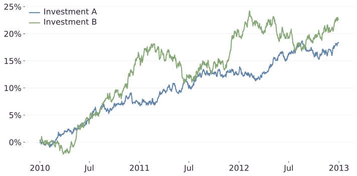

# Text styles

Duis maximus massa vitae libero imperdiet feugiat quis a sapien. Quisque sodales neque dui, a mollis justo porta eu. Nullam semper ipsum ac ante rhoncus, ac facilisis lacus posuere. Mauris pulvinar elementum ligula in mattis. Fusce rhoncus consequat lorem accumsan rhoncus.

## Links

Duis maximus massa vitae [libero](#) imperdiet feugiat quis a sapien. Quisque sodales neque dui, a mollis justo porta eu. Nullam semper ipsum ac ante rhoncus, ac facilisis lacus posuere.Suspendisse sed [sapien placerat velit](#) pulvinar condimentum. Curabitur lacinia id metus id hendrerit. Curabitur luctus enim id nibh ullamcorper fringilla. Aenean id molestie metus. Donec [vestibulum](#) ipsum arcu, sed commodo lacus lacinia sed. Aenean vestibulum leo non condimentum vulputate.

## Bold text

Nulla ultrices gravida interdum. Nam nec est quam. In porta mi in mi facilisis, in suscipit nisl dictum. Aenean sapien nibh, **convallis eget faucibus** sit amet, efficitur blandit odio. Vestibulum libero orci, egestas sit amet risus et, luctus tempor diam.

**Aliquam erat volutpat**

Curabitur pulvinar magna sit amet mattis semper. Nulla interdum nunc quis turpis iaculis finibus. Donec purus leo, aliquam at malesuada sit amet, elementum vitae quam. Quisque mi justo, euismod ac leo nec, elementum eleifend purus. Etiam ut ornare velit. 

**Aliquam erat volutpat**

Curabitur pulvinar magna sit amet mattis semper. Nulla interdum nunc quis turpis iaculis finibus. Donec purus leo, aliquam at malesuada sit amet, elementum vitae quam. Quisque mi justo, euismod ac leo nec, elementum eleifend purus. Etiam ut ornare velit. 

# Callout

Nulla ultrices gravida interdum. Nam nec est quam. In porta mi in mi facilisis, in suscipit nisl dictum. Aenean sapien nibh, convallis eget faucibus sit amet, efficitur blandit odio. Vestibulum libero orci, egestas sit amet risus et, luctus tempor diam.

<callout>
Quisque mi justo, euismod ac leo nec, elementum eleifend purus.
</callout>

Curabitur pulvinar magna sit amet mattis semper. Nulla interdum nunc quis turpis iaculis finibus. Donec purus leo, aliquam at malesuada sit amet, elementum vitae quam. Quisque mi justo, euismod ac leo nec, elementum eleifend purus. Etiam ut ornare velit. 


# Maths

## Inline maths

Curabitur pulvinar magna sit amet mattis semper. Nulla interdum \\(a = \sum x^2\\) nunc quis turpis iaculis finibus. Donec purus leo, aliquam at malesuada sit amet, elementum vitae quam. This is a financial number $100 ok and this is another $100. Curabitur pulvinar magna sit amet mattis semper.


## Math blocks

Curabitur pulvinar magna sit amet mattis semper. Nulla interdum nunc quis turpis iaculis finibus. Donec purus leo, aliquam at malesuada sit amet, elementum vitae quam. Quisque mi justo, euismod ac leo nec, elementum eleifend purus. Etiam ut ornare velit. 

$$
\left( \frac{C}{p_{\text{now}}} +m \sum_{y=\text{now}}^{\text{now}+T} \frac{(1 + \phi)^y}{p_y} \right) p_{\text{now} + T} = A
$$

Curabitur pulvinar magna sit amet mattis semper. Nulla interdum nunc quis turpis iaculis finibus. Donec purus leo, aliquam at malesuada sit amet, elementum vitae quam. Quisque mi justo, euismod ac leo nec, elementum eleifend purus. Etiam ut ornare velit. 

# Code

## Python

```python
for i in range(10):
    print(i**2)
```

## JSON

```json
{
    "something": 6,
}
```

# Table

| Investment   | Worst day return  |
|--------------|-------------------|
| Investment A | -0.6%             |
| Investment B | -0.9%             |


# Images




# Footnotes & references

Donec auctor lacus est, sit amet dapibus erat porta ac. Proin facilisis, dui quis lacinia convallis, eros nunc rhoncus orci, at tempor enim magna nec enim. Nulla facilisi [^Cavallo2012]. Etiam ut ex dignissim, porttitor augue ac, congue ex. Ut sit amet tellus gravida, venenatis nisl et, luctus eros. Nam massa lacus, ornare ac pulvinar eget, consequat vitae nisl. Lorem ipsum dolor sit amet, consectetur adipiscing elit [^2]. Integer ut ornare tellus.

Quisque dictum, odio a tristique pretium, velit sem egestas quam, eu ultrices [^Shiller2000] enim risus at leo. Nulla tortor ante, commodo et euismod consectetur, dictum ullamcorper nisi [^Vapnik1998].

[^Cavallo2012]: Cavallo, J. V., & Fitzsimons, G. M. (2012). [Goal competition, conflict, coordination, and completion: How intergoal dynamics affect self-regulation.](https://psycnet.apa.org/record/2011-26825-009) In H. Aarts & A. J. Elliot (Eds.), Frontiers of social psychology. Goal-directed behavior (p. 267–299). Psychology Press.

[^2]: If you type this phrase into Google you will get many hits. I do not know who said it first. There are many people using it without reference. I think I might have first read it in a <a href="https://www.forbes.com/sites/moneywisewomen/2012/10/26/you-can-have-anything-you-want/?sh=78b73db1d8e4" target="_blank">Forbes article</a>.

[^Shiller2000]: Economist Robert J. Shiller wrote a book called *Irrational Exuberance* published in 2000 showing hundreds of years worth of data. He demonstrates that housing prices do not always go up.

{}